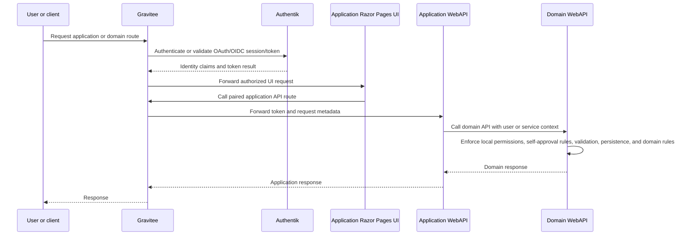

# API Gateway and Identity

## Status

This document defines Gravitee ingress, Authentik OAuth/OIDC integration, OpenAPI publication, route conventions, API authorization, and service communication rules.

## Fixed Decisions

- All user and external client traffic enters through Gravitee.
- Authentik provides OAuth/OIDC identity and integrates with Gravitee.
- The initial release uses password-only login on ACME's protected internal network.
- APIs use ASP.NET Core WebAPI Controllers.
- API contracts use OpenAPI 3.0.
- APIs remain responsible for business authorization, local self-approval rules, and business invariants.

## Ingress Topology

Internal Kubernetes service calls are permitted after ingress for trusted ERP service-to-service communication when the called API enforces service identity, authorization, and contract validation.

The local developer gateway URL is `http://localhost:8082`. The Kubernetes Gravitee gateway service is exposed to the workstation by the local Helm values as a Docker Desktop `LoadBalancer` on port `8082`; non-gateway platform and ERP services remain internal to the `erp-local` namespace. Local Gravitee runs in database-less gateway-only mode, synchronizing API definitions from Kubernetes ConfigMaps under `build/k8s/gravitee/routes` instead of deploying the APIM Management API, portal, UI, MongoDB, or Elasticsearch. Authentik OAuth/OIDC redirect URIs and allowed origins for local development must use `http://localhost:8082` when OAuth application bootstrap is automated.

## Route Conventions

| Service | Public route | Health endpoints | Contract endpoint |
|---|---|---|---|
| Sales Domain API | `/domain/sales/api` | `/healthz`, `/readyz` | `/openapi/v1.json` |
| Purchasing Domain API | `/domain/purchasing/api` | `/healthz`, `/readyz` | `/openapi/v1.json` |
| Inventory Management Domain API | `/domain/inventory/api` | `/healthz`, `/readyz` | `/openapi/v1.json` |
| Order Fulfilment Domain API | `/domain/fulfilment/api` | `/healthz`, `/readyz` | `/openapi/v1.json` |
| Sales Assistant API | `/apps/sales-assistant/api` | `/healthz`, `/readyz` | `/openapi/v1.json` |
| Sales Assistant UI | `/apps/sales-assistant/ui` | `/healthz`, `/readyz` | Not applicable |
| Customer Ordering API | `/apps/customer-ordering/api` | `/healthz`, `/readyz` | `/openapi/v1.json` |
| Customer Ordering UI | `/apps/customer-ordering/ui` | `/healthz`, `/readyz` | Not applicable |
| Buyer API | `/apps/buyer/api` | `/healthz`, `/readyz` | `/openapi/v1.json` |
| Buyer UI | `/apps/buyer/ui` | `/healthz`, `/readyz` | Not applicable |
| Warehouse Operator API | `/apps/warehouse-operator/api` | `/healthz`, `/readyz` | `/openapi/v1.json` |
| Warehouse Operator UI | `/apps/warehouse-operator/ui` | `/healthz`, `/readyz` | Not applicable |
| Fulfilment Operator API | `/apps/fulfilment-operator/api` | `/healthz`, `/readyz` | `/openapi/v1.json` |
| Fulfilment Operator UI | `/apps/fulfilment-operator/ui` | `/healthz`, `/readyz` | Not applicable |
| Inventory Supervisor API | `/apps/inventory-supervisor/api` | `/healthz`, `/readyz` | `/openapi/v1.json` |
| Inventory Supervisor UI | `/apps/inventory-supervisor/ui` | `/healthz`, `/readyz` | Not applicable |
| Fulfilment Supervisor API | `/apps/fulfilment-supervisor/api` | `/healthz`, `/readyz` | `/openapi/v1.json` |
| Fulfilment Supervisor UI | `/apps/fulfilment-supervisor/ui` | `/healthz`, `/readyz` | Not applicable |

## Gravitee Responsibilities

- Publish external routes for APIs and UI services.
- Integrate with Authentik for OAuth/OIDC authentication.
- Enforce coarse-grained route access policy and API subscription policy where needed.
- Forward identity claims, bearer tokens, and request metadata to downstream services.
- Centralize API exposure and OpenAPI publication.
- Apply rate limits or request policies where needed for internal stability.
- Record gateway access logs and route-level failures.

Gravitee does not replace domain authorization. A request allowed by Gravitee can still be rejected by the target API.

## Authentik Responsibilities

- Authenticate internal users, support users where enabled, service identities, and customer users where customer account access exists.
- Provide OAuth/OIDC tokens and claims consumed by Gravitee and downstream APIs.
- Enforce initial password-only login, 60 minute idle timeout, 8 hour absolute timeout, and account lockout policy.
- Support MFA later if ACME changes exposure or privileged-user policy.
- Provide group, role, or claim inputs used by ERP authorization mapping.

## API Authorization Responsibilities

Every domain API enforces:

- Required authenticated identity or service account identity.
- Domain-level permission checks.
- Data-scope restrictions by role, domain, application, channel, location, supplier, customer, or assignment where configured.
- Local self-approval prevention for controlled actions.
- Configurable approval thresholds and approval authority.
- Customer data privacy restrictions.

Domain API authorization must fail closed when authorization status cannot be determined. Application APIs also fail closed for route and workflow authorization, but they must not replace domain authorization decisions.

## Role and Claim Mapping

Authentik supplies identity and coarse role/group claims. ERP services map claims to domain and application permissions and data scopes according to each owning application or domain requirement.

Initial MVP personas and identity subjects are Customer, Sales Assistant, Sales Supervisor, Buyer, Purchasing Manager, Warehouse Operator, Inventory Supervisor, Fulfilment Operator, Fulfilment Supervisor, Support User where enabled, and Integration Service Account where required.

Platform administration access does not imply business approval authority. Business approval authority must be explicitly assigned in the owning application/domain requirements.

## Service-to-Service Communication

- Service calls use authenticated service identities or delegated user context where the workflow requires the initiating user identity.
- Application APIs call domain APIs using delegated user context or scoped service identity according to the workflow contract.
- Application UIs call only their paired application APIs.
- Domain APIs do not call application APIs.
- Called APIs validate caller authorization and current business state before changing local data.

## OpenAPI Rules

- Every domain and application WebAPI service publishes OpenAPI 3.0 JSON.
- Contracts document authentication, authorization, validation errors, and business error responses.
- Public endpoints use route names that reflect feature behavior rather than database entities alone.
- OpenAPI descriptions include external ID fields where payloads cross domain boundaries.
- Breaking contract changes require explicit architecture or API review.

## Review Checklist

- [ ] All inbound user and external client traffic is routed through Gravitee.
- [ ] Authentik is the OAuth/OIDC identity provider.
- [ ] Gravitee performs gateway policy but APIs enforce business authorization.
- [ ] Domain and application APIs publish OpenAPI 3.0 contracts.
- [ ] Service accounts are scoped and non-interactive.
- [ ] Self-approval rules and approval authority are enforced in domain APIs, not only in UI, application APIs, or gateway policy.
