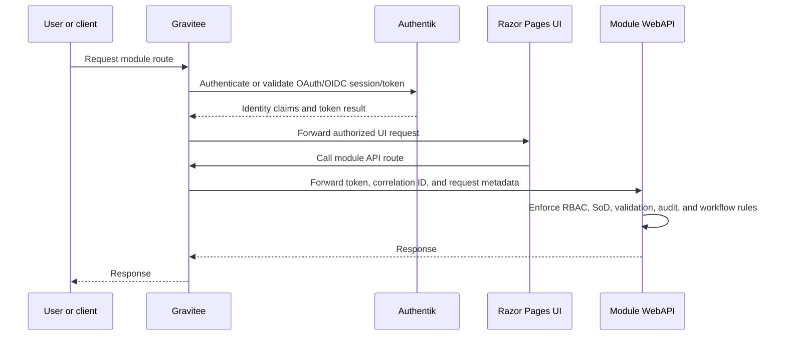

# API Gateway and Identity

## Status

This document defines Gravitee ingress, Authentik OAuth/OIDC integration, OpenAPI publication, route conventions, API authorization, and service communication rules.

## Fixed Decisions

- All user and external client traffic enters through Gravitee.
- Authentik provides OAuth/OIDC identity and integrates with Gravitee.
- The initial release uses password-only login on ACME's protected internal network.
- APIs use ASP.NET Core WebAPI Controllers.
- API contracts use OpenAPI 3.0.
- APIs remain responsible for business authorization and segregation-of-duties enforcement.

## Ingress Topology

Internal Kubernetes service calls are permitted after ingress for trusted ERP service-to-service communication when the called API enforces service identity, authorization, correlation, contract validation, and audit requirements.

## Route Conventions

| Service | Public route | Health endpoints | Contract endpoint |
|---|---|---|---|
| Sales API | `/sales/api` | `/healthz`, `/readyz` | `/openapi/v1.json` |
| Sales UI | `/sales/ui` | `/healthz`, `/readyz` | Not applicable |
| Purchasing API | `/purchasing/api` | `/healthz`, `/readyz` | `/openapi/v1.json` |
| Purchasing UI | `/purchasing/ui` | `/healthz`, `/readyz` | Not applicable |
| Inventory Management API | `/inventory/api` | `/healthz`, `/readyz` | `/openapi/v1.json` |
| Inventory Management UI | `/inventory/ui` | `/healthz`, `/readyz` | Not applicable |
| Order Fulfilment API | `/fulfilment/api` | `/healthz`, `/readyz` | `/openapi/v1.json` |
| Order Fulfilment UI | `/fulfilment/ui` | `/healthz`, `/readyz` | Not applicable |

## Gravitee Responsibilities

- Publish external routes for APIs and UI services.
- Integrate with Authentik for OAuth/OIDC authentication.
- Enforce coarse-grained route access policy and API subscription policy where needed.
- Forward identity claims, bearer tokens, correlation IDs, and request metadata to downstream services.
- Centralize API exposure and OpenAPI publication.
- Apply rate limits or request policies where needed for internal stability.
- Record gateway access logs and route-level failures.

Gravitee does not replace module authorization. A request allowed by Gravitee can still be rejected by the target API.

## Authentik Responsibilities

- Authenticate internal users, administrators, auditors, support users, service identities, and customer users where customer account access exists.
- Provide OAuth/OIDC tokens and claims consumed by Gravitee and downstream APIs.
- Enforce initial password-only login, 60 minute idle timeout, 8 hour absolute timeout, and account lockout policy.
- Support MFA later if ACME changes exposure or privileged-user policy.
- Provide group, role, or claim inputs used by ERP authorization mapping.

## API Authorization Responsibilities

Every API enforces:

- Required authenticated identity or service account identity.
- Module-level permission checks.
- Data-scope restrictions by role, module, channel, location, supplier, customer, or assignment where configured.
- Segregation-of-duties rules, including self-approval prevention for controlled actions.
- Configurable approval thresholds and approval authority.
- Customer data privacy restrictions.
- Audit logging for controlled actions, denied actions where policy requires, and data exports.

API authorization must fail closed when authorization status cannot be determined.

## Role and Claim Mapping

Authentik supplies identity and coarse role/group claims. ERP services map claims to module permissions and data scopes according to security configuration.

Initial global roles include Customer, Sales Assistant, Sales Supervisor, Buyer, Purchasing Manager, Warehouse Operator, Inventory Supervisor, Fulfilment Operator, Fulfilment Supervisor, Finance/AP User, Finance/AR User, Security Administrator, System Administrator, Auditor, Support User, and Integration Service Account.

System Administrator access does not imply business approval authority. Business approval authority must be explicitly assigned and audited.

## Service-to-Service Communication

- Service calls use authenticated service identities or delegated user context where the workflow requires user traceability.
- Mutating calls carry idempotency keys.
- All calls carry correlation IDs.
- Called APIs validate caller authorization and current business state before changing local data.
- Integration failures are recorded and surfaced as workflow exceptions where they affect user decisions.

## OpenAPI Rules

- Every WebAPI service publishes OpenAPI 3.0 JSON.
- Contracts document authentication, authorization, correlation ID, idempotency key, validation errors, and business error responses.
- Public endpoints use route names that reflect feature behavior rather than database entities alone.
- OpenAPI descriptions include external ID fields where payloads cross module boundaries.
- Breaking contract changes require explicit architecture or API review.

## Review Checklist

- [ ] All inbound user and external client traffic is routed through Gravitee.
- [ ] Authentik is the OAuth/OIDC identity provider.
- [ ] Gravitee performs gateway policy but APIs enforce business authorization.
- [ ] APIs publish OpenAPI 3.0 contracts.
- [ ] Correlation IDs flow from gateway to services and across service calls.
- [ ] Service accounts are scoped and non-interactive.
- [ ] SoD and approval authority are enforced in APIs, not only in UI or gateway policy.
