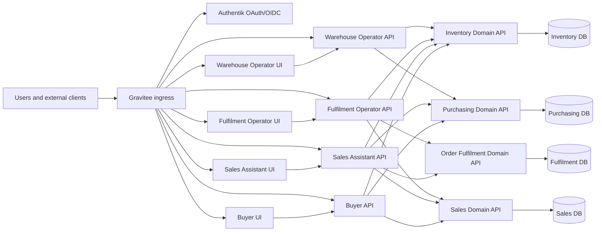

# Domain and Application Boundaries

## Status

This document defines the target split between domain bounded contexts and user-facing applications for the ACME ERP.

## Boundary Rules

- Domain services represent bounded contexts in the domain layer.
- Domain services expose WebAPI contracts and own durable business state.
- Domain services own their own SQL Server databases and EF Core migrations.
- Domain services do not have Razor Pages UI services.
- Application services represent user-facing workloads for specific roles or channels.
- Each application has exactly one Razor Pages UI and exactly one application WebAPI.
- Application UIs call only their paired application API.
- Application APIs do not own databases, EF Core migrations, or durable business state.
- Application APIs orchestrate role workflows by calling one or more domain APIs.
- Authentication and identity are cross-cutting platform concerns handled by Authentik and Gravitee using OAuth2/OIDC.
- Authorization and access permissions are owned by each UI/application workflow and paired application API, with domain APIs enforcing business authorization, validation, state transitions, data-scope checks, and business invariants for their bounded context.
- All user and external client traffic enters through Gravitee and uses Authentik-backed identity.

## Domain Bounded Contexts

| Domain bounded context | Domain API | Database | Owns | Does not own |
|---|---|---|---|---|
| Sales | `Acme.Erp.Sales.Api` | Sales database | Customer account reference data for MVP, sales orders, order channels, buyer request state, release-to-fulfilment decisions | User interface flows, picking, packing, shipping, purchase order authoring, stock balance updates |
| Purchasing | `Acme.Erp.Purchasing.Api` | Purchasing database | Supplier reference data for MVP, purchase orders, purchase order approval state, buyer request queue state, purchase order receipt visibility | User interface flows, goods receipt booking, inventory balances, sales order entry, finance postings |
| Inventory Management | `Acme.Erp.InventoryManagement.Api` | Inventory database | Product/SKU/barcode/stocking configuration for MVP, recorded stock, reservations, goods receipts, stock checks, stock movements, discrepancy state | User interface flows, purchase order authoring, sales order authoring, courier shipment purchase |
| Order Fulfilment | `Acme.Erp.OrderFulfilment.Api` | Fulfilment database | Fulfilment task state, pick/pack/ship/completion rules, courier shipment purchase records, label references, fulfilment exceptions | User interface flows, sales order creation, product master ownership, stock balance authority |

## Application Services

The MVP no longer includes a Security and Audit bounded context, Security Administration application, or active auditing/compliance workflows. Authentication and identity are cross-cutting platform concerns handled by Authentik and Gravitee through OAuth2/OIDC. Each role-focused UI/application owns its own access-permission experience and its paired API enforces workflow authorization before calling domain APIs. Domain APIs remain authoritative for their own business rules, state transitions, data ownership, and domain-specific authorization checks.

| Application | Application UI | Application API | Primary users | Domain APIs consumed | Database |
|---|---|---|---|---|---|
| Sales Assistant | `Acme.Erp.SalesAssistant.Ui` | `Acme.Erp.SalesAssistant.Api` | Sales Assistant, Sales Supervisor | Sales, Inventory Management, Purchasing, Order Fulfilment | None |
| Customer Ordering | `Acme.Erp.CustomerOrdering.Ui` | `Acme.Erp.CustomerOrdering.Api` | Authenticated Customer | Sales, Inventory Management | None |
| Buyer | `Acme.Erp.Buyer.Ui` | `Acme.Erp.Buyer.Api` | Buyer, Purchasing Manager | Purchasing, Sales, Inventory Management | None |
| Warehouse Operator | `Acme.Erp.WarehouseOperator.Ui` | `Acme.Erp.WarehouseOperator.Api` | Warehouse Operator | Inventory Management, Purchasing | None |
| Fulfilment Operator | `Acme.Erp.FulfilmentOperator.Ui` | `Acme.Erp.FulfilmentOperator.Api` | Fulfilment Operator | Order Fulfilment, Sales, Inventory Management | None |
| Inventory Supervisor | `Acme.Erp.InventorySupervisor.Ui` | `Acme.Erp.InventorySupervisor.Api` | Inventory Supervisor | Inventory Management, Purchasing, Order Fulfilment | None |
| Fulfilment Supervisor | `Acme.Erp.FulfilmentSupervisor.Ui` | `Acme.Erp.FulfilmentSupervisor.Api` | Fulfilment Supervisor | Order Fulfilment, Sales, Inventory Management | None |

## Boundary Diagram

## Review Checklist

- [ ] Every domain bounded context has one database-owning API and no UI service.
- [ ] Every application has one UI and one API.
- [ ] Every application UI calls only its paired application API.
- [ ] Application APIs do not connect to SQL Server or own EF Core migrations.
- [ ] Application APIs communicate with domain APIs for all durable business state changes.
- [ ] Domain APIs remain responsible for business authorization, validation, persistence, and domain invariants.
- [ ] Cross-domain references use external ID columns and integration contracts.
- [ ] All ingress is routed through Gravitee with Authentik-backed identity.