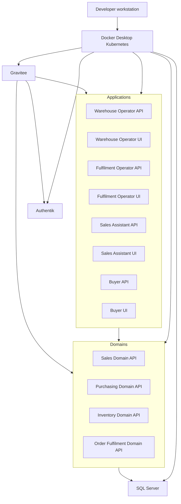

# Local Kubernetes Runtime

## Status

This document defines the local Docker Desktop Kubernetes runtime architecture and developer validation flow.

## Runtime Goals

- Run the complete ERP locally using Docker Desktop, Kubernetes, and Skaffold.
- Include SQL Server, Authentik, Gravitee, all domain API services, all application API services, all application UI services, and local configuration dependencies.
- Keep generated local secrets out of source control.
- Provide repeatable bootstrap and validation scripts for developers.

## Prerequisites

- .NET 10 SDK
- Docker Desktop with Kubernetes enabled
- `kubectl` configured for the `docker-desktop` context
- Skaffold
- Helm
- Optional `sqlcmd` for manual SQL Server inspection

## Local Topology



## Skaffold Profiles

| Profile | Purpose | Assets |
|---|---|---|
| `platform` | Deploy shared local platform prerequisites | Namespaces, SQL Server, Authentik bootstrap ConfigMap, Gravitee route ConfigMap |
| `apps` | Build and deploy ERP domain and application services | Domain API images, application API images, application UI images, and service manifests |
| `all` | Deploy platform and applications together | Platform and app manifests |

`bootstrap-local.ps1` installs Authentik and Gravitee Helm releases because their local values require generated secrets. Skaffold manages raw manifests and app image builds.

## Deployment Units

| Unit | Location | Notes |
|---|---|---|
| Skaffold config | `build/skaffold.yaml` | Builds local images with `push: false` and applies Kubernetes manifests. |
| App manifests | `build/k8s/services/*.yaml` | Workloads and services for API/UI projects. |
| Namespace manifest | `build/k8s/namespaces/erp-local.yaml` | Local ERP namespace setup. |
| SQL Server manifests | `build/k8s/sqlserver/*` | SQL Server deployment and bootstrap job. |
| Authentik assets | `build/k8s/authentik/*` | Local values and bootstrap blueprint ConfigMap. |
| Gravitee assets | `build/k8s/gravitee/*` | Local values and route configuration. |
| Bootstrap script | `build/scripts/bootstrap-local.ps1` | Prerequisites, secrets, Helm, Skaffold, readiness. |
| Validation script | `build/scripts/validate-local.ps1` | Build and local runtime checks. |

## Local Secret and Configuration Rules

- Generated local secrets live under `build/.local/` and are ignored by Git.
- Existing local secrets are preserved by default.
- Use `-RotateSecrets` only when intentionally replacing local credentials.
- Kubernetes Secrets hold local SQL Server, Authentik, Gravitee, OIDC, and service credential material.
- Do not commit generated passwords, client secrets, local tokens, or machine-specific kubeconfig data.

## Bootstrap Flow

From the repository root:

```powershell
Set-ExecutionPolicy -Scope Process -ExecutionPolicy Bypass
.\build\scripts\bootstrap-local.ps1 -DeploymentScope platform
.\build\scripts\bootstrap-local.ps1 -DeploymentScope apps
```

Use `-DeploymentScope all` when a full local deployment is desired in one operation. Use `-SkipDeploy` when prerequisites and secrets should be generated without deployment.

The bootstrap script validates tools, Kubernetes context, namespace creation, local secrets, platform workloads, Helm releases, Skaffold deployment, and SQL Server bootstrap readiness.

## Validation Flow

```powershell
.\build\scripts\validate-local.ps1
```

Validation builds the solution, checks expected Kubernetes resources, waits for SQL Server bootstrap completion, waits for Authentik and Gravitee workloads, validates route configuration, and performs in-cluster HTTP checks through the Kubernetes service proxy. It does not create validation pods or gateway exposure.

Host-level UI reachability can be checked through the same script:

```powershell
.\build\scripts\validate-local.ps1 -IncludeExternalUi
```

This mode expects the local Gravitee gateway to be reachable at `http://localhost:8082`. The local Gravitee Helm values configure Gravitee in database-less gateway-only mode and expose only the gateway service as a Docker Desktop `LoadBalancer` on port `8082`. Gravitee Management API, portal, UI, MongoDB, and Elasticsearch are not deployed locally. Authentik, SQL Server, and ERP service endpoints remain internal `ClusterIP` services unless otherwise documented. Confirm the endpoint after platform deployment:

```powershell
kubectl get service gravitee-apim-gateway -n erp-local
```

The validation script does not create gateway exposure. It checks `/apps/sales-assistant/ui`, `/apps/customer-ordering/ui`, `/apps/buyer/ui`, `/apps/warehouse-operator/ui`, `/apps/fulfilment-operator/ui`, `/apps/inventory-supervisor/ui`, and `/apps/fulfilment-supervisor/ui` through `http://localhost:8082`.

Gravitee route publication is configuration-driven. The database-less gateway watches Kubernetes ConfigMaps labeled `managed-by=gravitee.io` and `gio-type=apidefinitions.gravitee.io`; the local route definitions live in `build/k8s/gravitee/route-config.yaml`. If external UI validation cannot reach the gateway or returns `404` for every UI route, validation fails because gateway exposure or ConfigMap synchronization is missing or incorrect.

## Health and Readiness

- All services expose `/healthz` and `/readyz`.
- Domain and application APIs also expose `/openapi/v1.json`.
- Readiness must fail when a service cannot serve its core workflow safely.
- Health endpoints must not leak secrets or sensitive configuration.

## Review Checklist

- [ ] The full local stack runs inside Docker Desktop Kubernetes.
- [ ] SQL Server, Authentik, Gravitee, domain APIs, application APIs, and application UIs are included.
- [ ] Skaffold builds all configured local service images.
- [ ] Local secrets are generated and ignored by Git.
- [ ] Bootstrap works for `platform`, `apps`, and `all` deployment scopes.
- [ ] Validation builds the solution, verifies platform and app readiness, and can optionally verify host-level UI reachability.
- [ ] App traffic is designed for Gravitee ingress, with local routes synchronized from database-less Gravitee ConfigMaps.
