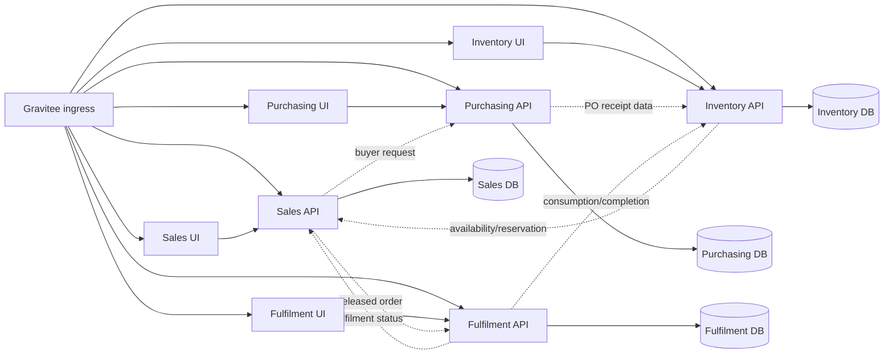

# Module Boundaries

## Status

This document defines the first-release service, UI, database, and integration ownership boundaries for the ACME ERP modules.

## Source Requirements

Requirements-derived constraints come from:

- `docs/cross-cutting/requirements.md`
- `docs/sales/requirements.md`
- `docs/purchasing/requirements.md`
- `docs/inventory-management/requirements.md`
- `docs/order-fulfilment/requirements.md`

## Requirements-Derived Constraints

- Each ERP module has a separate WebAPI service, Razor Pages UI service, and SQL Server database.
- Razor Pages UI services are presentation-only clients. They do not access databases directly.
- WebAPI services are the only database access path.
- Cross-module data references use external ID columns and integration contracts, not cross-database foreign keys.
- All user and external client ingress enters through Gravitee.
- API services enforce business authorization, segregation of duties, validation, persistence, and audit behavior.
- Authentik provides OAuth/OIDC identity for users, administrators, customers where applicable, and service identities.

## Service Ownership Matrix

| Module | API service | UI service | Database | Owns | Does not own |
|---|---|---|---|---|---|
| Sales | `Acme.Erp.Sales.Api` | `Acme.Erp.Sales.Ui` | Sales database | Customer account reference data for MVP, sales orders, order channels, buyer requests, release-to-fulfilment decisions | Picking, packing, shipping, PO creation, stock balance updates |
| Purchasing | `Acme.Erp.Purchasing.Api` | `Acme.Erp.Purchasing.Ui` | Purchasing database | Supplier reference data for MVP, purchase orders, buyer review queue, purchasing approvals, PO status | Goods receipt booking, inventory balances, sales order entry, finance postings |
| Inventory Management | `Acme.Erp.InventoryManagement.Api` | `Acme.Erp.InventoryManagement.Ui` | Inventory database | Product/SKU/barcode/stocking configuration for MVP, recorded stock, availability, reservations, goods receipts, stock checks, stock movements | Purchase order authoring, sales order authoring, courier shipment purchase |
| Order Fulfilment | `Acme.Erp.OrderFulfilment.Api` | `Acme.Erp.OrderFulfilment.Ui` | Fulfilment database | Released fulfilment work, picking, packing, courier shipment purchase, label references, fulfilment completion, exceptions | Sales order creation, product master ownership, stock balance authority |
| Cross-cutting | Shared projects and platform services where explicitly introduced | Security/audit administration views where required | Separate storage only if a cross-cutting service is introduced | Identity integration conventions, authorization policy support, audit conventions, correlation, observability, OpenAPI conventions, health, testing support | Module-specific workflow behavior |

## Boundary Diagram

## Module Decisions

### Sales

Sales owns the sales order lifecycle from draft through release, cancellation before fulfilment work starts, and status reconciliation after fulfilment updates. Sales stores the customer account reference data needed for the MVP and must identify the sales channel for every order.

Sales depends on Inventory Management for active stocked product availability and on Purchasing for non-routinely stocked product requests. Sales may display fulfilment status returned by Order Fulfilment but does not own warehouse execution.

Key external references include `ExternalInventoryItemId`, `ExternalBuyerRequestId`, and `ExternalFulfilmentTaskId` where the Sales database needs durable links to records owned outside Sales.

### Purchasing

Purchasing owns supplier-backed purchase orders, buyer workflow, PO approval controls, buyer review of non-routinely stocked product requests, and PO data needed by Inventory Management for goods receipt matching.

Purchasing does not book goods into stock. It receives receipt status and exceptions from Inventory Management to maintain PO receipt visibility.

Key external references include `ExternalSalesBuyerRequestId`, `ExternalInventoryReceiptId`, and `ExternalProductId` where Purchasing records depend on external ownership.

### Inventory Management

Inventory Management is the stock system of record. It owns product, SKU, barcode, stocking, and serialized-product configuration for the MVP. It owns stock checks, discrepancy review, goods receipt booking, available/non-available stock states, reservations, and immutable stock movements.

Inventory validates goods receipts against Purchasing PO data and publishes availability to Sales and Order Fulfilment. Inventory reserves stock at fulfilment release and consumes stock at fulfilment completion.

Key external references include `ExternalPurchaseOrderId`, `ExternalPurchaseOrderLineId`, `ExternalSalesOrderId`, and `ExternalFulfilmentTaskId`.

### Order Fulfilment

Order Fulfilment owns warehouse execution after Sales releases an eligible order. It owns the fulfilment queue, picking, packing, courier shipment purchase, label data, completion, partial fulfilment, and fulfilment exceptions.

Order Fulfilment initiates reservation, consumption, and reversal requests through Inventory Management but does not directly update stock balances. It reports completion, partial fulfilment, shipment references, and exceptions back to Sales.

Key external references include `ExternalSalesOrderId`, `ExternalSalesOrderLineId`, `ExternalInventoryReservationId`, and `ExternalInventoryMovementId`.

## Integration Contract Rules

- Every cross-module command or event carries a correlation identifier, source service, target service, idempotency key where mutation may be retried, and external record identifiers.
- APIs reject incomplete cross-module payloads rather than inferring missing ownership data.
- Read models copied from another module record source, version, update time, and external ID.
- Status feedback is explicit. A consumer may cache the last known status but must expose stale or failed integration state where it affects user decisions.
- Finance integrations are future scope for the MVP; operational CSV exports and reports provide interim visibility.

## Review Checklist

- [ ] Each module has one API, one UI, and one owned database.
- [ ] UI services call APIs and never connect directly to SQL Server.
- [ ] WebAPI services own all persistence and EF Core migrations for their databases.
- [ ] Cross-module references use external ID columns.
- [ ] Sales releases orders and Order Fulfilment executes warehouse work.
- [ ] Inventory reserves at fulfilment release and consumes at fulfilment completion.
- [ ] Purchasing supplies PO data for inventory receipt validation but does not book stock.
- [ ] All ingress is routed through Gravitee with Authentik-backed identity.
