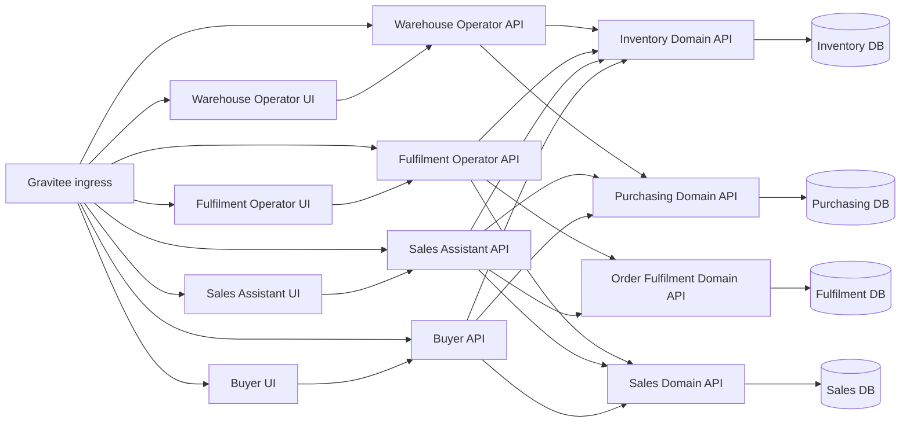

# Module Boundaries

## Status

This document is retained as a compatibility summary for earlier module-based wording. The controlling boundary model is now `docs/architecture/domain-and-application-boundaries.md`.

The architecture no longer treats each ERP module as a full-stack `API + UI + database` unit. Bounded contexts are domain services. User-facing workloads are application services.

## Updated Boundary Rules

- Domain bounded contexts own durable business state and SQL Server databases.
- Domain bounded contexts expose WebAPI contracts and do not own Razor Pages UI services.
- Application services own user-facing workflows for roles or channels.
- Each application service has exactly one Razor Pages UI and exactly one application WebAPI.
- Application UIs call only their paired application APIs.
- Application APIs do not own databases, EF Core migrations, or durable business state.
- Application APIs call one or more domain APIs to read or mutate durable business state.
- Domain APIs remain authoritative for business authorization, validation, persistence, domain invariants, audit decisions, and segregation-of-duties enforcement.

## Domain Boundary Matrix

| Domain bounded context | Domain API | Database | Owns | Does not own |
|---|---|---|---|---|
| Sales | `Acme.Erp.Sales.Api` | Sales database | Customer account reference data for MVP, sales orders, order channels, buyer request state, release-to-fulfilment decisions | Sales assistant UI, customer ordering UI, picking, packing, shipping, PO creation, stock balance updates |
| Purchasing | `Acme.Erp.Purchasing.Api` | Purchasing database | Supplier reference data for MVP, purchase orders, buyer request queue state, purchasing approvals, PO status | Buyer UI, goods receipt booking, inventory balances, sales order entry, finance postings |
| Inventory Management | `Acme.Erp.InventoryManagement.Api` | Inventory database | Product/SKU/barcode/stocking configuration for MVP, recorded stock, availability, reservations, goods receipts, stock checks, stock movements | Warehouse UI, purchase order authoring, sales order authoring, courier shipment purchase |
| Order Fulfilment | `Acme.Erp.OrderFulfilment.Api` | Fulfilment database | Fulfilment task state, picking, packing, courier shipment records, label references, completion, exceptions | Fulfilment application UI, sales order creation, product master ownership, stock balance authority |
| Security and Audit | Explicit platform/domain services when introduced | Separate storage only where a service is explicitly introduced | Identity integration conventions, authorization policy support, audit, access review, service account policy | Domain-specific workflow behaviour |

## Application Boundary Matrix

| Application | Application API | Application UI | Primary users | Domain APIs consumed | Database |
|---|---|---|---|---|---|
| Sales Assistant | `Acme.Erp.SalesAssistant.Api` | `Acme.Erp.SalesAssistant.Ui` | Sales Assistant, Sales Supervisor | Sales, Inventory Management, Purchasing, Order Fulfilment | None |
| Customer Ordering | `Acme.Erp.CustomerOrdering.Api` | `Acme.Erp.CustomerOrdering.Ui` | Authenticated Customer | Sales, Inventory Management | None |
| Buyer | `Acme.Erp.Buyer.Api` | `Acme.Erp.Buyer.Ui` | Buyer, Purchasing Manager | Purchasing, Sales, Inventory Management | None |
| Warehouse Operator | `Acme.Erp.WarehouseOperator.Api` | `Acme.Erp.WarehouseOperator.Ui` | Warehouse Operator | Inventory Management, Purchasing | None |
| Fulfilment Operator | `Acme.Erp.FulfilmentOperator.Api` | `Acme.Erp.FulfilmentOperator.Ui` | Fulfilment Operator | Order Fulfilment, Sales, Inventory Management | None |
| Inventory Supervisor | `Acme.Erp.InventorySupervisor.Api` | `Acme.Erp.InventorySupervisor.Ui` | Inventory Supervisor | Inventory Management, Purchasing, Order Fulfilment | None |
| Fulfilment Supervisor | `Acme.Erp.FulfilmentSupervisor.Api` | `Acme.Erp.FulfilmentSupervisor.Ui` | Fulfilment Supervisor | Order Fulfilment, Sales, Inventory Management | None |
| Security Administration | `Acme.Erp.SecurityAdministration.Api` | `Acme.Erp.SecurityAdministration.Ui` | Security Administrator, System Administrator | Security and Audit services, Authentik integration, domain metadata APIs | None |
| Audit Reporting | `Acme.Erp.AuditReporting.Api` | `Acme.Erp.AuditReporting.Ui` | Auditor, Security Administrator, business control owners | Security and Audit services, domain audit/reporting APIs | None |

## Boundary Diagram

## Integration Contract Rules

- Every cross-service command or event carries a correlation identifier, source service, target service, idempotency key where mutation may be retried, and external record identifiers.
- Application APIs may compose domain API calls but must not infer ownership data that domain APIs require.
- Domain APIs reject incomplete cross-domain payloads rather than inferring missing ownership data.
- Read models copied from another domain record source, version, update time, and external ID.
- Status feedback is explicit. A consumer may cache the last known status but must expose stale or failed integration state where it affects user decisions.
- Finance integrations are future scope for the MVP; operational CSV exports and reports provide interim visibility.

## Review Checklist

- [ ] Each domain bounded context has one database-owning API and no UI.
- [ ] Each application has one UI and one API.
- [ ] Application UI services call only their paired application APIs.
- [ ] Application APIs call domain APIs and never connect directly to SQL Server.
- [ ] Domain APIs own persistence and EF Core migrations for their databases.
- [ ] Cross-domain references use external ID columns.
- [ ] Sales releases orders and Order Fulfilment executes warehouse fulfilment state.
- [ ] Inventory reserves at fulfilment release and consumes at fulfilment completion.
- [ ] Purchasing supplies PO data for inventory receipt validation but does not book stock.
- [ ] All ingress is routed through Gravitee with Authentik-backed identity.