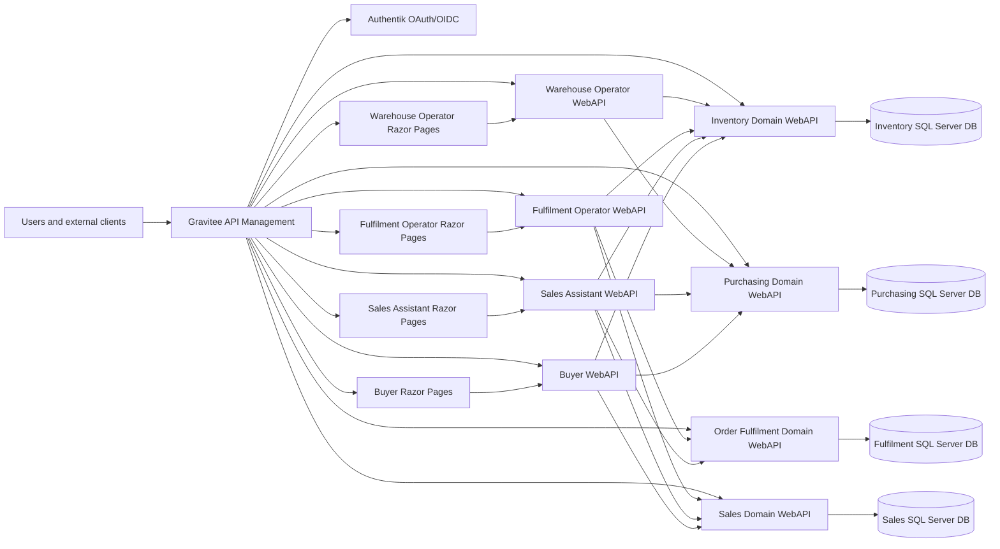

# ERP Architecture Overview

## Status

This is the initial architecture baseline for the ERP system. It records fixed decisions, service boundaries, and the documentation structure that the architecture specification agent should expand.

## Source Requirements

The architecture is derived from these requirement sources:

- `docs/domain/*/requirements.md`
- `docs/application/*/requirements.md`

## ACME Context Assumptions

- ACME is a medium-sized B2B seller of computer systems.
- ACME operates from a single office and a single warehouse.
- The initial catalog contains approximately 1,000 active products.
- ACME works with approximately 10 to 20 active suppliers.
- ACME serves approximately 100 business customers.
- The ERP is an internal system on a protected network.
- Authentication and identity are provided by Authentik with password-only login for the initial release and Gravitee OAuth/OIDC ingress integration.

## Fixed Technology Stack

| Area | Decision |
|---|---|
| Repository style | Microservices architecture in a monorepo |
| Local runtime | Docker Desktop, Kubernetes, Skaffold |
| Language and runtime | Latest C# language version, .NET 10 |
| API framework | ASP.NET Core WebAPI using Controllers |
| UI framework | ASP.NET Razor Pages with server-side rendering |
| Persistence | Entity Framework Core Code-First with migrations |
| Database engine | SQL Server |
| Testing | XUnit v3 |
| API management | Gravitee |
| Identity provider | Authentik using OAuth/OIDC |
| API contract standard | OpenAPI 3.0 |
| Code quality | Full analyzers enabled with the strictest feasible Microsoft-aligned settings |

## Non-Negotiable Architecture Constraints

- The full system, including SQL Server, Gravitee, Authentik, and service dependencies, must run locally in Kubernetes/Docker.
- All traffic must enter through Gravitee.
- Authentik must integrate with Gravitee.
- Razor Pages apps must be separate from WebAPI services.
- Domain services must be WebAPI services and must not have Razor Pages UI services.
- Domain services represent bounded contexts and each domain service must own its own database.
- Application services must have a 1:1 relationship between each Razor Pages UI and its paired application WebAPI.
- Application UIs must call only their paired application APIs.
- Application APIs must not own databases or EF Core migrations.
- Application APIs must communicate with domain APIs for durable business state and domain decisions.
- Only database-owning domain WebAPI services may communicate with SQL Server databases.
- Database primary keys must use SQL Server `UNIQUEIDENTIFIER` and .NET `System.Guid`.
- Cross-database references must use external ID columns rather than cross-database foreign keys.
- Layered architecture is required inside services.
- File and class organization must remain feature-oriented and vertical-slice friendly.
- Common platform concerns must be documented as conventions and implemented inside the owning service unless a later explicit architecture decision reintroduces shared projects.

## Initial Boundary Model

Domain bounded contexts own durable business state and expose WebAPI contracts. User-facing workloads are separate application services with a paired UI and API.

The MVP no longer includes a Security and Audit bounded context, Security Administration application, Audit Reporting application, or active auditing/compliance workflows. Authentication and identity are cross-cutting platform concerns handled by Authentik and Gravitee through OAuth2/OIDC. Each role-focused UI/application owns its own access-permission experience and its paired API enforces workflow authorization before calling domain APIs. Domain APIs remain authoritative for their own business rules, state transitions, data ownership, and domain-specific authorization checks.

| Domain bounded context | Domain API responsibility | Database ownership | UI ownership |
|---|---|---|---|
| Sales | Sales order state, customer account reference data for MVP, order channels, buyer request state, release-to-fulfilment decisions, sales operational history | Sales database | None |
| Purchasing | Supplier reference data for MVP, purchase orders, buyer request queue state, purchasing approvals, purchase order receipt visibility | Purchasing database | None |
| Inventory Management | Product/SKU/barcode/stocking configuration for MVP, recorded stock, availability, reservations, goods receipts, stock checks, stock movements | Inventory database | None |
| Order Fulfilment | Fulfilment task state, pick/pack/ship/completion rules, courier shipment records, label references, fulfilment exceptions | Fulfilment database | None |

| Application | Application API responsibility | Application UI responsibility | Database ownership |
|---|---|---|---|
| Sales Assistant | Orchestrates Sales, Inventory Management, Purchasing, and Order Fulfilment for internal sales order entry and monitoring | Sales assistant and sales supervisor workflows | None |
| Customer Ordering | Orchestrates Sales and Inventory Management for authenticated customer website orders and own-order visibility | Customer order submission and order status views | None |
| Buyer | Orchestrates Purchasing, Sales, and Inventory Management for PO entry, buyer requests, approvals, and receipt visibility | Buyer and purchasing manager workflows | None |
| Warehouse Operator | Orchestrates Inventory Management and Purchasing for stock checks and goods receipt | Warehouse stock count and goods receipt workflows | None |
| Fulfilment Operator | Orchestrates Order Fulfilment, Sales, and Inventory Management for pick, pack, ship, label, and completion work | Fulfilment operator workflows | None |
| Inventory Supervisor | Orchestrates Inventory Management, Purchasing, and Order Fulfilment for discrepancy and receipt exception review | Inventory supervisor workflows | None |
| Fulfilment Supervisor | Orchestrates Order Fulfilment, Sales, and Inventory Management for fulfilment exception review | Fulfilment supervisor workflows | None |

## Traffic and Identity Baseline

Gateway responsibilities include ingress, route publication, authentication integration, coarse-grained access policy, API subscription policy where needed, request correlation, and OpenAPI exposure.

Domain API services remain responsible for business authorization, local self-approval rules, validation, persistence, and operational history. Application APIs enforce workflow and route authorization for user experience before calling domain APIs, but they do not replace domain API authorization.

## Data Ownership Baseline

- A domain service may write only to its own database.
- An application service may not write to any database.
- A service may reference records owned by another service only through external ID columns.
- No domain database may enforce foreign keys into another domain database.
- Integration contracts must define the meaning, source, and lifecycle of external IDs.
- EF Core migrations are owned by the domain WebAPI project or an adjacent domain-owned persistence project for that database.

Example external ID conventions:

| Owning domain | Referencing domain | Example column |
|---|---|---|
| Sales | Fulfilment | `ExternalSalesOrderId` |
| Purchasing | Inventory | `ExternalPurchaseOrderId` |
| Inventory | Sales | `ExternalInventoryItemId` |
| Inventory | Fulfilment | `ExternalInventoryMovementId` |

## Internal Service Architecture Baseline

Each WebAPI service should use layered architecture while grouping code by feature or workflow. A feature may contain API boundary code, application orchestration, domain rules, persistence configuration, and tests that are specific to that feature.

Recommended feature-oriented examples:

- `SalesOrderEntry`
- `InventoryAvailability`
- `GoodsReceipt`
- `PurchaseOrderApproval`
- `FulfilmentPicking`
- `FulfilmentShipping`
- `StockDiscrepancyReview`

Avoid broad technical buckets such as `Models`, `Helpers`, `Utils`, or a catch-all `Controllers` folder as the primary organization method.

## Architecture Document Set

This baseline is expanded by these architecture documents:

| Document | Purpose |
|---|---|
| `domain-and-application-boundaries.md` | Detailed ownership across database-owning domain APIs and database-free application UI/API pairs |
| `module-boundaries.md` | Legacy compatibility summary that points to the domain/application boundary model |
| `monorepo-structure.md` | Repository, project, namespace, Docker image, and deployment asset conventions |
| `service-internal-architecture.md` | Layering and vertical-slice organization rules |
| `data-architecture.md` | SQL Server, EF Core, migrations, keys, external IDs, and consistency rules |
| `api-gateway-and-identity.md` | Gravitee, Authentik, OAuth/OIDC, OpenAPI, and ingress conventions |
| `local-kubernetes-runtime.md` | Docker Desktop, Kubernetes, Skaffold, local dependencies, and developer flow |
| `testing-and-quality.md` | XUnit v3, analyzers, validation gates, and smoke tests |
| `cross-cutting-projects.md` | Retired note for shared cross-cutting project scope |
| `decisions-and-open-questions.md` | Architecture decisions, assumptions, risks, and unresolved policy decisions |

## Architecture Decisions

- Approval thresholds shall be configurable by domain and role. Initial defaults are: purchase orders over 10,000 require Purchasing Manager approval; inventory adjustments over 2,000 value or 10 percent variance require Inventory Supervisor approval; sales overrides and post-confirmation cancellations over 5,000 require Sales Manager approval; fulfilment substitutions, short picks, and completion overrides require Fulfilment Supervisor approval.
- Inventory shall be reserved when Sales releases an eligible order to Order Fulfilment. Draft, submitted, and confirmed orders may check availability but shall not reserve stock.
- Partial fulfilment shall be allowed. Unfulfilled stocked items remain on backorder, and non-routinely stocked items are routed through the buyer request process.
- Authentik shall provide password-only authentication for the initial protected-network release. MFA is deferred unless ACME later exposes the ERP outside the protected network or requires privileged-user MFA.
- Sessions shall use a 60 minute idle timeout and an 8 hour absolute timeout. Account lockout shall be enforced through Authentik after repeated failed login attempts.
- The MVP does not include a Security and Audit bounded context, Security Administration application, Audit Reporting application, or active auditing/compliance workflows. Operational history remains owned by the domain that owns the business state.
- The MVP documentation no longer defines or requires shared cross-cutting projects. Platform responsibilities remain documented in the architecture areas that own them, and each service implements its own OpenAPI, health, logging, diagnostics, correlation, idempotency, authorization, and operational-history behavior.
- Local self-approval rules shall prevent users from approving controlled business actions that they created or requested. Users may hold multiple operational roles when each owning domain allows the resulting permissions.
- All user and external client ingress shall pass through Gravitee. Internal Kubernetes service calls are permitted after ingress for trusted application-to-domain and domain-to-domain APIs where contracts, service identity, correlation, authorization, and operational-history requirements are enforced by the called API.

## MVP Scope Decisions

- No separate master-data service is required for the first implementation. Inventory Management owns the MVP product catalog, SKU, barcode, stocking, and serialized-product configuration. Sales owns customer account reference data. Purchasing owns supplier reference data. Other domains keep only the external IDs and read models needed for their workflows. Application services do not own master data.
- The first release shall support one courier integration path. Royal Mail is the default first provider unless ACME supplies a different existing courier account before implementation starts. FedEx, DHL, and additional provider adapters are future scope.
- Finance integration is not part of the MVP. AP, AR, invoicing, tax, payment, and automated finance event export are future scope; MVP users rely on operational reports and CSV exports where finance visibility is needed.