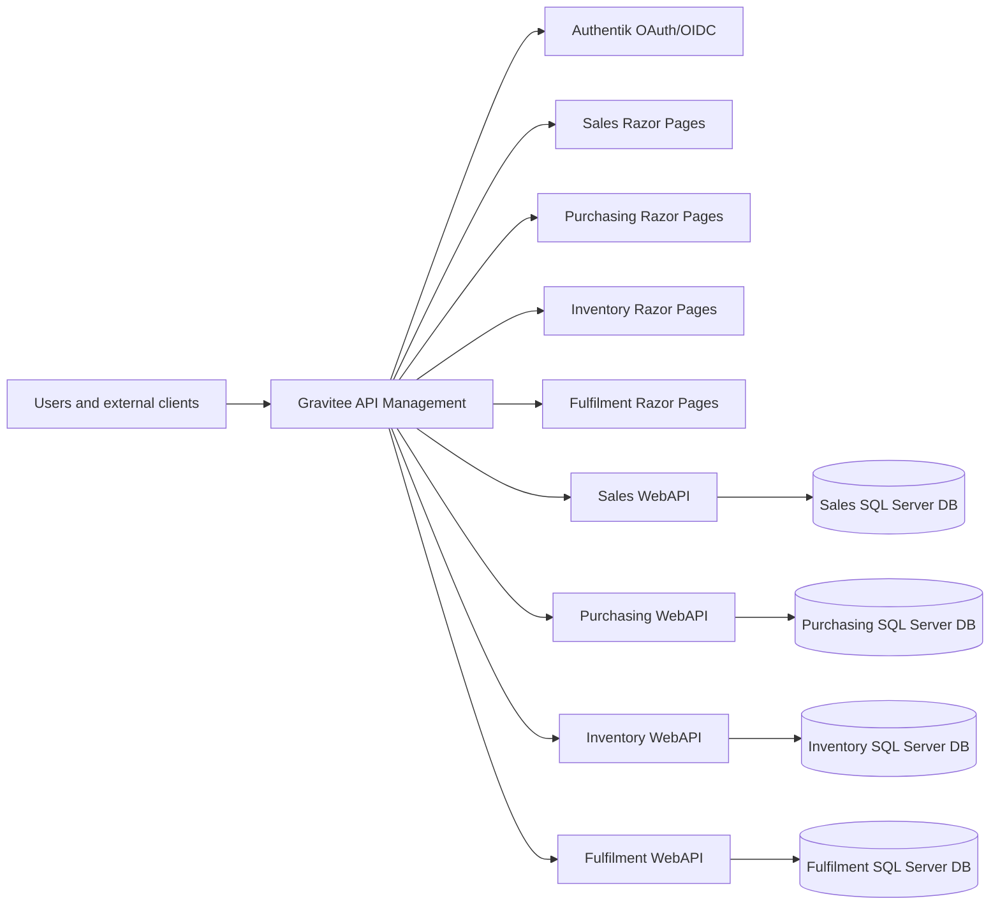

# ERP Architecture Overview

## Status

This is the initial architecture baseline for the ERP system. It records fixed decisions, service boundaries, and the documentation structure that the architecture specification agent should expand.

## Source Requirements

The architecture is derived from these requirement sources:

- `cross-cutting/requirements.md`
- `sales/requirements.md`
- `purchasing/requirements.md`
- `inventory-management/requirements.md`
- `order-fulfilment/requirements.md`

## ACME Context Assumptions

- ACME is a medium-sized B2B seller of computer systems.
- ACME operates from a single office and a single warehouse.
- The initial catalog contains approximately 1,000 active products.
- ACME works with approximately 10 to 20 active suppliers.
- ACME serves approximately 100 business customers.
- The ERP is an internal system on a protected network.
- Authentication is provided by Authentik with password-only login for the initial release.

## Fixed Technology Stack

| Area | Decision |
|---|---|
| Repository style | Microservices architecture in a monorepo |
| Local runtime | Docker Desktop, Kubernetes, Skaffold |
| Language and runtime | Latest C# language version, .NET 10 |
| API framework | ASP.NET Core WebAPI using Controllers |
| UI framework | ASP.NET Razor Pages with server-side rendering |
| Persistence | Entity Framework Core Code-First with migrations |
| Database engine | SQL Server |
| Testing | XUnit v3 |
| API management | Gravitee |
| Identity provider | Authentik using OAuth/OIDC |
| API contract standard | OpenAPI 3.0 |
| Code quality | Full analyzers enabled with the strictest feasible Microsoft-aligned settings |

## Non-Negotiable Architecture Constraints

- The full system, including SQL Server, Gravitee, Authentik, and service dependencies, must run locally in Kubernetes/Docker.
- All traffic must enter through Gravitee.
- Authentik must integrate with Gravitee.
- Razor Pages apps must be separate from WebAPI services.
- Only WebAPI services may communicate with databases.
- Each ERP module must have separate services and a separate database.
- Database primary keys must use SQL Server `UNIQUEIDENTIFIER` and .NET `System.Guid`.
- Cross-database references must use external ID columns rather than cross-database foreign keys.
- Layered architecture is required inside services.
- File and class organization must remain feature-oriented and vertical-slice friendly.
- Cross-cutting concerns used by multiple APIs/services must be placed in separate shared projects.

## Initial Service Boundary Model

| Module | API service responsibility | UI service responsibility | Database ownership |
|---|---|---|---|
| Sales | Sales order intake, availability checks, non-stocked product request handling, release-to-fulfilment integration | Sales assistant and customer-facing order experiences | Sales database |
| Purchasing | Purchase order creation, buyer workflows, approval controls, supplier ordering, purchase-order data for receipt validation | Buyer and purchasing manager workflows | Purchasing database |
| Inventory Management | Stock system of record, availability, goods receipt, stock checks, discrepancy review, stock movement recording | Warehouse inventory operation workflows | Inventory database |
| Order Fulfilment | Released order queues, pick/pack/ship workflow, courier shipment purchase, label handling, fulfilment completion, stock consumption events | Fulfilment operator and supervisor workflows | Fulfilment database |
| Cross-cutting | Shared contracts and infrastructure for identity, authorization policy support, audit, correlation, OpenAPI conventions, health, observability, and testing support | Security administration and audit views where required | Separate storage only where a cross-cutting service is explicitly defined |

## Traffic and Identity Baseline

Gateway responsibilities include ingress, route publication, authentication integration, coarse-grained access policy, API subscription policy where needed, request correlation, and OpenAPI exposure.

API services remain responsible for business authorization, segregation-of-duties enforcement, validation, persistence, and audit decisions.

## Data Ownership Baseline

- A service may write only to its own database.
- A service may reference records owned by another service only through external ID columns.
- No module database may enforce foreign keys into another module database.
- Integration contracts must define the meaning, source, and lifecycle of external IDs.
- EF Core migrations are owned by the WebAPI project or an adjacent module-owned persistence project for that database.

Example external ID conventions:

| Owning module | Referencing module | Example column |
|---|---|---|
| Sales | Fulfilment | `ExternalSalesOrderId` |
| Purchasing | Inventory | `ExternalPurchaseOrderId` |
| Inventory | Sales | `ExternalInventoryItemId` |
| Inventory | Fulfilment | `ExternalInventoryMovementId` |

## Internal Service Architecture Baseline

Each WebAPI service should use layered architecture while grouping code by feature or workflow. A feature may contain API boundary code, application orchestration, domain rules, persistence configuration, and tests that are specific to that feature.

Recommended feature-oriented examples:

- `SalesOrderEntry`
- `InventoryAvailability`
- `GoodsReceipt`
- `PurchaseOrderApproval`
- `FulfilmentPicking`
- `FulfilmentShipping`
- `StockDiscrepancyReview`

Avoid broad technical buckets such as `Models`, `Helpers`, `Utils`, or a catch-all `Controllers` folder as the primary organization method.

## Documentation Backlog

The architecture specification agent should expand this baseline into these documents:

| Document | Purpose |
|---|---|
| `architecture/module-boundaries.md` | Detailed service/database/API/UI ownership by ERP module |
| `architecture/monorepo-structure.md` | Repository, project, namespace, Docker image, and deployment asset conventions |
| `architecture/service-internal-architecture.md` | Layering and vertical-slice organization rules |
| `architecture/data-architecture.md` | SQL Server, EF Core, migrations, keys, external IDs, and consistency rules |
| `architecture/api-gateway-and-identity.md` | Gravitee, Authentik, OAuth/OIDC, OpenAPI, and ingress conventions |
| `architecture/local-kubernetes-runtime.md` | Docker Desktop, Kubernetes, Skaffold, local dependencies, and developer flow |
| `architecture/testing-and-quality.md` | XUnit v3, analyzers, validation gates, and smoke tests |
| `architecture/cross-cutting-projects.md` | Shared projects for concerns that affect multiple APIs/services |
| `architecture/decisions-and-open-questions.md` | Architecture decisions, assumptions, risks, and unresolved policy decisions |

## Architecture Decisions

- Approval thresholds shall be configurable by module and role. Initial defaults are: purchase orders over 10,000 require Purchasing Manager approval; inventory adjustments over 2,000 value or 10 percent variance require Inventory Supervisor approval; sales overrides and post-confirmation cancellations over 5,000 require Sales Manager approval; fulfilment substitutions, short picks, and completion overrides require Fulfilment Supervisor approval.
- Inventory shall be reserved when Sales releases an eligible order to Order Fulfilment. Draft, submitted, and confirmed orders may check availability but shall not reserve stock.
- Partial fulfilment shall be allowed. Unfulfilled stocked items remain on backorder, and non-routinely stocked items are routed through the buyer request process.
- Authentik shall provide password-only authentication for the initial protected-network release. MFA is deferred unless ACME later exposes the ERP outside the protected network or requires privileged-user MFA.
- Sessions shall use a 60 minute idle timeout and an 8 hour absolute timeout. Account lockout shall be enforced through Authentik after repeated failed login attempts.
- Audit retention shall be 7 years for sales, purchasing, approval, and financially relevant business events; 3 years for inventory and fulfilment operational events; 1 year for authentication, authorization, and integration events unless linked to an incident; and 7 years for security incident evidence.
- Segregation of duties shall prevent users from approving transactions or access changes that they created or requested. Users may hold multiple operational roles only when the resulting role set does not violate configured conflict rules.
- All user and external client ingress shall pass through Gravitee. Internal Kubernetes service calls are permitted after ingress for trusted module-to-module APIs where contracts, service identity, correlation, authorization, and audit requirements are enforced by the called API.

## MVP Scope Decisions

- No separate master-data service is required for the first implementation. Inventory Management owns the MVP product catalog, SKU, barcode, stocking, and serialized-product configuration. Sales owns customer account reference data. Purchasing owns supplier reference data. Other modules keep only the external IDs and read models needed for their workflows.
- The first release shall support one courier integration path. Royal Mail is the default first provider unless ACME supplies a different existing courier account before implementation starts. FedEx, DHL, and additional provider adapters are future scope.
- Finance integration is not part of the MVP. AP, AR, invoicing, tax, payment, and automated finance event export are future scope; MVP users rely on operational reports and CSV exports where finance visibility is needed.