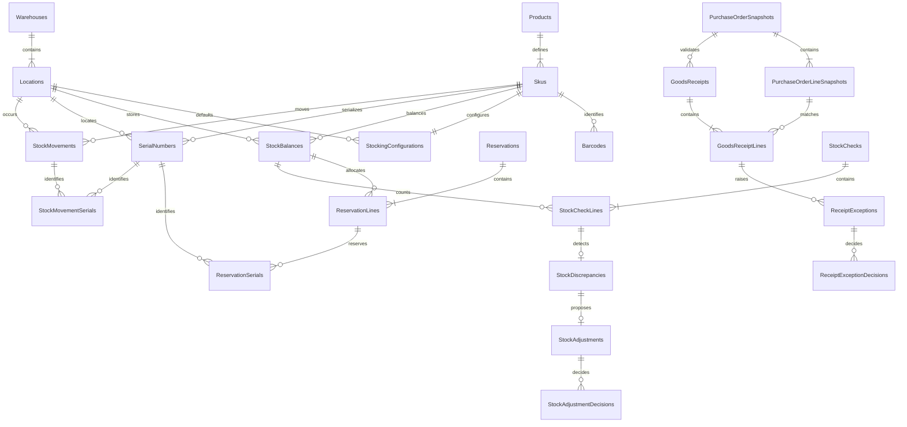

# Inventory Management Database Design

## Status and Authority

This document is the implementation-authoritative relational design for the Inventory Management domain database. Read it with the adjacent `requirements.md`, `../../architecture/data-architecture.md`, and `../../architecture/domain-and-application-boundaries.md`. The requirements control inventory semantics, shared data architecture controls common SQL/EF conventions, and this file controls Inventory tables, columns, relationships, constraints, indexes, and transaction boundaries.

Resolve conflicts before changing the EF Core model or generating a migration. Purchasing, Sales, and Order Fulfilment records are represented only by scalar external IDs or copied receipt-matching snapshots.

## Database Identity

| Item | Value |
|---|---|
| Runtime database | `inventory_db` |
| Owning service | `Acme.Erp.InventoryManagement.Api` |
| EF Core context | `InventoryManagementDbContext` |
| Connection key | `ConnectionStrings:DomainDatabase` |
| Schema | `dbo` |
| Migration history | `__InventoryManagementMigrationsHistory` |

## Relationship Diagram

Movement source links and business Inventory exceptions use typed scalar references and are omitted from the ERD for readability.

## Product and Location Configuration

### `Products`

| Column | SQL type | Null | Rules |
|---|---|---:|---|
| `Id` | `uniqueidentifier` | No | Primary key; generated by Inventory |
| `ProductCode` | `nvarchar(32)` | No | Stable unique product code |
| `Name` | `nvarchar(200)` | No | Non-empty |
| `Description` | `nvarchar(1000)` | Yes | Optional |
| `IsActive` | `bit` | No | Default `1` |
| `CreatedAt` | `datetimeoffset(7)` | No | UTC |
| `UpdatedAt` | `datetimeoffset(7)` | No | UTC |
| `RowVersion` | `rowversion` | No | Concurrency token |

Unique constraint: `UQ_Products_ProductCode`.

### `Skus`

| Column | SQL type | Null | Rules |
|---|---|---:|---|
| `Id` | `uniqueidentifier` | No | Primary key |
| `ProductId` | `uniqueidentifier` | No | FK to `Products.Id` |
| `SkuCode` | `nvarchar(64)` | No | Stable unique SKU |
| `Name` | `nvarchar(200)` | No | Non-empty |
| `UnitOfMeasure` | `nvarchar(16)` | No | Stable quantity unit |
| `IsSerialized` | `bit` | No | Serial tracking policy |
| `IsActive` | `bit` | No | Default `1` |
| `CreatedAt` | `datetimeoffset(7)` | No | UTC |
| `UpdatedAt` | `datetimeoffset(7)` | No | UTC |
| `RowVersion` | `rowversion` | No | Concurrency token |

Unique constraint: `UQ_Skus_SkuCode`.

### `Barcodes`

| Column | SQL type | Null | Rules |
|---|---|---:|---|
| `Id` | `uniqueidentifier` | No | Primary key |
| `SkuId` | `uniqueidentifier` | No | FK to `Skus.Id` |
| `Value` | `nvarchar(128)` | No | Globally unique barcode value |
| `BarcodeType` | `nvarchar(16)` | No | `EAN`, `UPC`, `Code128`, or `Other` |
| `IsPrimary` | `bit` | No | Default `0` |
| `IsActive` | `bit` | No | Default `1` |
| `CreatedAt` | `datetimeoffset(7)` | No | UTC |
| `UpdatedAt` | `datetimeoffset(7)` | No | UTC |
| `RowVersion` | `rowversion` | No | Concurrency token |

Unique constraint: `UQ_Barcodes_Value`. Filtered unique index: `UX_Barcodes_PrimarySku` on `SkuId` where `IsPrimary = 1 AND IsActive = 1`.

### `Warehouses`

| Column | SQL type | Null | Rules |
|---|---|---:|---|
| `Id` | `uniqueidentifier` | No | Primary key; deterministic MVP seed ID |
| `WarehouseCode` | `nvarchar(32)` | No | Unique code |
| `Name` | `nvarchar(100)` | No | Non-empty |
| `IsActive` | `bit` | No | Default `1` |
| `RowVersion` | `rowversion` | No | Concurrency token |

### `Locations`

| Column | SQL type | Null | Rules |
|---|---|---:|---|
| `Id` | `uniqueidentifier` | No | Primary key |
| `WarehouseId` | `uniqueidentifier` | No | FK to `Warehouses.Id` |
| `LocationCode` | `nvarchar(32)` | No | Unique within warehouse |
| `Name` | `nvarchar(100)` | No | Non-empty |
| `IsDefault` | `bit` | No | Default `0` |
| `IsActive` | `bit` | No | Default `1` |
| `CreatedAt` | `datetimeoffset(7)` | No | UTC |
| `UpdatedAt` | `datetimeoffset(7)` | No | UTC |
| `RowVersion` | `rowversion` | No | Concurrency token |

Unique constraint: `UQ_Locations_WarehouseCode` on `(WarehouseId, LocationCode)`. One active default location per warehouse is enforced by a filtered unique index.

### `StockingConfigurations`

| Column | SQL type | Null | Rules |
|---|---|---:|---|
| `Id` | `uniqueidentifier` | No | Primary key |
| `SkuId` | `uniqueidentifier` | No | FK to `Skus.Id`; unique |
| `DefaultLocationId` | `uniqueidentifier` | No | FK to `Locations.Id` |
| `IsStocked` | `bit` | No | Current stocked-product flag |
| `LocationTrackingEnabled` | `bit` | No | Location is always persisted; flag controls validation policy |
| `IsActive` | `bit` | No | Default `1` |
| `CreatedAt` | `datetimeoffset(7)` | No | UTC |
| `UpdatedAt` | `datetimeoffset(7)` | No | UTC |
| `RowVersion` | `rowversion` | No | Concurrency token |

## Current Stock Tables

### `StockBalances`

One row stores the current quantity for a SKU, location, and stock state. Available-to-promise is the sum of `Available` rows; recorded on-hand is the sum of all physical states, including `Reserved`, `Quarantine`, `Damaged`, `Rejected`, and `NonAvailable`.

| Column | SQL type | Null | Rules |
|---|---|---:|---|
| `Id` | `uniqueidentifier` | No | Primary key |
| `SkuId` | `uniqueidentifier` | No | FK to `Skus.Id` |
| `LocationId` | `uniqueidentifier` | No | FK to `Locations.Id` |
| `StockState` | `nvarchar(16)` | No | Stock state catalog |
| `Quantity` | `decimal(18,4)` | No | Non-negative |
| `LastMovementAt` | `datetimeoffset(7)` | Yes | Latest committed movement |
| `UpdatedAt` | `datetimeoffset(7)` | No | UTC |
| `RowVersion` | `rowversion` | No | Required for stock mutation concurrency |

Unique constraint: `UQ_StockBalances_SkuLocationState` on `(SkuId, LocationId, StockState)`. Checks constrain state and `Quantity >= 0`.

### `SerialNumbers`

| Column | SQL type | Null | Rules |
|---|---|---:|---|
| `Id` | `uniqueidentifier` | No | Primary key |
| `SkuId` | `uniqueidentifier` | No | FK to `Skus.Id`; SKU must be serialized |
| `SerialNumber` | `nvarchar(128)` | No | Globally unique normalized value |
| `LocationId` | `uniqueidentifier` | Yes | FK to `Locations.Id`; null after physical exit |
| `StockState` | `nvarchar(16)` | Yes | Physical state; null after exit |
| `LifecycleStatus` | `nvarchar(16)` | No | `InStock`, `Reserved`, `Consumed`, `Disposed`, `Returned` |
| `ReceivedAt` | `datetimeoffset(7)` | No | UTC |
| `ExitedAt` | `datetimeoffset(7)` | Yes | UTC |
| `RowVersion` | `rowversion` | No | Concurrency token |

Unique constraint: `UQ_SerialNumbers_SerialNumber`. Checks require location/state for `InStock` or `Reserved` and require both null for `Consumed` or `Disposed`.

## Purchasing Snapshot Tables

### `PurchaseOrderSnapshots`

| Column | SQL type | Null | Rules |
|---|---|---:|---|
| `Id` | `uniqueidentifier` | No | Inventory copy PK |
| `ExternalPurchaseOrderId` | `uniqueidentifier` | No | Unique Purchasing PO ID |
| `PurchaseOrderNumber` | `nvarchar(32)` | No | Copied business number |
| `ExternalSupplierId` | `uniqueidentifier` | No | Purchasing supplier ID |
| `SupplierCode` | `nvarchar(32)` | No | Receipt-matching snapshot |
| `SupplierName` | `nvarchar(200)` | No | Receipt-matching snapshot |
| `Status` | `nvarchar(32)` | No | Copied PO status |
| `PurchaseDate` | `date` | No | Copied date |
| `ExpectedArrivalDate` | `date` | No | Copied date |
| `CurrencyCode` | `char(3)` | No | Copied currency |
| `UpdatedAt` | `datetimeoffset(7)` | No | UTC business update time |
| `RowVersion` | `rowversion` | No | Concurrency token |

### `PurchaseOrderLineSnapshots`

| Column | SQL type | Null | Rules |
|---|---|---:|---|
| `Id` | `uniqueidentifier` | No | Inventory copy PK |
| `PurchaseOrderSnapshotId` | `uniqueidentifier` | No | FK to `PurchaseOrderSnapshots.Id` |
| `ExternalPurchaseOrderLineId` | `uniqueidentifier` | No | Unique Purchasing PO line ID |
| `LineNumber` | `int` | No | Positive |
| `ItemDescription` | `nvarchar(500)` | No | Copied snapshot |
| `SkuId` | `uniqueidentifier` | Yes | Optional local FK resolved from external SKU |
| `ExternalProductId` | `uniqueidentifier` | Yes | Purchasing's Inventory product reference |
| `ExternalSkuId` | `uniqueidentifier` | Yes | Purchasing's Inventory SKU reference; must equal local `SkuId` when resolved |
| `ExternalBarcodeId` | `uniqueidentifier` | Yes | Purchasing's Inventory barcode reference |
| `QuantityOrdered` | `decimal(18,4)` | No | Greater than zero |
| `UnitCost` | `decimal(19,4)` | No | Non-negative |
| `ExpectedArrivalDate` | `date` | No | Effective header/line date |
| `Status` | `nvarchar(24)` | No | Copied line status |

Unique constraint: `UQ_PurchaseOrderLineSnapshots_ExternalLineId`.

## Reservation Tables

### `Reservations`

| Column | SQL type | Null | Rules |
|---|---|---:|---|
| `Id` | `uniqueidentifier` | No | Inventory reservation reference |
| `ExternalSalesOrderId` | `uniqueidentifier` | No | Sales-owned order |
| `ExternalFulfilmentTaskId` | `uniqueidentifier` | Yes | Fulfilment task when available |
| `Status` | `nvarchar(24)` | No | Reservation status catalog |
| `RequestedAt` | `datetimeoffset(7)` | No | UTC |
| `ReservedAt` | `datetimeoffset(7)` | Yes | UTC |
| `CompletedAt` | `datetimeoffset(7)` | Yes | Consumed/released/reversed time |
| `RowVersion` | `rowversion` | No | Aggregate concurrency token |

An active `ExternalSalesOrderId` reservation is unique for statuses `Requested`, `Reserved`, or `PartiallyReserved`.

### `ReservationLines`

Each row is one allocation against one `StockBalances` Available row.

| Column | SQL type | Null | Rules |
|---|---|---:|---|
| `Id` | `uniqueidentifier` | No | Primary key |
| `ReservationId` | `uniqueidentifier` | No | FK to `Reservations.Id` |
| `LineNumber` | `int` | No | Positive allocation sequence |
| `ExternalSalesOrderLineId` | `uniqueidentifier` | No | Sales line |
| `ExternalFulfilmentTaskLineId` | `uniqueidentifier` | Yes | Fulfilment line |
| `SkuId` | `uniqueidentifier` | No | FK to `Skus.Id` |
| `SourceStockBalanceId` | `uniqueidentifier` | No | FK to Available `StockBalances.Id` |
| `RequestedQuantity` | `decimal(18,4)` | No | Greater than zero |
| `ReservedQuantity` | `decimal(18,4)` | No | Between zero and requested |
| `ConsumedQuantity` | `decimal(18,4)` | No | Non-negative; not above reserved |
| `ReleasedQuantity` | `decimal(18,4)` | No | Non-negative; consumed plus released not above reserved |
| `Status` | `nvarchar(24)` | No | Line reservation status |
| `RowVersion` | `rowversion` | No | Concurrency token |

Unique constraint: `UQ_ReservationLines_ReservationLineNumber` on `(ReservationId, LineNumber)`. Cross-column quantity checks enforce the documented bounds.

### `ReservationSerials`

| Column | SQL type | Null | Rules |
|---|---|---:|---|
| `Id` | `uniqueidentifier` | No | Primary key |
| `ReservationLineId` | `uniqueidentifier` | No | FK to `ReservationLines.Id` |
| `SerialNumberId` | `uniqueidentifier` | No | FK to `SerialNumbers.Id` |
| `Status` | `nvarchar(16)` | No | `Reserved`, `Consumed`, `Released`, `Reversed` |
| `UpdatedAt` | `datetimeoffset(7)` | No | UTC |
| `RowVersion` | `rowversion` | No | Concurrency token |

Unique constraint: `UQ_ReservationSerials_ReservationLineSerial`. A filtered unique index prevents one serial being active in multiple reservations.

## Immutable Stock Movement Ledger

### `StockMovements`

| Column | SQL type | Null | Rules |
|---|---|---:|---|
| `Id` | `uniqueidentifier` | No | Primary key; append-only |
| `MovementType` | `nvarchar(24)` | No | Receipt, reservation, release, consumption, reversal, adjustment, or state transfer |
| `SkuId` | `uniqueidentifier` | No | FK to `Skus.Id` |
| `LocationId` | `uniqueidentifier` | No | FK to `Locations.Id` |
| `FromStockState` | `nvarchar(16)` | Yes | Null for stock entering Inventory |
| `ToStockState` | `nvarchar(16)` | Yes | Null for stock leaving Inventory |
| `Quantity` | `decimal(18,4)` | No | Greater than zero |
| `FromQuantityBefore` | `decimal(18,4)` | Yes | Required when `FromStockState` exists |
| `FromQuantityAfter` | `decimal(18,4)` | Yes | Required and non-negative with source state |
| `ToQuantityBefore` | `decimal(18,4)` | Yes | Required when `ToStockState` exists |
| `ToQuantityAfter` | `decimal(18,4)` | Yes | Required and non-negative with target state |
| `ReservationId` | `uniqueidentifier` | Yes | Optional FK to `Reservations.Id` |
| `GoodsReceiptLineId` | `uniqueidentifier` | Yes | Optional FK to `GoodsReceiptLines.Id` |
| `StockAdjustmentId` | `uniqueidentifier` | Yes | Optional FK to `StockAdjustments.Id` |
| `ReversesStockMovementId` | `uniqueidentifier` | Yes | Optional self-FK to original movement |
| `ExternalSalesOrderId` | `uniqueidentifier` | Yes | Sales source reference |
| `ExternalFulfilmentTaskId` | `uniqueidentifier` | Yes | Fulfilment source reference |
| `ExternalPurchaseOrderId` | `uniqueidentifier` | Yes | Purchasing source reference |
| `ActorSubject` | `nvarchar(200)` | No | User/service actor |
| `SourceService` | `nvarchar(100)` | No | Originating service/application |
| `OccurredAt` | `datetimeoffset(7)` | No | UTC |

Checks require at least one source or target state, valid states, quantity/before/after consistency, and exactly one primary local source for receipt, reservation, or adjustment movement types. Existing rows are never updated or deleted; corrections append a movement linked by `ReversesStockMovementId`.

### `StockMovementSerials`

| Column | SQL type | Null | Rules |
|---|---|---:|---|
| `Id` | `uniqueidentifier` | No | Primary key; append-only |
| `StockMovementId` | `uniqueidentifier` | No | FK to `StockMovements.Id` |
| `SerialNumberId` | `uniqueidentifier` | No | FK to `SerialNumbers.Id` |

Unique constraint: `UQ_StockMovementSerials_MovementSerial`.

## Goods Receipt Tables

### `GoodsReceipts`

| Column | SQL type | Null | Rules |
|---|---|---:|---|
| `Id` | `uniqueidentifier` | No | Inventory-owned receipt ID |
| `ReceiptNumber` | `nvarchar(32)` | No | Unique business number |
| `PurchaseOrderSnapshotId` | `uniqueidentifier` | No | FK to `PurchaseOrderSnapshots.Id` |
| `ExternalPurchaseOrderId` | `uniqueidentifier` | No | Purchasing PO identity snapshot |
| `Status` | `nvarchar(32)` | No | Receipt status catalog |
| `ReceivedDate` | `date` | No | Business date |
| `RecordedBySubject` | `nvarchar(200)` | No | Warehouse operator/service |
| `CreatedAt` | `datetimeoffset(7)` | No | UTC |
| `BookedAt` | `datetimeoffset(7)` | Yes | UTC |
| `ClosedAt` | `datetimeoffset(7)` | Yes | UTC |
| `RowVersion` | `rowversion` | No | Aggregate concurrency token |

Unique constraint: `UQ_GoodsReceipts_ReceiptNumber`.

### `GoodsReceiptLines`

| Column | SQL type | Null | Rules |
|---|---|---:|---|
| `Id` | `uniqueidentifier` | No | Primary key |
| `GoodsReceiptId` | `uniqueidentifier` | No | FK to `GoodsReceipts.Id` |
| `LineNumber` | `int` | No | Positive |
| `PurchaseOrderLineSnapshotId` | `uniqueidentifier` | Yes | FK when line matched |
| `ExternalPurchaseOrderLineId` | `uniqueidentifier` | Yes | Purchasing line snapshot |
| `SkuId` | `uniqueidentifier` | Yes | FK to `Skus.Id`; null for unknown item exception |
| `BarcodeId` | `uniqueidentifier` | Yes | Optional FK to `Barcodes.Id` |
| `LocationId` | `uniqueidentifier` | No | FK to `Locations.Id` |
| `ReceivedQuantity` | `decimal(18,4)` | No | Greater than zero |
| `BookedQuantity` | `decimal(18,4)` | No | Non-negative and not above received |
| `Condition` | `nvarchar(24)` | No | `Accepted`, `Damaged`, `Quarantine`, `Rejected`, `Unknown` |
| `Status` | `nvarchar(24)` | No | `Pending`, `Matched`, `Exception`, `Booked`, `Rejected` |
| `RowVersion` | `rowversion` | No | Concurrency token |

Unique constraint on `(GoodsReceiptId, LineNumber)`. Checks enforce quantity bounds and supported condition/status.

### `ReceiptExceptions`

| Column | SQL type | Null | Rules |
|---|---|---:|---|
| `Id` | `uniqueidentifier` | No | Primary key |
| `GoodsReceiptLineId` | `uniqueidentifier` | No | FK to `GoodsReceiptLines.Id` |
| `ExceptionType` | `nvarchar(32)` | No | `Unmatched`, `UnknownItem`, `Damaged`, `Quarantine`, `Rejected`, `OverReceipt`, `UnderReceipt` |
| `Status` | `nvarchar(24)` | No | `PendingReview`, `Approved`, `Rejected`, `Resolved`, `Closed` |
| `RecordedBySubject` | `nvarchar(200)` | No | Cannot approve related resolution |
| `Reason` | `nvarchar(1000)` | No | Operator reason |
| `OpenedAt` | `datetimeoffset(7)` | No | UTC |
| `ResolvedAt` | `datetimeoffset(7)` | Yes | UTC |
| `RowVersion` | `rowversion` | No | Concurrency token |

### `ReceiptExceptionDecisions`

| Column | SQL type | Null | Rules |
|---|---|---:|---|
| `Id` | `uniqueidentifier` | No | Primary key; append-only decision attempt |
| `ReceiptExceptionId` | `uniqueidentifier` | No | FK to `ReceiptExceptions.Id` |
| `Decision` | `nvarchar(16)` | No | `Approved`, `Rejected`, `Denied` |
| `DecidedBySubject` | `nvarchar(200)` | No | Must differ from recorder for approval |
| `Reason` | `nvarchar(1000)` | Yes | Required for reject/deny |
| `DecidedAt` | `datetimeoffset(7)` | No | UTC |

## Stock Check and Adjustment Tables

### `StockChecks`

| Column | SQL type | Null | Rules |
|---|---|---:|---|
| `Id` | `uniqueidentifier` | No | Primary key |
| `StockCheckNumber` | `nvarchar(32)` | No | Unique business number |
| `Status` | `nvarchar(32)` | No | Stock-check status catalog |
| `RecordedBySubject` | `nvarchar(200)` | No | Recorder cannot approve adjustment |
| `StartedAt` | `datetimeoffset(7)` | No | UTC |
| `CountedAt` | `datetimeoffset(7)` | Yes | UTC |
| `ClosedAt` | `datetimeoffset(7)` | Yes | UTC |
| `RowVersion` | `rowversion` | No | Aggregate concurrency token |

### `StockCheckLines`

| Column | SQL type | Null | Rules |
|---|---|---:|---|
| `Id` | `uniqueidentifier` | No | Primary key |
| `StockCheckId` | `uniqueidentifier` | No | FK to `StockChecks.Id` |
| `LineNumber` | `int` | No | Positive |
| `StockBalanceId` | `uniqueidentifier` | No | FK to `StockBalances.Id` |
| `SkuId` | `uniqueidentifier` | No | FK to `Skus.Id` |
| `BarcodeId` | `uniqueidentifier` | Yes | Optional FK to `Barcodes.Id` |
| `LocationId` | `uniqueidentifier` | No | FK to `Locations.Id` |
| `StockState` | `nvarchar(16)` | No | Counted state |
| `RecordedQuantity` | `decimal(18,4)` | No | Non-negative snapshot |
| `ActualQuantity` | `decimal(18,4)` | No | Non-negative count |
| `VarianceQuantity` | `decimal(18,4)` | No | `ActualQuantity - RecordedQuantity` |
| `CountedAt` | `datetimeoffset(7)` | No | UTC |
| `RowVersion` | `rowversion` | No | Concurrency token |

Unique constraint: `(StockCheckId, LineNumber)`. The arithmetic relationship is checked in SQL.

### `StockDiscrepancies`

| Column | SQL type | Null | Rules |
|---|---|---:|---|
| `Id` | `uniqueidentifier` | No | Primary key |
| `StockCheckLineId` | `uniqueidentifier` | No | FK to `StockCheckLines.Id`; unique |
| `Status` | `nvarchar(24)` | No | `PendingReview`, `AdjustmentProposed`, `Approved`, `Rejected`, `Investigating`, `Closed` |
| `VarianceQuantity` | `decimal(18,4)` | No | Non-zero snapshot |
| `EstimatedUnitValue` | `decimal(19,4)` | Yes | Optional policy input |
| `EstimatedVarianceValue` | `decimal(19,4)` | Yes | Optional policy result |
| `VariancePercentage` | `decimal(9,4)` | Yes | Optional policy result |
| `Reason` | `nvarchar(1000)` | Yes | Review context |
| `OpenedAt` | `datetimeoffset(7)` | No | UTC |
| `ClosedAt` | `datetimeoffset(7)` | Yes | UTC |
| `RowVersion` | `rowversion` | No | Concurrency token |

### `StockAdjustments`

| Column | SQL type | Null | Rules |
|---|---|---:|---|
| `Id` | `uniqueidentifier` | No | Primary key |
| `StockDiscrepancyId` | `uniqueidentifier` | No | FK to `StockDiscrepancies.Id`; unique |
| `AdjustmentQuantity` | `decimal(18,4)` | No | Non-zero |
| `Status` | `nvarchar(24)` | No | `Proposed`, `ApprovalRequired`, `Approved`, `Rejected`, `Posted`, `Cancelled` |
| `RequestedBySubject` | `nvarchar(200)` | No | Cannot approve controlled adjustment |
| `Reason` | `nvarchar(1000)` | No | Required |
| `ValueThreshold` | `decimal(19,4)` | No | Configured policy snapshot |
| `PercentageThreshold` | `decimal(9,4)` | No | Configured policy snapshot |
| `EvaluatedValue` | `decimal(19,4)` | Yes | Applied value |
| `EvaluatedPercentage` | `decimal(9,4)` | Yes | Applied percentage |
| `CurrencyCode` | `char(3)` | No | Configured currency |
| `RequiresApproval` | `bit` | No | Applied policy result |
| `RequestedAt` | `datetimeoffset(7)` | No | UTC |
| `PostedAt` | `datetimeoffset(7)` | Yes | UTC |
| `RowVersion` | `rowversion` | No | Concurrency token |

### `StockAdjustmentDecisions`

| Column | SQL type | Null | Rules |
|---|---|---:|---|
| `Id` | `uniqueidentifier` | No | Primary key; append-only decision attempt |
| `StockAdjustmentId` | `uniqueidentifier` | No | FK to `StockAdjustments.Id` |
| `Decision` | `nvarchar(16)` | No | `Approved`, `Rejected`, `Denied` |
| `DecidedBySubject` | `nvarchar(200)` | No | Must differ from count/adjustment recorder for approval |
| `Reason` | `nvarchar(1000)` | Yes | Required for reject/deny |
| `DecidedAt` | `datetimeoffset(7)` | No | UTC |

## Status Catalogs

| Area | Allowed values |
|---|---|
| Stock state | `Available`, `Reserved`, `Quarantine`, `Damaged`, `Rejected`, `NonAvailable` |
| Reservation | `Requested`, `Reserved`, `PartiallyReserved`, `Rejected`, `Consumed`, `Released`, `Reversed` |
| Goods receipt | `Open`, `Matched`, `PartiallyMatched`, `ExceptionPendingReview`, `Booked`, `Rejected`, `Closed` |
| Stock check | `Open`, `Counted`, `NoVariance`, `DiscrepancyPendingReview`, `AdjustmentApproved`, `AdjustmentRejected`, `Closed` |

All current-state values are checked in SQL. Inventory enforces transition graphs and state-specific guards from `requirements.md`.

## Local Foreign Keys and Delete Behavior

All foreign keys use `ON DELETE NO ACTION`; all required FK columns are indexed. Local source links in `StockMovements` are optional only because movement types have different sources. Cross-database external IDs never receive foreign keys.

Key local relationship groups are catalog to SKU, warehouse to location, SKU/location to balances and serials, PO snapshots to lines/receipts, reservations to allocation lines/serials, receipts to lines/exceptions/decisions, checks to lines/discrepancies/adjustments/decisions, and movements to local SKU/location/source/serial records.

## Indexes for Required Queries

| Index | Purpose |
|---|---|
| `IX_Products_Name_IsActive` on `(Name, IsActive, Id)` | Product search |
| `IX_Skus_Product_IsActive` on `(ProductId, IsActive, SkuCode)` | Product/SKU validation |
| `IX_Barcodes_Value` unique on `Value` | Scanner/barcode lookup |
| `IX_StockBalances_Location_State_Sku` on `(LocationId, StockState, SkuId)` include `Quantity` | Location/state balance search |
| `IX_StockBalances_Sku_State` on `(SkuId, StockState, LocationId)` include `Quantity` | Availability calculation |
| `IX_SerialNumbers_Sku_Status` on `(SkuId, LifecycleStatus, LocationId)` | Serialized stock lookup |
| `IX_Reservations_ExternalSalesOrderId` on `(ExternalSalesOrderId, Status, Id)` | Sales reservation lookup |
| `IX_Reservations_ExternalFulfilmentTaskId` on `(ExternalFulfilmentTaskId, Status, Id)` | Fulfilment operations |
| `IX_StockMovements_Sku_OccurredAt` on `(SkuId, OccurredAt DESC, Id)` | SKU ledger operations |
| `IX_StockMovements_Location_OccurredAt` on `(LocationId, OccurredAt DESC, Id)` | Location ledger operations |
| `IX_GoodsReceipts_ExternalPurchaseOrderId` on `(ExternalPurchaseOrderId, Status, Id)` | PO receipt lookup |
| `IX_ReceiptExceptions_Status_OpenedAt` on `(Status, OpenedAt, Id)` | Receipt exception queue |
| `IX_StockDiscrepancies_Status_OpenedAt` on `(Status, OpenedAt, Id)` | Discrepancy queue |

## Transactional Invariants and Concurrency

- Mutate affected `StockBalances` only when optimistic `RowVersion` checks succeed; a conflict rejects the command without changing quantities.
- Reserve by decreasing the Available balance and increasing the matching Reserved balance, then append one transfer movement and update reservation lines/serials in one transaction. Total physical on-hand remains unchanged.
- Release by decreasing Reserved and increasing Available with a compensating transfer movement. Consume by decreasing Reserved with no target state and append a consumption movement. Never make any balance negative.
- Reverse a completed consumption by appending a reversal movement linked to the original and increasing the policy-approved target state. Never edit or delete the original movement.
- Book a matched accepted receipt by increasing the appropriate state balance, creating/updating serials, appending movement rows, and updating receipt lines/header in one transaction. Exception quantities do not enter Available until an authorized resolution is committed.
- Post an adjustment only after approval policy and self-approval checks. Update the balance, append the adjustment movement, and close/update discrepancy state atomically.
- Capture `RecordedQuantity` when a stock-check line is created. A later balance change does not rewrite the snapshot; adjustment posting revalidates current balance and may require renewed review.
- For serialized SKUs, the service verifies that affected serial records and movement serial rows equal the integral movement quantity. SQL constraints cannot enforce this cross-row count.
- State-transition legality, one active reservation across multiple allocation rows, serialized quantity reconciliation, self-approval, and sums across balances are domain rules enforced inside these transactions.
- Never hold a database transaction open across Purchasing, Sales, or Fulfilment HTTP calls.

## External References

| Column family | Owning system | SQL foreign key |
|---|---|---:|
| Purchase order, line, and supplier external IDs | Purchasing | No |
| `ExternalSalesOrderId`, `ExternalSalesOrderLineId` | Sales | No |
| `ExternalFulfilmentTaskId`, `ExternalFulfilmentTaskLineId` | Order Fulfilment | No |
| Recorder, approver, actor, and service subjects | Authentik/platform identity | No |

## Requirement Traceability

| Requirement | Persistence coverage |
|---|---|
| `INV-DOM-001` | Products, SKUs, unique barcodes, locations, stocking flags, serialization policy, active state, and concurrency |
| `INV-DOM-002` | Purchasing snapshots, receipt matching, conditions, exception/decision state, atomic booking, and movement evidence |
| `INV-DOM-003` | Stock-check quantity snapshots, actual/variance checks, discrepancy state, and adjustment outcome |
| `INV-DOM-004` | Policy snapshots, approval requirement, requester/decider identities, denied attempts, and atomic posting |
| `INV-DOM-005` | Append-only typed stock movements, source links, prior/new quantities/states, serial links, actor, and time |
| `INV-DOM-006` | Non-negative balance checks plus transaction/concurrency rules before every decrement |
| `INV-DOM-007` | Indexed balance states, stocked configuration, and authoritative Inventory query source |
| `INV-DOM-008` | Reservation header, allocations, serials, external Sales/Fulfilment IDs, and Available-to-Reserved transfer |
| `INV-DOM-009` | Reservation consumption/release/reversal quantities, immutable movements, and accepted external references |
| `INV-DOM-010` | Product, balance, reservation, discrepancy, and receipt-exception indexes |

Authorization, scanner/form validation, transition decisions, policy evaluation, service calls, pagination, data serialization, and cross-row reconciliation remain domain/API responsibilities.

### Business Rule Traceability

| Rule | Persistence or domain disposition |
|---|---|
| `INV-BR-001` | Stock-check line snapshots identify balance, SKU, optional barcode, location, state, recorded/actual quantities, and checked variance |
| `INV-BR-002` | Receipt lines link to Purchasing snapshots before booking; unmatched lines remain exceptions |
| `INV-BR-003` | Conditions and receipt-exception states prevent unresolved quantities entering Available |
| `INV-BR-004` | Discrepancy/adjustment state is separate from current balances; posting transaction is the only balance mutation path |
| `INV-BR-005` | Value/percentage threshold snapshots, evaluated values, approval state, and decisions support configurable policy |
| `INV-BR-006` | Recorder/requester and decider subjects support self-approval rejection and retained denial evidence |
| `INV-BR-007` | Every movement has typed local/external source references; source-shape checks apply by movement type |
| `INV-BR-008` | `Quantity >= 0` checks plus optimistic transactional decrement guards prohibit negative stock |
| `INV-BR-009` | Reservation allocations and Available-to-Reserved movement atomically reduce available-to-promise |
| `INV-BR-010` | SKU serialization policy, unique serial records, reservation/movement serial links, and cross-row reconciliation guard |

## Seed and Lifecycle Policy

- Seed one deterministic MVP warehouse and one deterministic default location. Additional bins are loaded through rerunnable Inventory-owned environment tooling.
- Load products, SKUs, barcodes, opening balances, and serials through deterministic Inventory tooling, not EF model seed data.
- Never physically delete stock movements, movement serials, booked receipts, posted adjustments, or decision records.
- Deactivate catalog/configuration records instead of deleting records referenced by business records.

## Excluded Schema

This design excludes Purchasing PO ownership, Sales orders, fulfilment tasks, finance/landed cost, returns/RMA, automated reservation expiry, lot/expiry tracking, multi-warehouse planning beyond the required location structure, warehouse automation, application-service persistence, multi-tenancy, and central audit/compliance tables.

## EF Core and Migration Checklist

- Explicitly map every type, length, check, unique/filter index, `rowversion`, and `DeleteBehavior.NoAction`.
- Configure decimal precision explicitly and never use floating-point types for quantities, values, or percentages.
- Keep all Purchasing, Sales, and Fulfilment IDs scalar with no cross-domain navigation.
- Persist status strings exactly as documented; do not map enum ordinals.
- Prevent updates/deletes to stock-movement ledger rows and append-only decision records in application persistence behavior.
- Use `__InventoryManagementMigrationsHistory`; inspect migrations for cascade deletes, negative-stock loopholes, cross-database FKs, destructive ledger changes, or accidental lot/expiry scope.
- Add SQL Server integration tests for unique catalog identifiers, balance uniqueness/non-negativity, concurrent decrement conflict, atomic reservation/receipt/adjustment posting, movement immutability, serial uniqueness, self-approval denial, checks, and migration application.
