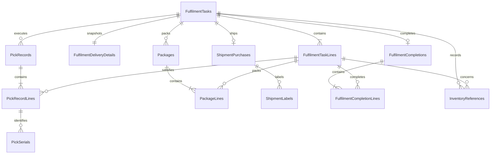

# Order Fulfilment Database Design

## Status and Authority

This document is the implementation-authoritative relational design for the Order Fulfilment domain database. Read it with the adjacent `requirements.md`, `../../architecture/data-architecture.md`, and `../../architecture/domain-and-application-boundaries.md`. Requirements control fulfilment semantics, shared data architecture controls common SQL/EF conventions, and this file controls Fulfilment tables, columns, relationships, constraints, indexes, and transaction boundaries.

Resolve conflicts before changing the EF Core model or generating a migration. Sales and Inventory records remain scalar external references or released-work snapshots. Courier records contain accepted provider business references, not provider credentials or label binaries.

## Database Identity

| Item | Value |
|---|---|
| Runtime database | `fulfilment_db` |
| Owning service | `Acme.Erp.OrderFulfilment.Api` |
| EF Core context | `OrderFulfilmentDbContext` |
| Connection key | `ConnectionStrings:DomainDatabase` |
| Schema | `dbo` |
| Migration history | `__OrderFulfilmentMigrationsHistory` |

## Relationship Diagram

## Table Catalog

| Area | Tables |
|---|---|
| Released work | `FulfilmentTasks`, `FulfilmentTaskLines`, `FulfilmentDeliveryDetails` |
| Picking | `PickRecords`, `PickRecordLines`, `PickSerials` |
| Packing | `Packages`, `PackageLines` |
| Shipping | `ShipmentPurchases`, `ShipmentLabels` |
| Completion | `FulfilmentCompletions`, `FulfilmentCompletionLines` |
| Inventory integration | `InventoryReferences` |

## Released Work Tables

### `FulfilmentTasks`

| Column | SQL type | Null | Rules |
|---|---|---:|---|
| `Id` | `uniqueidentifier` | No | Primary key; generated by Fulfilment |
| `TaskNumber` | `nvarchar(32)` | No | Unique Fulfilment business number |
| `ExternalSalesOrderId` | `uniqueidentifier` | No | Unique Sales order identity |
| `SalesOrderNumber` | `nvarchar(32)` | No | Released snapshot |
| `SalesChannel` | `nvarchar(32)` | No | Released snapshot |
| `Status` | `nvarchar(32)` | No | Fulfilment task status catalog |
| `Priority` | `int` | No | `1` highest through `5` lowest; default `3` |
| `AssignedOperatorSubject` | `nvarchar(200)` | Yes | Current assignment |
| `SourceService` | `nvarchar(100)` | No | Authenticated Sales release source |
| `ReleaseIdempotencyKey` | `nvarchar(200)` | No | Authenticated Sales release identity; unique with source |
| `CorrelationId` | `uniqueidentifier` | No | Release and workflow correlation identity |
| `ReleasedAt` | `datetimeoffset(7)` | No | Sales release time |
| `PickingStartedAt` | `datetimeoffset(7)` | Yes | Set when the task is claimed |
| `CreatedAt` | `datetimeoffset(7)` | No | UTC |
| `UpdatedAt` | `datetimeoffset(7)` | No | UTC |
| `CompletedAt` | `datetimeoffset(7)` | Yes | UTC |
| `RowVersion` | `rowversion` | No | Aggregate concurrency token |

Unique constraints apply to `TaskNumber`, `ExternalSalesOrderId`, and `(SourceService, ReleaseIdempotencyKey)`. Checks constrain status and priority.

### `FulfilmentTaskLines`

| Column | SQL type | Null | Rules |
|---|---|---:|---|
| `Id` | `uniqueidentifier` | No | Primary key |
| `FulfilmentTaskId` | `uniqueidentifier` | No | FK to `FulfilmentTasks.Id` |
| `LineNumber` | `int` | No | Positive; stable within task |
| `ExternalSalesOrderLineId` | `uniqueidentifier` | No | Unique within released task |
| `ExternalProductId` | `uniqueidentifier` | No | Inventory product |
| `ExternalSkuId` | `uniqueidentifier` | No | Inventory SKU |
| `SkuCode` | `nvarchar(64)` | No | Released snapshot |
| `ItemDescription` | `nvarchar(500)` | No | Released snapshot |
| `RequiredQuantity` | `decimal(18,4)` | No | Greater than zero |
| `PickedQuantity` | `decimal(18,4)` | No | Non-negative; not above required quantity |
| `PackedQuantity` | `decimal(18,4)` | No | Non-negative; not above picked |
| `UnitOfMeasure` | `nvarchar(16)` | No | Inventory-supplied code |
| `IsSerialized` | `bit` | No | Released Inventory policy |
| `Status` | `nvarchar(32)` | No | Fulfilment line status |
| `RowVersion` | `rowversion` | No | Concurrency token |

Unique constraints on `(FulfilmentTaskId, LineNumber)` and `(FulfilmentTaskId, ExternalSalesOrderLineId)`. Quantity checks enforce row-local bounds.

### `FulfilmentDeliveryDetails`

One immutable released delivery snapshot per task.

| Column | SQL type | Null | Rules |
|---|---|---:|---|
| `Id` | `uniqueidentifier` | No | Primary key |
| `FulfilmentTaskId` | `uniqueidentifier` | No | FK to `FulfilmentTasks.Id`; unique |
| `ContactName` | `nvarchar(200)` | No | Ship-to contact snapshot |
| `ContactEmail` | `nvarchar(320)` | No | Snapshot |
| `ContactPhone` | `nvarchar(32)` | Yes | Snapshot |
| `ShipToRecipientName` | `nvarchar(200)` | No | Snapshot |
| `ShipToLine1` | `nvarchar(200)` | No | Snapshot |
| `ShipToLine2` | `nvarchar(200)` | Yes | Snapshot |
| `ShipToCity` | `nvarchar(100)` | No | Snapshot |
| `ShipToRegion` | `nvarchar(100)` | Yes | Snapshot |
| `ShipToPostalCode` | `nvarchar(20)` | No | Snapshot |
| `ShipToCountryCode` | `char(2)` | No | Snapshot |
| `ShipFromName` | `nvarchar(200)` | No | Warehouse snapshot |
| `ShipFromLine1` | `nvarchar(200)` | No | Snapshot |
| `ShipFromLine2` | `nvarchar(200)` | Yes | Snapshot |
| `ShipFromCity` | `nvarchar(100)` | No | Snapshot |
| `ShipFromRegion` | `nvarchar(100)` | Yes | Snapshot |
| `ShipFromPostalCode` | `nvarchar(20)` | No | Snapshot |
| `ShipFromCountryCode` | `char(2)` | No | Snapshot |

## Pick and Pack Tables

### `PickRecords`

| Column | SQL type | Null | Rules |
|---|---|---:|---|
| `Id` | `uniqueidentifier` | No | Primary key |
| `FulfilmentTaskId` | `uniqueidentifier` | No | FK to `FulfilmentTasks.Id` |
| `SequenceNumber` | `int` | No | Positive attempt sequence |
| `Status` | `nvarchar(16)` | No | `InProgress` or `Completed` |
| `OperatorSubject` | `nvarchar(200)` | No | Acting operator |
| `StartedAt` | `datetimeoffset(7)` | No | UTC |
| `CompletedAt` | `datetimeoffset(7)` | Yes | UTC |
| `RowVersion` | `rowversion` | No | Concurrency token |

Unique constraint: `(FulfilmentTaskId, SequenceNumber)`.

### `PickRecordLines`

| Column | SQL type | Null | Rules |
|---|---|---:|---|
| `Id` | `uniqueidentifier` | No | Primary key |
| `PickRecordId` | `uniqueidentifier` | No | FK to `PickRecords.Id` |
| `FulfilmentTaskLineId` | `uniqueidentifier` | No | FK to `FulfilmentTaskLines.Id` |
| `ExternalPickedProductId` | `uniqueidentifier` | No | Actual Inventory product |
| `ExternalPickedSkuId` | `uniqueidentifier` | No | Must equal the released Inventory SKU |
| `Quantity` | `decimal(18,4)` | No | Greater than zero |
| `RecordedAt` | `datetimeoffset(7)` | No | UTC |

Unique constraint: `(PickRecordId, FulfilmentTaskLineId, ExternalPickedSkuId)`. Product, SKU, serial, and quantity mismatches reject the command without changing pick totals.

### `PickSerials`

| Column | SQL type | Null | Rules |
|---|---|---:|---|
| `Id` | `uniqueidentifier` | No | Primary key |
| `PickRecordLineId` | `uniqueidentifier` | No | FK to `PickRecordLines.Id` |
| `ExternalInventorySerialId` | `uniqueidentifier` | No | Inventory-owned serial ID |
| `SerialNumber` | `nvarchar(128)` | No | Evidence snapshot |

Unique constraints on `(PickRecordLineId, ExternalInventorySerialId)` and `(PickRecordLineId, SerialNumber)`. A filtered task-level application check prevents duplicate serial use across pick attempts.

### `Packages`

| Column | SQL type | Null | Rules |
|---|---|---:|---|
| `Id` | `uniqueidentifier` | No | Primary key |
| `FulfilmentTaskId` | `uniqueidentifier` | No | FK to `FulfilmentTasks.Id` |
| `PackageNumber` | `int` | No | Positive; unique within task |
| `Weight` | `decimal(18,3)` | No | Greater than zero |
| `Length` | `decimal(18,3)` | No | Greater than zero |
| `Width` | `decimal(18,3)` | No | Greater than zero |
| `Height` | `decimal(18,3)` | No | Greater than zero |
| `MeasurementSystem` | `nvarchar(8)` | No | `Metric` for MVP |
| `Status` | `nvarchar(16)` | No | `Open`, `Packed`, or `Shipped` |
| `PackedBySubject` | `nvarchar(200)` | Yes | Required when packed |
| `PackedAt` | `datetimeoffset(7)` | Yes | UTC |
| `RowVersion` | `rowversion` | No | Concurrency token |

### `PackageLines`

| Column | SQL type | Null | Rules |
|---|---|---:|---|
| `Id` | `uniqueidentifier` | No | Primary key |
| `PackageId` | `uniqueidentifier` | No | FK to `Packages.Id` |
| `FulfilmentTaskLineId` | `uniqueidentifier` | No | FK to `FulfilmentTaskLines.Id` |
| `Quantity` | `decimal(18,4)` | No | Greater than zero |

Unique constraint on `(PackageId, FulfilmentTaskLineId)`. Packed totals across packages are validated transactionally against picked quantities.

## Courier Shipment Tables

### `ShipmentPurchases`

| Column | SQL type | Null | Rules |
|---|---|---:|---|
| `Id` | `uniqueidentifier` | No | Primary key |
| `FulfilmentTaskId` | `uniqueidentifier` | No | FK to `FulfilmentTasks.Id` |
| `Provider` | `nvarchar(50)` | No | `RoyalMail` for MVP; schema remains provider-neutral |
| `ServiceLevel` | `nvarchar(100)` | No | Requested service snapshot |
| `ProviderRequestId` | `nvarchar(200)` | No | Provider idempotency identity; unique |
| `PackageCount` | `int` | No | Greater than zero |
| `Amount` | `decimal(19,4)` | Yes | Provider-returned amount |
| `CurrencyCode` | `char(3)` | Yes | Required with amount |
| `ProviderTransactionId` | `nvarchar(200)` | No | Unique accepted provider reference |
| `ShipmentReference` | `nvarchar(200)` | No | Unique provider shipment reference |
| `TrackingReference` | `nvarchar(200)` | No | Unique tracking reference |
| `PurchasedAt` | `datetimeoffset(7)` | No | UTC |
| `RowVersion` | `rowversion` | No | Concurrency token |

Unique constraints apply to `FulfilmentTaskId`, provider request, provider transaction, shipment, and tracking references.

### `ShipmentLabels`

| Column | SQL type | Null | Rules |
|---|---|---:|---|
| `Id` | `uniqueidentifier` | No | Primary key |
| `ShipmentPurchaseId` | `uniqueidentifier` | No | FK to `ShipmentPurchases.Id` |
| `ProviderLabelId` | `nvarchar(200)` | No | Provider label reference |
| `StorageReference` | `nvarchar(500)` | Yes | Optional external PDF/object reference; no label blob |
| `ContentType` | `nvarchar(100)` | No | `application/pdf` for MVP |
| `ContentSha256` | `char(64)` | Yes | Optional evidence digest |
| `Status` | `nvarchar(16)` | No | `Available` or `Printed` |
| `CreatedAt` | `datetimeoffset(7)` | No | UTC |
| `PrintedAt` | `datetimeoffset(7)` | Yes | Application-reported evidence |
| `PrintedBySubject` | `nvarchar(200)` | Yes | Application-reported actor |
| `RowVersion` | `rowversion` | No | Concurrency token |

Unique constraint: `(ShipmentPurchaseId, ProviderLabelId)`.

## Completion and External Business References

### `FulfilmentCompletions`

| Column | SQL type | Null | Rules |
|---|---|---:|---|
| `Id` | `uniqueidentifier` | No | Primary key |
| `FulfilmentTaskId` | `uniqueidentifier` | No | FK to `FulfilmentTasks.Id`; unique |
| `CompletedBySubject` | `nvarchar(200)` | No | Acting user/service |
| `ExternalSalesUpdateId` | `uniqueidentifier` | No | Sales completion update identity; unique |
| `CorrelationId` | `uniqueidentifier` | No | Completion operation correlation identity |
| `CompletedAt` | `datetimeoffset(7)` | No | Set after Sales and Inventory accept required updates |
| `RowVersion` | `rowversion` | No | Concurrency token |

Unique constraint on `FulfilmentTaskId` permits one immutable completion per task.

### `FulfilmentCompletionLines`

| Column | SQL type | Null | Rules |
|---|---|---:|---|
| `Id` | `uniqueidentifier` | No | Primary key |
| `FulfilmentCompletionId` | `uniqueidentifier` | No | FK to `FulfilmentCompletions.Id` |
| `FulfilmentTaskLineId` | `uniqueidentifier` | No | FK to `FulfilmentTaskLines.Id` |
| `ConsumedQuantity` | `decimal(18,4)` | No | Positive and exactly equal to the task line required quantity |

Unique constraint on `(FulfilmentCompletionId, FulfilmentTaskLineId)`. Domain logic requires one line for every task line and exact required quantities.

### `InventoryReferences`

| Column | SQL type | Null | Rules |
|---|---|---:|---|
| `Id` | `uniqueidentifier` | No | Primary key |
| `FulfilmentTaskId` | `uniqueidentifier` | No | FK to `FulfilmentTasks.Id` |
| `FulfilmentTaskLineId` | `uniqueidentifier` | Yes | Optional FK to task line |
| `ReferenceType` | `nvarchar(16)` | No | `Reservation` or `Consumption` |
| `ExternalInventoryReservationId` | `uniqueidentifier` | Yes | Inventory reservation reference |
| `ExternalInventoryMovementId` | `uniqueidentifier` | Yes | Inventory movement reference |
| `RecordedAt` | `datetimeoffset(7)` | No | UTC |

Checks require the external reference appropriate to `ReferenceType`. Filtered unique indexes make Inventory reservation and movement IDs unique when present.

## Status Models

| Area | Allowed values |
|---|---|
| Fulfilment task | `Released`, `Picking`, `Picked`, `Packing`, `Packed`, `ShippingPurchased`, `LabelReady`, `Completing`, `Completed` |
| Task line | `Released`, `Picking`, `Picked`, `Packed`, `Completed` |
| Pick record | `InProgress`, `Completed` |
| Package | `Open`, `Packed`, `Shipped` |
| Shipment label | `Available`, `Printed` |

Valid task transitions are `Released -> Picking`, `Picking -> Picked`, `Picked -> Packing`, `Packing -> Packed`, `Packed -> ShippingPurchased`, `ShippingPurchased -> LabelReady`, `LabelReady -> Completing`, and `Completing -> Completed`. `Completed` is terminal. Pick confirmation, packing, Inventory consumption, and completion each require every task line to equal its exact released quantity.

## Local Foreign Keys and Delete Behavior

All foreign keys use `ON DELETE NO ACTION`; required FK columns are indexed. The local graph consists of task-owned lines/delivery, picks and lines/serials, packages and lines, accepted shipment purchases/labels, completion lines, and accepted Inventory references. External Sales, Inventory, courier, and identity references never receive SQL foreign keys.

## Indexes for Required Queries

| Index | Purpose |
|---|---|
| `IX_FulfilmentTasks_Status_Priority_ReleasedAt` on `(Status, Priority, ReleasedAt, Id)` | Stable operator task queue |
| `IX_FulfilmentTasks_Assignee_Status_ReleasedAt` on `(AssignedOperatorSubject, Status, ReleasedAt, Id)` | Assigned workload |
| `IX_FulfilmentTasks_Channel_Status` on `(SalesChannel, Status, ReleasedAt, Id)` | Channel filtering |
| `IX_FulfilmentTaskLines_ExternalSkuId` on `(ExternalSkuId, FulfilmentTaskId)` | SKU queue search |
| `IX_ShipmentPurchases_TrackingReference` filtered unique on `TrackingReference` | Tracking lookup |
| `IX_ShipmentPurchases_Provider_PurchasedAt` on `(Provider, PurchasedAt, Id)` | Shipment review |
| `UX_FulfilmentCompletions_Task` unique on `FulfilmentTaskId` | One full completion per task |

## Transactions and Concurrency

- Intake an accepted released Sales payload, delivery snapshot, and lines in one transaction.
- Apply task transitions only with `FulfilmentTasks.RowVersion` and update affected lines atomically.
- Validate product, SKU, serial, and quantity inputs before recording picks. Persist valid pick lines and serials and update cumulative line quantities in one transaction; rejected commands leave pick totals unchanged.
- Confirm packing only when package lines reconcile with accepted picks. Update package and task state under optimistic concurrency.
- Persist a shipment purchase only after the courier accepts it and returns the required provider, shipment, and tracking references.
- Label evidence changes the task to `LabelReady` only when a valid label reference exists.
- Create a completion, its lines, accepted Inventory references, and current task status in one transaction after Inventory and Sales accept their required business updates.
- Completion stores the exact consumed quantity for every task line, Inventory movement references, the accepted Sales update identity, and the operation correlation identity.
- Cumulative pick and pack reconciliation, exact completion reconciliation, serial uniqueness across picks, transition legality, and completion guards are cross-row domain rules enforced inside local transactions.
- Never hold a database transaction open across Sales, Inventory, or courier HTTP calls.

## External References

| Column family | Owning system | SQL foreign key |
|---|---|---:|
| Sales order and line IDs | Sales | No |
| Product, SKU, serial, reservation, and movement IDs | Inventory Management | No |
| Provider transaction, shipment, tracking, and label IDs | Courier provider | No |
| Operator, actor, and service subjects | Authentik/platform identity | No |

## Requirement Traceability

| Requirement | Persistence coverage |
|---|---|
| `FUL-DOM-001` | Unique Sales order identity, released header/line/delivery snapshots, and atomic intake |
| `FUL-DOM-002` | Assignment identity, picking start time, task concurrency, and transactional claim transition |
| `FUL-DOM-003` | Pick attempts, lines, serials, exact Inventory IDs, quantity evidence, and pre-persistence mismatch validation |
| `FUL-DOM-004` | Exact required and picked quantities plus task/line state support all-line pick confirmation |
| `FUL-DOM-005` | Package dimensions, exact package-line quantities, actor, and packing time |
| `FUL-DOM-006` | One accepted shipment purchase with unique provider, shipment, and tracking references |
| `FUL-DOM-007` | Label reference tied by FK to the accepted shipment purchase |
| `FUL-DOM-008` | One exact completion, consumed line quantities, Inventory movement IDs, Sales update ID, and correlation ID |
| `FUL-DOM-009` | Purpose-built task, assignment, SKU, shipment, and completion indexes |

Authorization, payload/schema validation, transition decisions, provider adapter behavior, Inventory/Sales calls, pagination, data serialization, and cumulative cross-row validation remain domain/API responsibilities.

### Business Rule Traceability

| Rule | Persistence or domain disposition |
|---|---|
| `FUL-BR-001` | Unique Sales release identity and immutable released snapshots prevent work without a Sales release |
| `FUL-BR-002` | Positive required quantities and reservation reference rows preserve release ownership data |
| `FUL-BR-003` | Required-versus-picked quantities and exact SKU/serial evidence drive confirmation guards |
| `FUL-BR-004` | Assignment identity and task state are checked for every operator mutation |
| `FUL-BR-005` | Exact pick and package-line reconciliation guards packing |
| `FUL-BR-006` | Shipment purchase FK and label reference enforce shipping-before-label ordering |
| `FUL-BR-007` | LabelReady state, exact completion lines, Inventory movements, and Sales update ID guard completion |
| `FUL-BR-008` | Unique immutable shipment, label, Inventory result, Sales update, and completion records support deterministic replay |
| `FUL-BR-009` | Task and workflow `RowVersion` values reject stale progress writes |

## Retention and Seed Policy

- Do not EF-seed fulfilment tasks, courier transactions, labels, or workflow examples.
- Courier provider and service-level configuration belongs to environment/application configuration; persisted values are transaction snapshots.
- Retain released snapshots, pick/pack evidence, accepted shipment purchases, labels, completions, and Inventory references for the ERP retention period.
- Retain provider transaction, shipment, tracking, and label references as fulfilment evidence.
- Purge only incomplete work under an explicit retention policy that preserves every record with downstream evidence; never cascade-delete completed task evidence.

## Excluded Schema

This design excludes Sales order/customer ownership, product master and stock balances, Purchasing, returns/RMA, failed-delivery processing, refunds, rate shopping, multi-provider failover, courier contract management, label binary storage, printer/ZPL configuration, finance postings, application-service persistence, multi-tenancy, and central audit/compliance tables.

## EF Core and Migration Checklist

- Explicitly map every SQL type, maximum length, decimal precision, check, unique/filter index, `rowversion`, and `DeleteBehavior.NoAction`.
- Keep all Sales, Inventory, courier, and identity references scalar with no cross-domain navigation.
- Persist status strings exactly as documented, never enum ordinals.
- Treat completion and accepted provider evidence as append-only in persistence behavior.
- Use `__OrderFulfilmentMigrationsHistory`; inspect migrations for cross-database FKs, cascade deletes, label blobs, provider-specific credentials, missing business references, or destructive schema changes.

## Proposed Persistence Tests

- Apply all migrations to an empty SQL Server database and verify `__OrderFulfilmentMigrationsHistory`.
- Verify unique Sales order intake, release idempotency key, task number, task line number, pick sequence, package number, provider references, labels, serials, completion task, and Sales update identity.
- Verify invalid product, SKU, serial, quantity, package, status, and completion inputs reject writes without changing lifecycle state.
- Verify concurrent task transitions produce one success and one `DbUpdateConcurrencyException` without divergent line state.
- Verify valid pick and pack commands update evidence, cumulative quantities, and task/line status atomically.
- Verify shipment and label progression requires accepted provider references and stores no credential or label binary.
- Verify full completion persists exact consumed quantities and accepted Sales and Inventory references atomically.
- Verify attempts to complete with any quantity other than the exact released quantity leave completion, task, Sales-update, and Inventory-reference rows unchanged.
- Verify every FK uses `NO ACTION` and no migration creates a cross-database FK.
