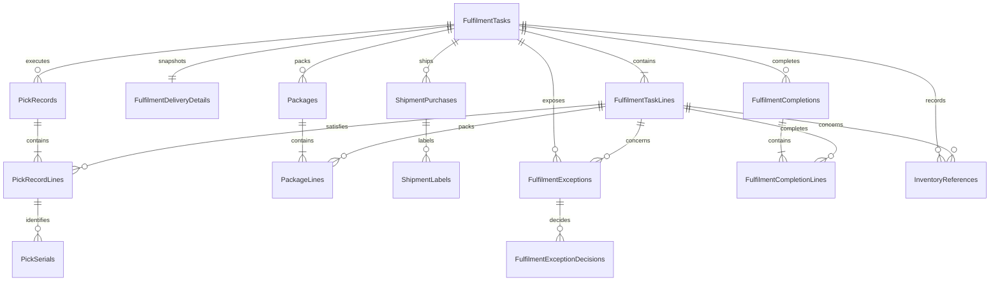

# Order Fulfilment Database Design

## Status and Authority

This document is the implementation-authoritative relational design for the Order Fulfilment domain database. Read it with the adjacent `requirements.md`, `../../architecture/data-architecture.md`, and `../../architecture/domain-and-application-boundaries.md`. Requirements control fulfilment semantics, shared data architecture controls common SQL/EF conventions, and this file controls Fulfilment tables, columns, relationships, constraints, indexes, and transaction boundaries.

Resolve conflicts before changing the EF Core model or generating a migration. Sales and Inventory records remain scalar external references or released-work snapshots. Courier records contain accepted provider business references, not provider credentials or label binaries.

## Database Identity

| Item | Value |
|---|---|
| Runtime database | `fulfilment_db` |
| Owning service | `Acme.Erp.OrderFulfilment.Api` |
| EF Core context | `OrderFulfilmentDbContext` |
| Connection key | `ConnectionStrings:DomainDatabase` |
| Schema | `dbo` |
| Migration history | `__OrderFulfilmentMigrationsHistory` |

## Relationship Diagram

## Released Work Tables

### `FulfilmentTasks`

| Column | SQL type | Null | Rules |
|---|---|---:|---|
| `Id` | `uniqueidentifier` | No | Primary key; generated by Fulfilment |
| `TaskNumber` | `nvarchar(32)` | No | Unique Fulfilment business number |
| `ExternalSalesOrderId` | `uniqueidentifier` | No | Unique Sales order identity |
| `SalesOrderNumber` | `nvarchar(32)` | No | Released snapshot |
| `SalesChannel` | `nvarchar(32)` | No | Released snapshot |
| `Status` | `nvarchar(32)` | No | Fulfilment task status catalog |
| `Priority` | `int` | No | `1` highest through `5` lowest; default `3` |
| `AssignedOperatorSubject` | `nvarchar(200)` | Yes | Current assignment |
| `ReleasedAt` | `datetimeoffset(7)` | No | Sales release time |
| `CreatedAt` | `datetimeoffset(7)` | No | UTC |
| `UpdatedAt` | `datetimeoffset(7)` | No | UTC |
| `CompletedAt` | `datetimeoffset(7)` | Yes | UTC |
| `CancelledAt` | `datetimeoffset(7)` | Yes | UTC |
| `RowVersion` | `rowversion` | No | Aggregate concurrency token |

Unique constraints: `UQ_FulfilmentTasks_TaskNumber` and `UQ_FulfilmentTasks_ExternalSalesOrderId`. Checks constrain status and priority.

### `FulfilmentTaskLines`

| Column | SQL type | Null | Rules |
|---|---|---:|---|
| `Id` | `uniqueidentifier` | No | Primary key |
| `FulfilmentTaskId` | `uniqueidentifier` | No | FK to `FulfilmentTasks.Id` |
| `LineNumber` | `int` | No | Positive; stable within task |
| `ExternalSalesOrderLineId` | `uniqueidentifier` | No | Unique within released task |
| `ExternalProductId` | `uniqueidentifier` | No | Inventory product |
| `ExternalSkuId` | `uniqueidentifier` | No | Inventory SKU |
| `SkuCode` | `nvarchar(64)` | No | Released snapshot |
| `ItemDescription` | `nvarchar(500)` | No | Released snapshot |
| `RequiredQuantity` | `decimal(18,4)` | No | Greater than zero |
| `PickedQuantity` | `decimal(18,4)` | No | Non-negative; not above requirement without approved exception |
| `PackedQuantity` | `decimal(18,4)` | No | Non-negative; not above picked |
| `FulfilledQuantity` | `decimal(18,4)` | No | Non-negative; not above packed |
| `BackorderedQuantity` | `decimal(18,4)` | No | Non-negative; fulfilled plus backordered not above required |
| `UnitOfMeasure` | `nvarchar(16)` | No | Inventory-supplied code |
| `IsSerialized` | `bit` | No | Released Inventory policy |
| `Status` | `nvarchar(32)` | No | Fulfilment line status |
| `RowVersion` | `rowversion` | No | Concurrency token |

Unique constraints on `(FulfilmentTaskId, LineNumber)` and `(FulfilmentTaskId, ExternalSalesOrderLineId)`. Quantity checks enforce row-local bounds.

### `FulfilmentDeliveryDetails`

One immutable released delivery snapshot per task.

| Column | SQL type | Null | Rules |
|---|---|---:|---|
| `Id` | `uniqueidentifier` | No | Primary key |
| `FulfilmentTaskId` | `uniqueidentifier` | No | FK to `FulfilmentTasks.Id`; unique |
| `ContactName` | `nvarchar(200)` | No | Ship-to contact snapshot |
| `ContactEmail` | `nvarchar(320)` | No | Snapshot |
| `ContactPhone` | `nvarchar(32)` | Yes | Snapshot |
| `ShipToRecipientName` | `nvarchar(200)` | No | Snapshot |
| `ShipToLine1` | `nvarchar(200)` | No | Snapshot |
| `ShipToLine2` | `nvarchar(200)` | Yes | Snapshot |
| `ShipToCity` | `nvarchar(100)` | No | Snapshot |
| `ShipToRegion` | `nvarchar(100)` | Yes | Snapshot |
| `ShipToPostalCode` | `nvarchar(20)` | No | Snapshot |
| `ShipToCountryCode` | `char(2)` | No | Snapshot |
| `ShipFromName` | `nvarchar(200)` | No | Warehouse snapshot |
| `ShipFromLine1` | `nvarchar(200)` | No | Snapshot |
| `ShipFromLine2` | `nvarchar(200)` | Yes | Snapshot |
| `ShipFromCity` | `nvarchar(100)` | No | Snapshot |
| `ShipFromRegion` | `nvarchar(100)` | Yes | Snapshot |
| `ShipFromPostalCode` | `nvarchar(20)` | No | Snapshot |
| `ShipFromCountryCode` | `char(2)` | No | Snapshot |

## Pick and Pack Tables

### `PickRecords`

| Column | SQL type | Null | Rules |
|---|---|---:|---|
| `Id` | `uniqueidentifier` | No | Primary key |
| `FulfilmentTaskId` | `uniqueidentifier` | No | FK to `FulfilmentTasks.Id` |
| `SequenceNumber` | `int` | No | Positive attempt sequence |
| `Status` | `nvarchar(16)` | No | `InProgress`, `Completed`, `Exception`, `Cancelled` |
| `OperatorSubject` | `nvarchar(200)` | No | Acting operator |
| `StartedAt` | `datetimeoffset(7)` | No | UTC |
| `CompletedAt` | `datetimeoffset(7)` | Yes | UTC |
| `RowVersion` | `rowversion` | No | Concurrency token |

Unique constraint: `(FulfilmentTaskId, SequenceNumber)`.

### `PickRecordLines`

| Column | SQL type | Null | Rules |
|---|---|---:|---|
| `Id` | `uniqueidentifier` | No | Primary key |
| `PickRecordId` | `uniqueidentifier` | No | FK to `PickRecords.Id` |
| `FulfilmentTaskLineId` | `uniqueidentifier` | No | FK to `FulfilmentTaskLines.Id` |
| `ExternalPickedProductId` | `uniqueidentifier` | No | Actual Inventory product |
| `ExternalPickedSkuId` | `uniqueidentifier` | No | Actual Inventory SKU; differs only under approved substitution |
| `Quantity` | `decimal(18,4)` | No | Greater than zero |
| `Condition` | `nvarchar(16)` | No | `Accepted` or `Damaged` |
| `RecordedAt` | `datetimeoffset(7)` | No | UTC |

Unique constraint: `(PickRecordId, FulfilmentTaskLineId, ExternalPickedSkuId)`. Substitution and quantity exceptions require a linked `FulfilmentExceptions` record before progression.

### `PickSerials`

| Column | SQL type | Null | Rules |
|---|---|---:|---|
| `Id` | `uniqueidentifier` | No | Primary key |
| `PickRecordLineId` | `uniqueidentifier` | No | FK to `PickRecordLines.Id` |
| `ExternalInventorySerialId` | `uniqueidentifier` | No | Inventory-owned serial ID |
| `SerialNumber` | `nvarchar(128)` | No | Evidence snapshot |

Unique constraints on `(PickRecordLineId, ExternalInventorySerialId)` and `(PickRecordLineId, SerialNumber)`. A filtered task-level application check prevents duplicate serial use across pick attempts.

### `Packages`

| Column | SQL type | Null | Rules |
|---|---|---:|---|
| `Id` | `uniqueidentifier` | No | Primary key |
| `FulfilmentTaskId` | `uniqueidentifier` | No | FK to `FulfilmentTasks.Id` |
| `PackageNumber` | `int` | No | Positive; unique within task |
| `Weight` | `decimal(18,3)` | No | Greater than zero |
| `Length` | `decimal(18,3)` | No | Greater than zero |
| `Width` | `decimal(18,3)` | No | Greater than zero |
| `Height` | `decimal(18,3)` | No | Greater than zero |
| `MeasurementSystem` | `nvarchar(8)` | No | `Metric` for MVP |
| `Status` | `nvarchar(16)` | No | `Open`, `Packed`, `Shipped`, `Cancelled` |
| `PackedBySubject` | `nvarchar(200)` | Yes | Required when packed |
| `PackedAt` | `datetimeoffset(7)` | Yes | UTC |
| `RowVersion` | `rowversion` | No | Concurrency token |

### `PackageLines`

| Column | SQL type | Null | Rules |
|---|---|---:|---|
| `Id` | `uniqueidentifier` | No | Primary key |
| `PackageId` | `uniqueidentifier` | No | FK to `Packages.Id` |
| `FulfilmentTaskLineId` | `uniqueidentifier` | No | FK to `FulfilmentTaskLines.Id` |
| `Quantity` | `decimal(18,4)` | No | Greater than zero |

Unique constraint on `(PackageId, FulfilmentTaskLineId)`. Packed totals across packages are validated transactionally against picked quantities.

## Courier Shipment Tables

### `ShipmentPurchases`

| Column | SQL type | Null | Rules |
|---|---|---:|---|
| `Id` | `uniqueidentifier` | No | Primary key |
| `FulfilmentTaskId` | `uniqueidentifier` | No | FK to `FulfilmentTasks.Id` |
| `Provider` | `nvarchar(50)` | No | `RoyalMail` for MVP; schema remains provider-neutral |
| `ServiceLevel` | `nvarchar(100)` | No | Requested service snapshot |
| `Status` | `nvarchar(24)` | No | `Purchased` or `Voided` |
| `PackageCount` | `int` | No | Greater than zero |
| `Amount` | `decimal(19,4)` | Yes | Provider-returned amount |
| `CurrencyCode` | `char(3)` | Yes | Required with amount |
| `ProviderTransactionId` | `nvarchar(200)` | No | Unique accepted provider reference |
| `ShipmentReference` | `nvarchar(200)` | No | Unique provider shipment reference |
| `TrackingReference` | `nvarchar(200)` | No | Unique tracking reference |
| `PurchasedAt` | `datetimeoffset(7)` | No | UTC |
| `RowVersion` | `rowversion` | No | Concurrency token |

Unique constraints apply to provider transaction, shipment, and tracking references.

### `ShipmentLabels`

| Column | SQL type | Null | Rules |
|---|---|---:|---|
| `Id` | `uniqueidentifier` | No | Primary key |
| `ShipmentPurchaseId` | `uniqueidentifier` | No | FK to `ShipmentPurchases.Id` |
| `ProviderLabelId` | `nvarchar(200)` | No | Provider label reference |
| `StorageReference` | `nvarchar(500)` | Yes | Optional external PDF/object reference; no label blob |
| `ContentType` | `nvarchar(100)` | No | `application/pdf` for MVP |
| `ContentSha256` | `char(64)` | Yes | Optional evidence digest |
| `Status` | `nvarchar(16)` | No | `Available`, `Printed`, or `Voided` |
| `CreatedAt` | `datetimeoffset(7)` | No | UTC |
| `PrintedAt` | `datetimeoffset(7)` | Yes | Application-reported evidence |
| `PrintedBySubject` | `nvarchar(200)` | Yes | Application-reported actor |
| `RowVersion` | `rowversion` | No | Concurrency token |

Unique constraint: `(ShipmentPurchaseId, ProviderLabelId)`.

## Exception and Approval Tables

### `FulfilmentExceptions`

| Column | SQL type | Null | Rules |
|---|---|---:|---|
| `Id` | `uniqueidentifier` | No | Primary key |
| `FulfilmentTaskId` | `uniqueidentifier` | No | FK to `FulfilmentTasks.Id` |
| `FulfilmentTaskLineId` | `uniqueidentifier` | Yes | Optional FK to task line |
| `ExceptionType` | `nvarchar(32)` | No | `ShortPick`, `Substitution`, `Damaged`, `Packing`, `Cancellation`, `Reversal`, or `Policy` |
| `Status` | `nvarchar(24)` | No | `Open`, `PendingApproval`, `Approved`, `Rejected`, `Resolved`, `Cancelled` |
| `ApprovedResumeStatus` | `nvarchar(32)` | Yes | Optional business state authorized by the decision |
| `RecordedBySubject` | `nvarchar(200)` | No | Cannot approve related control action |
| `Reason` | `nvarchar(1000)` | No | Business/operator reason |
| `DetailsJson` | `nvarchar(max)` | Yes | Valid sanitized JSON |
| `OpenedAt` | `datetimeoffset(7)` | No | UTC |
| `ResolvedAt` | `datetimeoffset(7)` | Yes | UTC |
| `RowVersion` | `rowversion` | No | Concurrency token |

### `FulfilmentExceptionDecisions`

| Column | SQL type | Null | Rules |
|---|---|---:|---|
| `Id` | `uniqueidentifier` | No | Primary key; append-only decision attempt |
| `FulfilmentExceptionId` | `uniqueidentifier` | No | FK to `FulfilmentExceptions.Id` |
| `Decision` | `nvarchar(16)` | No | `Approved`, `Rejected`, `Denied` |
| `DecidedBySubject` | `nvarchar(200)` | No | Must differ from recorder for approval |
| `Reason` | `nvarchar(1000)` | Yes | Required for reject/deny |
| `DecidedAt` | `datetimeoffset(7)` | No | UTC |

## Completion and External Business References

### `FulfilmentCompletions`

| Column | SQL type | Null | Rules |
|---|---|---:|---|
| `Id` | `uniqueidentifier` | No | Primary key |
| `FulfilmentTaskId` | `uniqueidentifier` | No | FK to `FulfilmentTasks.Id` |
| `SequenceNumber` | `int` | No | Positive; supports partial then final completion |
| `CompletionType` | `nvarchar(16)` | No | `Partial`, `Final`, `Reversal` |
| `Status` | `nvarchar(24)` | No | `Completed` or `Reversed` |
| `CompletedBySubject` | `nvarchar(200)` | No | Acting user/service |
| `ApprovedExceptionId` | `uniqueidentifier` | Yes | Optional FK supporting controlled override |
| `CompletedAt` | `datetimeoffset(7)` | No | Set after Sales and Inventory accept required updates |
| `RowVersion` | `rowversion` | No | Concurrency token |

Unique constraint on `(FulfilmentTaskId, SequenceNumber)`.

### `FulfilmentCompletionLines`

| Column | SQL type | Null | Rules |
|---|---|---:|---|
| `Id` | `uniqueidentifier` | No | Primary key |
| `FulfilmentCompletionId` | `uniqueidentifier` | No | FK to `FulfilmentCompletions.Id` |
| `FulfilmentTaskLineId` | `uniqueidentifier` | No | FK to `FulfilmentTaskLines.Id` |
| `FulfilledQuantity` | `decimal(18,4)` | No | Non-negative |
| `BackorderedQuantity` | `decimal(18,4)` | No | Non-negative |
| `ReversedQuantity` | `decimal(18,4)` | No | Non-negative |

Unique constraint on `(FulfilmentCompletionId, FulfilmentTaskLineId)`. Domain logic validates cumulative quantities against the released requirement.

### `InventoryReferences`

| Column | SQL type | Null | Rules |
|---|---|---:|---|
| `Id` | `uniqueidentifier` | No | Primary key |
| `FulfilmentTaskId` | `uniqueidentifier` | No | FK to `FulfilmentTasks.Id` |
| `FulfilmentTaskLineId` | `uniqueidentifier` | Yes | Optional FK to task line |
| `ReferenceType` | `nvarchar(16)` | No | `Reservation`, `Consumption`, or `Reversal` |
| `ExternalInventoryReservationId` | `uniqueidentifier` | Yes | Inventory reservation reference |
| `ExternalInventoryMovementId` | `uniqueidentifier` | Yes | Inventory movement reference |
| `RecordedAt` | `datetimeoffset(7)` | No | UTC |

Checks require the external reference appropriate to `ReferenceType`. Filtered unique indexes make Inventory reservation and movement IDs unique when present.

## Status Catalogs

| Area | Allowed values |
|---|---|
| Fulfilment task | `Released`, `Picking`, `PickException`, `Picked`, `Packing`, `Packed`, `ShippingPurchased`, `LabelPrinted`, `PartiallyFulfilled`, `Completed`, `Cancelled`, `Exception` |
| Task line | `Released`, `Picking`, `Picked`, `Packed`, `PartiallyFulfilled`, `Fulfilled`, `Backordered`, `Cancelled`, `Exception` |
| Shipment purchase | `Purchased`, `Voided` |
| Completion | `Completed`, `Reversed` |

SQL checks limit current values. Order Fulfilment enforces transition graphs and controlled guards from `requirements.md`.

## Local Foreign Keys and Delete Behavior

All foreign keys use `ON DELETE NO ACTION`; required FK columns are indexed. The local graph consists of task-owned lines/delivery, picks and lines/serials, packages and lines, accepted shipment purchases/labels, exceptions/decisions, completion lines, and accepted Inventory references. External Sales, Inventory, courier, and identity references never receive SQL foreign keys.

## Indexes for Required Queries

| Index | Purpose |
|---|---|
| `IX_FulfilmentTasks_Status_Priority_ReleasedAt` on `(Status, Priority, ReleasedAt, Id)` | Stable operator task queue |
| `IX_FulfilmentTasks_Assignee_Status_ReleasedAt` on `(AssignedOperatorSubject, Status, ReleasedAt, Id)` | Assigned workload |
| `IX_FulfilmentTasks_Channel_Status` on `(SalesChannel, Status, ReleasedAt, Id)` | Channel filtering |
| `IX_FulfilmentTaskLines_ExternalSkuId` on `(ExternalSkuId, FulfilmentTaskId)` | SKU queue/report search |
| `IX_FulfilmentExceptions_Status_Type_OpenedAt` on `(Status, ExceptionType, OpenedAt, Id)` | Supervisor exception queue |
| `IX_ShipmentPurchases_TrackingReference` filtered unique on `TrackingReference` | Tracking lookup |
| `IX_ShipmentPurchases_Provider_Status_PurchasedAt` on `(Provider, Status, PurchasedAt, Id)` | Shipment review |
| `IX_FulfilmentCompletions_Task_Sequence` on `(FulfilmentTaskId, SequenceNumber)` | Completion sequencing |

## Transactions and Concurrency

- Intake an accepted released Sales payload, delivery snapshot, and lines in one transaction.
- Apply task transitions only with `FulfilmentTasks.RowVersion` and update affected lines atomically.
- Record picks and serials in one transaction, then update cumulative line quantities. Quantity, SKU, serial, damage, short-pick, or substitution mismatches open an exception instead of silently progressing.
- Confirm packing only when package lines reconcile with accepted picks. Update package and task state under optimistic concurrency.
- Persist a shipment purchase only after the courier accepts it and returns the required provider, shipment, and tracking references.
- Label evidence changes the task to `LabelPrinted` only when a label reference exists or an approved override permits progression.
- Create a completion, its lines, accepted Inventory references, and current task status in one transaction after Inventory and Sales accept their required business updates.
- Partial completion requires an approved exception and stores fulfilled/backordered quantities sent to Sales. Cumulative completion quantities cannot exceed released requirements.
- Record reversal as a new completion plus an accepted Inventory reversal reference; never mutate the original completion or provider evidence.
- Self-approval, cumulative pick/pack/completion reconciliation, serial uniqueness across picks, transition legality, and completion guards are cross-row domain rules enforced inside local transactions.
- Never hold a database transaction open across Sales, Inventory, or courier HTTP calls.

## External References

| Column family | Owning system | SQL foreign key |
|---|---|---:|
| Sales order and line IDs | Sales | No |
| Product, SKU, serial, reservation, and movement IDs | Inventory Management | No |
| Provider transaction, shipment, tracking, and label IDs | Courier provider | No |
| Operator, supervisor, actor, and service subjects | Authentik/platform identity | No |

## Requirement Traceability

| Requirement | Persistence coverage |
|---|---|
| `FUL-DOM-001` | Unique Sales order identity, released header/line/delivery snapshots, and atomic intake |
| `FUL-DOM-002` | Checked current task/line states, concurrency, and transactional transition rules |
| `FUL-DOM-003` | Pick attempts/lines/serials, actual Inventory IDs, quantity/condition evidence, and exception links |
| `FUL-DOM-004` | Typed exceptions, recorder identity, approval decisions/denials, reasons, and self-approval transaction guard |
| `FUL-DOM-005` | Accepted shipment purchase, provider/shipment/tracking references, and label references |
| `FUL-DOM-006` | Completion/line records, package/shipment/label evidence, and accepted Inventory references |
| `FUL-DOM-007` | Approved business exception, partial completion lines, and cumulative fulfilled/backordered quantities |
| `FUL-DOM-008` | Typed accepted Inventory reservation/consumption/reversal references with unique external IDs |
| `FUL-DOM-009` | Purpose-built task, assignment, SKU, business exception, shipment, and completion indexes |

Authorization, payload/schema validation, transition decisions, provider adapter behavior, Inventory/Sales calls, pagination, CSV shaping, and cumulative cross-row validation remain domain/API responsibilities.

### Business Rule Traceability

| Rule | Persistence or domain disposition |
|---|---|
| `FUL-BR-001` | Unique Sales order/release identity and immutable released snapshots prevent work without a Sales release |
| `FUL-BR-002` | Required-versus-picked quantities and actual SKU/serial evidence drive mismatch exceptions and progression guards |
| `FUL-BR-003` | Shipment purchase and label statuses/references support the shipping-before-label guard; approved override is explicit |
| `FUL-BR-004` | Pick, pack, shipment, label, Inventory, and Sales business states are checked before completion is persisted |
| `FUL-BR-005` | Inventory reference rows carry the task, Sales order through the task, and accepted reservation or movement reference |
| `FUL-BR-006` | Completion lines persist fulfilled/backordered quantities after Sales accepts the update |
| `FUL-BR-007` | Exception recorder and decision actor support self-approval prevention and append-only denial evidence |
| `FUL-BR-008` | Provider is a persisted transaction snapshot; Royal Mail remains environment configuration rather than a schema constraint |

## Seed and Lifecycle Policy

- Do not EF-seed fulfilment tasks, courier transactions, labels, or workflow examples.
- Courier provider and service-level configuration belongs to environment/application configuration; persisted values are transaction snapshots.
- Never physically delete released snapshots, pick/pack evidence, accepted shipment purchases, labels, decisions, completions, or Inventory references.

## Excluded Schema

This design excludes Sales order/customer ownership, product master and stock balances, Purchasing, returns/RMA, failed-delivery processing, refunds, rate shopping, multi-provider failover, courier contract management, label binary storage, printer/ZPL configuration, finance postings, application-service persistence, multi-tenancy, and central audit/compliance tables.

## EF Core and Migration Checklist

- Explicitly map every SQL type, maximum length, decimal precision, check, unique/filter index, `rowversion`, and `DeleteBehavior.NoAction`.
- Keep all Sales, Inventory, courier, and identity references scalar with no cross-domain navigation.
- Persist status strings exactly as documented, never enum ordinals.
- Treat exception decisions and completion evidence as append-only in persistence behavior.
- Use `__OrderFulfilmentMigrationsHistory`; inspect migrations for cross-database FKs, cascade deletes, label blobs, provider-specific credentials, missing business references, or destructive schema changes.
- Add SQL Server integration tests for unique Sales order intake, quantity checks, serial uniqueness, self-approval denial, optimistic task concurrency, completion guards, provider reference uniqueness, status checks, and migration application.
