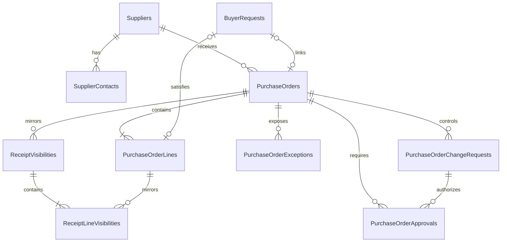

# Purchasing Database Design

## Status and Authority

This document is the implementation-authoritative relational design for the Purchasing domain database. Read it with the adjacent `requirements.md`, `../../architecture/data-architecture.md`, and `../../architecture/domain-and-application-boundaries.md`. Requirements control business semantics, the shared data architecture controls common SQL/EF conventions, and this file controls Purchasing tables, columns, relationships, constraints, indexes, and transaction boundaries.

Resolve conflicts in documentation before changing the EF Core model or generating a migration. Sales and Inventory records appear only as scalar external references or copied visibility.

## Database Identity

| Item | Value |
|---|---|
| Runtime database | `purchasing_db` |
| Owning service | `Acme.Erp.Purchasing.Api` |
| EF Core context | `PurchasingDbContext` |
| Connection key | `ConnectionStrings:DomainDatabase` |
| Schema | `dbo` |
| Migration history | `__PurchasingMigrationsHistory` |

## Relationship Diagram

## Supplier Tables

### `Suppliers`

| Column | SQL type | Null | Rules |
|---|---|---:|---|
| `Id` | `uniqueidentifier` | No | Primary key; generated by Purchasing |
| `SupplierCode` | `nvarchar(32)` | No | Stable unique code |
| `Name` | `nvarchar(200)` | No | Non-empty |
| `DefaultDeliveryLeadTimeNote` | `nvarchar(500)` | Yes | Informational MVP note |
| `IsActive` | `bit` | No | Default `1` |
| `CreatedAt` | `datetimeoffset(7)` | No | UTC |
| `UpdatedAt` | `datetimeoffset(7)` | No | UTC |
| `RowVersion` | `rowversion` | No | Concurrency token |

Unique constraint: `UQ_Suppliers_SupplierCode`.

### `SupplierContacts`

| Column | SQL type | Null | Rules |
|---|---|---:|---|
| `Id` | `uniqueidentifier` | No | Primary key |
| `SupplierId` | `uniqueidentifier` | No | FK to `Suppliers.Id` |
| `Name` | `nvarchar(200)` | No | Non-empty |
| `Email` | `nvarchar(320)` | No | Format validated by Purchasing |
| `Phone` | `nvarchar(32)` | Yes | Optional |
| `IsDefault` | `bit` | No | Default `0` |
| `IsActive` | `bit` | No | Default `1` |
| `CreatedAt` | `datetimeoffset(7)` | No | UTC |
| `UpdatedAt` | `datetimeoffset(7)` | No | UTC |
| `RowVersion` | `rowversion` | No | Concurrency token |

Filtered unique index: `UX_SupplierContacts_Default` on `SupplierId` where `IsDefault = 1 AND IsActive = 1`.

## Purchase Order Tables

### `PurchaseOrders`

| Column | SQL type | Null | Rules |
|---|---|---:|---|
| `Id` | `uniqueidentifier` | No | Primary key |
| `PurchaseOrderNumber` | `nvarchar(32)` | No | Unique Purchasing business number |
| `SupplierId` | `uniqueidentifier` | No | FK to `Suppliers.Id` |
| `Status` | `nvarchar(32)` | No | Purchase order status catalog |
| `PurchaseDate` | `date` | No | Business date |
| `ExpectedArrivalDate` | `date` | No | Header default; not before purchase date |
| `CurrencyCode` | `char(3)` | No | Configured company currency |
| `TotalAmount` | `decimal(19,4)` | No | Non-negative; maintained from lines |
| `BuyerSubject` | `nvarchar(200)` | No | Creating buyer identity |
| `SourceApplication` | `nvarchar(100)` | No | Calling application |
| `CreatedAt` | `datetimeoffset(7)` | No | UTC |
| `UpdatedAt` | `datetimeoffset(7)` | No | UTC |
| `SubmittedAt` | `datetimeoffset(7)` | Yes | UTC |
| `ApprovedAt` | `datetimeoffset(7)` | Yes | UTC |
| `OrderedAt` | `datetimeoffset(7)` | Yes | UTC |
| `ClosedAt` | `datetimeoffset(7)` | Yes | UTC |
| `CancelledAt` | `datetimeoffset(7)` | Yes | UTC |
| `RowVersion` | `rowversion` | No | Aggregate concurrency token |

Unique constraint: `UQ_PurchaseOrders_PurchaseOrderNumber`. Checks constrain `Status`, `TotalAmount >= 0`, and `ExpectedArrivalDate >= PurchaseDate`.

### `PurchaseOrderLines`

| Column | SQL type | Null | Rules |
|---|---|---:|---|
| `Id` | `uniqueidentifier` | No | Primary key |
| `PurchaseOrderId` | `uniqueidentifier` | No | FK to `PurchaseOrders.Id` |
| `LineNumber` | `int` | No | Positive; stable within PO |
| `ItemDescription` | `nvarchar(500)` | No | Required snapshot |
| `ExternalProductId` | `uniqueidentifier` | Yes | Inventory product |
| `ExternalSkuId` | `uniqueidentifier` | Yes | Inventory SKU |
| `ExternalBarcodeId` | `uniqueidentifier` | Yes | Inventory barcode |
| `QuantityOrdered` | `decimal(18,4)` | No | Greater than zero |
| `UnitOfMeasure` | `nvarchar(16)` | No | Inventory-supplied code where applicable |
| `UnitCost` | `decimal(19,4)` | No | Non-negative |
| `ExpectedArrivalDate` | `date` | Yes | Optional line override |
| `Status` | `nvarchar(24)` | No | Line lifecycle |
| `CreatedAt` | `datetimeoffset(7)` | No | UTC |
| `UpdatedAt` | `datetimeoffset(7)` | No | UTC |
| `RowVersion` | `rowversion` | No | Concurrency token |

Unique constraint: `UQ_PurchaseOrderLines_OrderLineNumber` on `(PurchaseOrderId, LineNumber)`. Checks require positive quantity, non-negative unit cost, and a supported status.

### `PurchaseOrderChangeRequests`

| Column | SQL type | Null | Rules |
|---|---|---:|---|
| `Id` | `uniqueidentifier` | No | Primary key |
| `PurchaseOrderId` | `uniqueidentifier` | No | FK to `PurchaseOrders.Id` |
| `ChangeType` | `nvarchar(24)` | No | `Amendment` or `Cancellation` |
| `Status` | `nvarchar(24)` | No | `Pending`, `Approved`, `Rejected`, `Applied`, `Cancelled` |
| `RequestedBySubject` | `nvarchar(200)` | No | Used for self-approval prevention |
| `Reason` | `nvarchar(1000)` | No | Required business reason |
| `ChangedFieldsJson` | `nvarchar(max)` | No | Valid sanitized JSON field diff |
| `OriginalAmount` | `decimal(19,4)` | No | Policy snapshot; non-negative |
| `ProposedAmount` | `decimal(19,4)` | No | Policy snapshot; non-negative |
| `CurrencyCode` | `char(3)` | No | Configured currency |
| `RequiresApproval` | `bit` | No | Applied policy result |
| `RequestedAt` | `datetimeoffset(7)` | No | UTC |
| `ResolvedAt` | `datetimeoffset(7)` | Yes | UTC |
| `RowVersion` | `rowversion` | No | Concurrency token |

### `PurchaseOrderApprovals`

This table records both initial PO approval and controlled amendment/cancellation decisions.

| Column | SQL type | Null | Rules |
|---|---|---:|---|
| `Id` | `uniqueidentifier` | No | Primary key |
| `PurchaseOrderId` | `uniqueidentifier` | No | FK to `PurchaseOrders.Id` |
| `PurchaseOrderChangeRequestId` | `uniqueidentifier` | Yes | Optional FK to `PurchaseOrderChangeRequests.Id` |
| `ApprovalType` | `nvarchar(24)` | No | `Initial`, `Amendment`, `Cancellation` |
| `Status` | `nvarchar(16)` | No | `Pending`, `Approved`, `Rejected`, `Denied` |
| `RequestedBySubject` | `nvarchar(200)` | No | Buyer/requester |
| `DecidedBySubject` | `nvarchar(200)` | Yes | Required after decision; must differ for approval |
| `DecisionReason` | `nvarchar(1000)` | Yes | Required for reject/deny |
| `ThresholdAmount` | `decimal(19,4)` | No | Configured policy snapshot |
| `EvaluatedAmount` | `decimal(19,4)` | No | PO/proposed amount snapshot |
| `CurrencyCode` | `char(3)` | No | Configured currency |
| `RequestedAt` | `datetimeoffset(7)` | No | UTC |
| `DecidedAt` | `datetimeoffset(7)` | Yes | UTC |
| `RowVersion` | `rowversion` | No | Pending-decision concurrency token |

### `PurchaseOrderExceptions`

| Column | SQL type | Null | Rules |
|---|---|---:|---|
| `Id` | `uniqueidentifier` | No | Primary key |
| `PurchaseOrderId` | `uniqueidentifier` | No | FK to `PurchaseOrders.Id` |
| `ExceptionType` | `nvarchar(64)` | No | Validation, approval, receipt, supplier, or policy exception |
| `Status` | `nvarchar(16)` | No | `Open`, `Resolved`, `Cancelled` |
| `Summary` | `nvarchar(500)` | No | Operator-safe summary |
| `DetailsJson` | `nvarchar(max)` | Yes | Valid sanitized JSON |
| `OpenedAt` | `datetimeoffset(7)` | No | UTC |
| `ResolvedAt` | `datetimeoffset(7)` | Yes | UTC |
| `RowVersion` | `rowversion` | No | Concurrency token |

## Buyer Request Tables

### `BuyerRequests`

| Column | SQL type | Null | Rules |
|---|---|---:|---|
| `Id` | `uniqueidentifier` | No | Purchasing-owned queue item PK |
| `ExternalSalesBuyerRequestId` | `uniqueidentifier` | No | Unique Sales request identity |
| `ExternalSalesOrderId` | `uniqueidentifier` | No | Sales order context |
| `ExternalSalesOrderLineId` | `uniqueidentifier` | No | Sales line context |
| `CustomerReference` | `nvarchar(100)` | Yes | Minimal copied context |
| `RequestedItemDescription` | `nvarchar(500)` | No | Request snapshot |
| `ExternalProductId` | `uniqueidentifier` | Yes | Optional Inventory product |
| `ExternalSkuId` | `uniqueidentifier` | Yes | Optional Inventory SKU |
| `Quantity` | `decimal(18,4)` | No | Greater than zero |
| `Reason` | `nvarchar(1000)` | No | Sales request reason |
| `Status` | `nvarchar(32)` | No | Buyer-request status catalog |
| `DecisionReason` | `nvarchar(1000)` | Yes | Required for rejection/return |
| `LinkedPurchaseOrderId` | `uniqueidentifier` | Yes | Optional local FK to `PurchaseOrders.Id` |
| `LinkedPurchaseOrderLineId` | `uniqueidentifier` | Yes | Optional local FK to `PurchaseOrderLines.Id` |
| `AssignedBuyerSubject` | `nvarchar(200)` | Yes | Queue assignment |
| `CreatedAt` | `datetimeoffset(7)` | No | UTC |
| `UpdatedAt` | `datetimeoffset(7)` | No | UTC |
| `RowVersion` | `rowversion` | No | Concurrency token |

Unique constraints: `UQ_BuyerRequests_ExternalSalesBuyerRequestId` and a filtered unique link to `LinkedPurchaseOrderLineId` when populated.

## Receipt Visibility Tables

### `ReceiptVisibilities`

| Column | SQL type | Null | Rules |
|---|---|---:|---|
| `Id` | `uniqueidentifier` | No | Purchasing copy PK |
| `PurchaseOrderId` | `uniqueidentifier` | No | FK to `PurchaseOrders.Id` |
| `ExternalInventoryReceiptId` | `uniqueidentifier` | No | Unique Inventory receipt ID |
| `ReceiptStatus` | `nvarchar(32)` | No | Copied receipt state |
| `ExceptionState` | `nvarchar(32)` | Yes | Copied exception state |
| `ReceiptDate` | `date` | No | Inventory business date |
| `UpdatedAt` | `datetimeoffset(7)` | No | UTC business update time |
| `RowVersion` | `rowversion` | No | Concurrency token |

### `ReceiptLineVisibilities`

| Column | SQL type | Null | Rules |
|---|---|---:|---|
| `Id` | `uniqueidentifier` | No | Primary key |
| `ReceiptVisibilityId` | `uniqueidentifier` | No | FK to `ReceiptVisibilities.Id` |
| `PurchaseOrderLineId` | `uniqueidentifier` | No | FK to `PurchaseOrderLines.Id` |
| `ExternalInventoryReceiptLineId` | `uniqueidentifier` | No | Inventory line ID |
| `ReceivedQuantity` | `decimal(18,4)` | No | Greater than zero |
| `Condition` | `nvarchar(24)` | No | Copied condition |
| `ExceptionType` | `nvarchar(64)` | Yes | Copied exception type |

Unique constraints apply to `ExternalInventoryReceiptLineId` and `(ReceiptVisibilityId, PurchaseOrderLineId, ExternalInventoryReceiptLineId)`.

## Status Catalogs

| Area | Allowed values |
|---|---|
| Purchase order | `Draft`, `Submitted`, `ApprovalRequired`, `Approved`, `Ordered`, `PartiallyReceived`, `Received`, `Returned`, `Rejected`, `Cancelled`, `Closed`, `Exception` |
| PO line | `Draft`, `Ordered`, `PartiallyReceived`, `Received`, `Cancelled`, `Closed`, `Exception` |
| Buyer request | `Received`, `Accepted`, `LinkedToPurchaseOrder`, `Rejected`, `ReturnedForClarification`, `Closed`, `Exception` |
| Receipt copy | `Open`, `Matched`, `PartiallyMatched`, `ExceptionPendingReview`, `Booked`, `Rejected`, `Closed` |

Checks limit persisted values. Purchasing enforces the state-transition graphs from `requirements.md`.

## Local Foreign Keys and Delete Behavior

All relationships use `ON DELETE NO ACTION` and indexed FK columns.

| Dependent | Principal |
|---|---|
| `SupplierContacts`, `PurchaseOrders` | `Suppliers` |
| `PurchaseOrderLines`, `PurchaseOrderChangeRequests`, `PurchaseOrderApprovals`, `PurchaseOrderExceptions`, `ReceiptVisibilities` | `PurchaseOrders` |
| `PurchaseOrderApprovals` | Optional `PurchaseOrderChangeRequests` |
| `BuyerRequests` | Optional linked `PurchaseOrders` and `PurchaseOrderLines` |
| `ReceiptLineVisibilities` | `ReceiptVisibilities` and `PurchaseOrderLines` |

## Indexes for Required Queries

| Index | Purpose |
|---|---|
| `IX_PurchaseOrders_Status_ExpectedArrival` on `(Status, ExpectedArrivalDate, Id)` | Open PO and expected-arrival queues |
| `IX_PurchaseOrders_Supplier_Status` on `(SupplierId, Status, PurchaseOrderNumber)` | Supplier-filtered search |
| `IX_PurchaseOrders_Buyer_Status_UpdatedAt` on `(BuyerSubject, Status, UpdatedAt, Id)` | Buyer workload |
| `IX_PurchaseOrderLines_ExternalSkuId` on `(ExternalSkuId, PurchaseOrderId)` | SKU receipt lookup |
| `IX_PurchaseOrderApprovals_Status_RequestedAt` on `(Status, RequestedAt, Id)` | Approval queue |
| `IX_BuyerRequests_Status_UpdatedAt` on `(Status, UpdatedAt, Id)` | Buyer request queue and age sorting |
| `IX_BuyerRequests_Assignee_Status` on `(AssignedBuyerSubject, Status, UpdatedAt, Id)` | Assigned queue |
| `IX_ReceiptVisibilities_Status_UpdatedAt` on `(ReceiptStatus, UpdatedAt, Id)` | Receipt status review |
| `IX_ReceiptVisibilities_ExceptionState_UpdatedAt` on `(ExceptionState, UpdatedAt, Id)` where `ExceptionState IS NOT NULL` | Receipt exception visibility |

## Transactions and Concurrency

- Create a PO and lines atomically. Recalculate `TotalAmount` from persisted lines in the same transaction.
- Apply transitions and amendments only with the current PO/line `RowVersion`.
- Persist the threshold and evaluated amount used for each approval. The approver must differ from the creator/requester before an approval decision commits.
- Apply an approved change only after revalidating PO and receipt state under optimistic concurrency. Partially received state may reject quantity, supplier, cost, date, or cancellation changes.
- Record an accepted Sales buyer request in one transaction. Record each accepted queue decision and resulting Sales-visible status atomically.
- Apply each valid Inventory receipt update by updating copied receipt visibility, current PO state, and any business exception atomically.
- Do not hold a local transaction across Sales or Inventory HTTP calls.

## External References

| Column family | Owning system | SQL foreign key |
|---|---|---:|
| `ExternalSalesBuyerRequestId`, `ExternalSalesOrderId`, `ExternalSalesOrderLineId` | Sales | No |
| `ExternalProductId`, `ExternalSkuId`, `ExternalBarcodeId`, `ExternalInventoryReceiptId`, `ExternalInventoryReceiptLineId` | Inventory Management | No |
| Buyer, approver, assignee, and actor subjects | Authentik/platform identity | No |

## Requirement Traceability

| Requirement | Persistence coverage |
|---|---|
| `PUR-DOM-001` | Active, uniquely coded suppliers and default contact enforcement |
| `PUR-DOM-002` | PO header/lines, required dates/costs/quantities, and atomic creation |
| `PUR-DOM-003` | Checked current status, optimistic concurrency, and transactional transition enforcement |
| `PUR-DOM-004` | Threshold/evaluated amount snapshots, approval records, requester/approver identities, and denied decisions |
| `PUR-DOM-005` | Unique Sales external request identity, Purchasing-owned queue state, optional local PO link, and accepted Sales-visible status |
| `PUR-DOM-006` | Indexed PO/supplier/line records provide the authoritative receipt-matching query source |
| `PUR-DOM-007` | Inventory receipt header/line copies carry external IDs, business status, exception state, and update time |
| `PUR-DOM-008` | Change requests, JSON field diffs, reasons, approval links, and receipt-aware concurrency |
| `PUR-DOM-009` | Purpose-built PO, arrivals, buyer queue, approval, and receipt exception indexes |

Authorization, field-level validation, status transitions, policy evaluation, Inventory product validation, and API response shaping remain domain/API responsibilities.

### Business Rule Traceability

| Rule | Persistence or domain disposition |
|---|---|
| `PUR-BR-001` | Required supplier FK and active supplier state; submission guard verifies active state |
| `PUR-BR-002` | Required line description, quantity, UOM, cost, dates, and optional Inventory references |
| `PUR-BR-003` | `QuantityOrdered > 0` check |
| `PUR-BR-004` | Required single `CurrencyCode` per PO and non-negative `UnitCost`; configured currency validation remains domain logic |
| `PUR-BR-005` | Indexed authoritative PO/line records expose receipt-matching data without copying stock ownership |
| `PUR-BR-006` | Persisted threshold/evaluated amounts and approval state; threshold calculation remains configurable domain logic |
| `PUR-BR-007` | Creator/requester and decider identities support self-approval rejection and retained denial evidence |
| `PUR-BR-008` | Draft state and `RowVersion` protect direct draft amendments |
| `PUR-BR-009` | Typed change requests, field-diff JSON, reason, approval, status, and receipt-aware transaction guard |
| `PUR-BR-010` | Checked buyer-request states, required reasons, and optional local PO links |

## Seed and Lifecycle Policy

- Do not EF-seed suppliers or contacts. Load the 10 to 20 MVP suppliers through rerunnable Purchasing-owned environment tooling.
- Do not physically delete POs, lines, approvals, change requests, buyer requests, receipt visibility, or exceptions.

## Excluded Schema

This design excludes supplier onboarding and contracts, tendering, scorecards, Inventory-owned receipt/stock mutation, Sales order ownership, invoices, accounts payable, tax, landed cost, payment, finance postings, multi-currency, blanket/recurring/partial-release POs, application-service persistence, and central audit/compliance tables.

## EF Core and Migration Checklist

- Explicitly map every SQL type, length, check, unique/filter index, `rowversion`, and `DeleteBehavior.NoAction`.
- Keep all Sales and Inventory IDs scalar with no cross-domain navigation.
- Persist status strings exactly as documented, never enum ordinals.
- Use `__PurchasingMigrationsHistory`; inspect migrations for cross-database FKs, cascade deletes, missing policy fields, or destructive schema operations.
- Add SQL Server integration tests for PO/supplier uniqueness, positive quantities, non-negative costs, date checks, status checks, self-approval denial, optimistic concurrency, and migration application.
