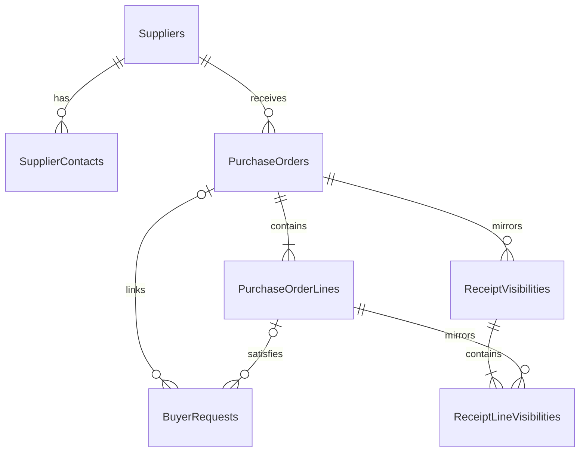

# Purchasing Database Design

## Status and Authority

This document is the implementation-authoritative relational design for the Purchasing domain database. Read it with the adjacent `requirements.md`, `../../architecture/data-architecture.md`, and `../../architecture/domain-and-application-boundaries.md`. Requirements control business semantics, the shared data architecture controls common SQL/EF conventions, and this file controls Purchasing tables, columns, relationships, constraints, indexes, and transaction boundaries.

Resolve conflicts in documentation before changing the EF Core model or generating a migration. Sales and Inventory records appear only as scalar external references or copied visibility.

## Database Identity

| Item | Value |
|---|---|
| Runtime database | `purchasing_db` |
| Owning service | `Acme.Erp.Purchasing.Api` |
| EF Core context | `PurchasingDbContext` |
| Connection key | `ConnectionStrings:DomainDatabase` |
| Schema | `dbo` |
| Migration history | `__PurchasingMigrationsHistory` |

## Relationship Diagram

## Table Catalog

| Table | Purpose |
|---|---|
| `Suppliers` | Purchasing-owned supplier reference |
| `SupplierContacts` | Active supplier contacts |
| `PurchaseOrders` | Purchase order aggregate root and current lifecycle state |
| `PurchaseOrderLines` | Ordered items, quantities, costs, and line state |
| `BuyerRequests` | Purchasing-owned handling of Sales non-stocked requests |
| `ReceiptVisibilities` | Copied Inventory receipt header state |
| `ReceiptLineVisibilities` | Copied Inventory cumulative received quantities |

## Supplier Tables

### `Suppliers`

| Column | SQL type | Null | Rules |
|---|---|---:|---|
| `Id` | `uniqueidentifier` | No | Primary key; generated by Purchasing |
| `SupplierCode` | `nvarchar(32)` | No | Stable unique code |
| `Name` | `nvarchar(200)` | No | Non-empty |
| `DefaultDeliveryLeadTimeNote` | `nvarchar(500)` | Yes | Informational MVP note |
| `IsActive` | `bit` | No | Default `1` |
| `CreatedAt` | `datetimeoffset(7)` | No | UTC |
| `UpdatedAt` | `datetimeoffset(7)` | No | UTC |
| `RowVersion` | `rowversion` | No | Concurrency token |

Unique constraint: `UQ_Suppliers_SupplierCode`.

### `SupplierContacts`

| Column | SQL type | Null | Rules |
|---|---|---:|---|
| `Id` | `uniqueidentifier` | No | Primary key |
| `SupplierId` | `uniqueidentifier` | No | FK to `Suppliers.Id` |
| `Name` | `nvarchar(200)` | No | Non-empty |
| `Email` | `nvarchar(320)` | No | Format validated by Purchasing |
| `Phone` | `nvarchar(32)` | Yes | Optional |
| `IsDefault` | `bit` | No | Default `0` |
| `IsActive` | `bit` | No | Default `1` |
| `CreatedAt` | `datetimeoffset(7)` | No | UTC |
| `UpdatedAt` | `datetimeoffset(7)` | No | UTC |
| `RowVersion` | `rowversion` | No | Concurrency token |

Filtered unique index: `UX_SupplierContacts_Default` on `SupplierId` where `IsDefault = 1 AND IsActive = 1`.

## Purchase Order Tables

### `PurchaseOrders`

| Column | SQL type | Null | Rules |
|---|---|---:|---|
| `Id` | `uniqueidentifier` | No | Primary key |
| `PurchaseOrderNumber` | `nvarchar(32)` | No | Unique Purchasing business number |
| `SupplierId` | `uniqueidentifier` | No | FK to `Suppliers.Id` |
| `Status` | `nvarchar(32)` | No | Purchase order status catalog |
| `PurchaseDate` | `date` | No | Business date |
| `ExpectedArrivalDate` | `date` | No | Header default; not before purchase date |
| `CurrencyCode` | `char(3)` | No | Configured company currency |
| `TotalAmount` | `decimal(19,4)` | No | Non-negative; maintained from lines |
| `BuyerSubject` | `nvarchar(200)` | No | Creating buyer identity |
| `SourceApplication` | `nvarchar(100)` | No | Calling application |
| `CreatedAt` | `datetimeoffset(7)` | No | UTC |
| `UpdatedAt` | `datetimeoffset(7)` | No | UTC |
| `OrderedAt` | `datetimeoffset(7)` | Yes | UTC |
| `ClosedAt` | `datetimeoffset(7)` | Yes | UTC |
| `RowVersion` | `rowversion` | No | Aggregate concurrency token |

Unique constraint: `UQ_PurchaseOrders_PurchaseOrderNumber`. Checks constrain `Status`, `TotalAmount >= 0`, and `ExpectedArrivalDate >= PurchaseDate`.

### `PurchaseOrderLines`

| Column | SQL type | Null | Rules |
|---|---|---:|---|
| `Id` | `uniqueidentifier` | No | Primary key |
| `PurchaseOrderId` | `uniqueidentifier` | No | FK to `PurchaseOrders.Id` |
| `LineNumber` | `int` | No | Positive; stable within PO |
| `ItemDescription` | `nvarchar(500)` | No | Required snapshot |
| `ExternalProductId` | `uniqueidentifier` | Yes | Inventory product |
| `ExternalSkuId` | `uniqueidentifier` | Yes | Inventory SKU |
| `ExternalBarcodeId` | `uniqueidentifier` | Yes | Inventory barcode |
| `QuantityOrdered` | `decimal(18,4)` | No | Greater than zero |
| `UnitOfMeasure` | `nvarchar(16)` | No | Inventory-supplied code where applicable |
| `UnitCost` | `decimal(19,4)` | No | Greater than zero |
| `ExpectedArrivalDate` | `date` | Yes | Optional line override |
| `Status` | `nvarchar(24)` | No | Line lifecycle |
| `CreatedAt` | `datetimeoffset(7)` | No | UTC |
| `UpdatedAt` | `datetimeoffset(7)` | No | UTC |
| `RowVersion` | `rowversion` | No | Concurrency token |

Unique constraint: `UQ_PurchaseOrderLines_OrderLineNumber` on `(PurchaseOrderId, LineNumber)`. Checks require positive quantity, positive unit cost, and a supported status.

## Buyer Request Tables

### `BuyerRequests`

| Column | SQL type | Null | Rules |
|---|---|---:|---|
| `Id` | `uniqueidentifier` | No | Purchasing-owned queue item PK |
| `ExternalSalesBuyerRequestId` | `uniqueidentifier` | No | Unique Sales request identity |
| `ExternalSalesOrderId` | `uniqueidentifier` | No | Sales order context |
| `ExternalSalesOrderLineId` | `uniqueidentifier` | No | Sales line context |
| `CustomerReference` | `nvarchar(100)` | Yes | Minimal copied context |
| `RequestedItemDescription` | `nvarchar(500)` | No | Request snapshot |
| `ExternalProductId` | `uniqueidentifier` | Yes | Optional Inventory product |
| `ExternalSkuId` | `uniqueidentifier` | Yes | Optional Inventory SKU |
| `Quantity` | `decimal(18,4)` | No | Greater than zero |
| `Reason` | `nvarchar(1000)` | No | Sales request reason |
| `Status` | `nvarchar(32)` | No | Buyer-request status catalog |
| `LinkedPurchaseOrderId` | `uniqueidentifier` | Yes | Optional local FK to `PurchaseOrders.Id` |
| `LinkedPurchaseOrderLineId` | `uniqueidentifier` | Yes | Optional local FK to `PurchaseOrderLines.Id` |
| `AssignedBuyerSubject` | `nvarchar(200)` | Yes | Queue assignment |
| `CreatedAt` | `datetimeoffset(7)` | No | UTC |
| `UpdatedAt` | `datetimeoffset(7)` | No | UTC |
| `RowVersion` | `rowversion` | No | Concurrency token |

Unique constraint: `UQ_BuyerRequests_ExternalSalesBuyerRequestId`. A check requires both purchase-order link columns to be null for Open requests and populated for Linked or Satisfied requests.

## Receipt Visibility Tables

### `ReceiptVisibilities`

| Column | SQL type | Null | Rules |
|---|---|---:|---|
| `Id` | `uniqueidentifier` | No | Purchasing copy PK |
| `PurchaseOrderId` | `uniqueidentifier` | No | FK to `PurchaseOrders.Id` |
| `ExternalInventoryReceiptId` | `uniqueidentifier` | No | Unique Inventory receipt ID |
| `ReceiptStatus` | `nvarchar(32)` | No | Copied receipt state |
| `ReceiptDate` | `date` | No | Inventory business date |
| `LastUpdateId` | `uniqueidentifier` | No | Inventory update identity; unique with source |
| `SourceService` | `nvarchar(100)` | No | Authenticated update source |
| `UpdatedAt` | `datetimeoffset(7)` | No | UTC business update time |
| `RowVersion` | `rowversion` | No | Concurrency token |

Unique constraints apply to `ExternalInventoryReceiptId` and `(SourceService, LastUpdateId)`.

### `ReceiptLineVisibilities`

| Column | SQL type | Null | Rules |
|---|---|---:|---|
| `Id` | `uniqueidentifier` | No | Primary key |
| `ReceiptVisibilityId` | `uniqueidentifier` | No | FK to `ReceiptVisibilities.Id` |
| `PurchaseOrderLineId` | `uniqueidentifier` | No | FK to `PurchaseOrderLines.Id` |
| `ExternalInventoryReceiptLineId` | `uniqueidentifier` | No | Inventory line ID |
| `CumulativeReceivedQuantity` | `decimal(18,4)` | No | Non-negative and not above ordered quantity |

Unique constraints apply to `ExternalInventoryReceiptLineId` and `(ReceiptVisibilityId, PurchaseOrderLineId, ExternalInventoryReceiptLineId)`.

## Status Models

| Area | Allowed values |
|---|---|
| Purchase order | `Draft`, `Ordered`, `PartiallyReceived`, `Received`, `Closed` |
| PO line | `Draft`, `Ordered`, `PartiallyReceived`, `Received`, `Closed` |
| Buyer request | `Open`, `Linked`, `Satisfied` |
| Receipt copy | `Booked` |

Valid PO transitions are `Draft -> Ordered`, `Ordered -> PartiallyReceived|Received`, `PartiallyReceived -> PartiallyReceived|Received`, and `Received -> Closed`. `Closed` is terminal. Only Draft purchase orders may be edited. Placement fixes supplier, item, quantity, unit cost, purchase date, and expected arrival data; later receipt updates only derive receipt progress and a Buyer may close only a Received order.

## Local Foreign Keys and Delete Behavior

All relationships use `ON DELETE NO ACTION` and indexed FK columns.

| Dependent | Principal |
|---|---|
| `SupplierContacts`, `PurchaseOrders` | `Suppliers` |
| `PurchaseOrderLines`, `ReceiptVisibilities` | `PurchaseOrders` |
| `BuyerRequests` | Optional linked `PurchaseOrders` and `PurchaseOrderLines` |
| `ReceiptLineVisibilities` | `ReceiptVisibilities` and `PurchaseOrderLines` |

## Indexes for Required Queries

| Index | Purpose |
|---|---|
| `IX_PurchaseOrders_Status_ExpectedArrival` on `(Status, ExpectedArrivalDate, Id)` | Open PO and expected-arrival queues |
| `IX_PurchaseOrders_Supplier_Status` on `(SupplierId, Status, PurchaseOrderNumber)` | Supplier-filtered search |
| `IX_PurchaseOrders_Buyer_Status_UpdatedAt` on `(BuyerSubject, Status, UpdatedAt, Id)` | Buyer workload |
| `IX_PurchaseOrderLines_ExternalSkuId` on `(ExternalSkuId, PurchaseOrderId)` | SKU receipt lookup |
| `IX_BuyerRequests_Status_UpdatedAt` on `(Status, UpdatedAt, Id)` | Buyer request queue and age sorting |
| `IX_BuyerRequests_Assignee_Status` on `(AssignedBuyerSubject, Status, UpdatedAt, Id)` | Assigned queue |
| `IX_ReceiptVisibilities_Status_UpdatedAt` on `(ReceiptStatus, UpdatedAt, Id)` | Receipt status review |

## Transaction Boundaries and Concurrency

- Create a PO and lines atomically. Recalculate `TotalAmount` from persisted lines in the same transaction.
- Apply Draft edits and valid transitions only with current PO and line `RowVersion` values.
- Revalidate supplier activity in the Draft edit and placement transactions. Every Ordered or later state rejects ordered-term edits.
- Record an accepted Sales buyer request in one transaction. Record each accepted queue decision and resulting Sales-visible status atomically.
- Apply each valid Inventory receipt update by updating copied header/line visibility and current PO/line state atomically.
- Do not hold a local transaction across Sales or Inventory HTTP calls.

## External References

| Column family | Owning system | SQL foreign key |
|---|---|---:|
| `ExternalSalesBuyerRequestId`, `ExternalSalesOrderId`, `ExternalSalesOrderLineId` | Sales | No |
| `ExternalProductId`, `ExternalSkuId`, `ExternalBarcodeId`, `ExternalInventoryReceiptId`, `ExternalInventoryReceiptLineId` | Inventory Management | No |
| Buyer and assignee subjects | Authentik/platform identity | No |

## Requirement Traceability

| Requirement | Persistence coverage |
|---|---|
| `PUR-DOM-001` | Active, uniquely coded suppliers and default contact enforcement |
| `PUR-DOM-002` | PO header/lines, required dates/costs/quantities, and atomic creation |
| `PUR-DOM-003` | Draft state guards and PO/line concurrency tokens enforce Draft-only editing |
| `PUR-DOM-004` | Ordered timestamp and direct `Draft -> Ordered` transition preserve placement |
| `PUR-DOM-005` | Unique Sales request identity and initial Open state support idempotent intake |
| `PUR-DOM-006` | Local PO/line links and checked Open/Linked/Satisfied states persist sourcing linkage |
| `PUR-DOM-007` | Indexed PO/supplier/line records provide the authoritative receipt lookup source |
| `PUR-DOM-008` | Receipt copies preserve Inventory IDs, cumulative quantities, source/update identity, and derived PO/line state |
| `PUR-DOM-009` | Received-state guard and `ClosedAt` persist valid closure |
| `PUR-DOM-010` | Purpose-built PO, arrivals, buyer-request, and receipt indexes |

Authorization, field-level validation, status transitions, Inventory product validation, and API response shaping remain domain/API responsibilities.

### Business Rule Traceability

| Rule | Persistence or domain disposition |
|---|---|
| `PUR-BR-001` | Required supplier FK and placement guard verify active supplier state |
| `PUR-BR-002` | Required line description, positive quantity/cost, UOM, and optional Inventory references |
| `PUR-BR-003` | Header and effective line dates are constrained not to precede the purchase date |
| `PUR-BR-004` | Required single `CurrencyCode`; configured currency validation remains domain logic |
| `PUR-BR-005` | Draft-only edit guards make ordered supplier, line, cost, and date terms immutable |
| `PUR-BR-006` | Buyer-request link checks require an Ordered line; quantity coverage remains a transactional domain guard |
| `PUR-BR-007` | Cumulative receipt quantities are non-negative and bounded by ordered quantity |
| `PUR-BR-008` | Closed PO and Satisfied buyer-request states have no outgoing transitions |
| `PUR-BR-009` | Supplier and Draft PO/line `RowVersion` values reject stale writes |

## Retention and Seed Policy

- Do not EF-seed suppliers or contacts. Load the 10 to 20 MVP suppliers through rerunnable Purchasing-owned environment tooling.
- Retain POs, lines, buyer requests, and receipt visibility for the ERP retention period.
- Deactivate suppliers and contacts instead of deleting records referenced by purchase orders.
- Purge only unreferenced inactive supplier data under an explicit retention job; never cascade-delete purchasing evidence.

## Excluded Schema

This design excludes supplier onboarding and contracts, tendering, scorecards, Inventory-owned receipt/stock mutation, Sales order ownership, invoices, accounts payable, tax, landed cost, payment, finance postings, multi-currency, blanket/recurring/partial-release POs, application-service persistence, and central audit/compliance tables.

## EF Core and Migration Checklist

- Explicitly map every SQL type, length, check, unique/filter index, `rowversion`, and `DeleteBehavior.NoAction`.
- Keep all Sales and Inventory IDs scalar with no cross-domain navigation.
- Persist status strings exactly as documented, never enum ordinals.
- Use `__PurchasingMigrationsHistory`; inspect migrations for cross-database FKs, cascade deletes, missing constraints, or destructive schema operations.

## Proposed Persistence Tests

- Apply all migrations to an empty SQL Server database and verify `__PurchasingMigrationsHistory`.
- Verify supplier code, default contact, PO number, line number, Sales request ID, and Inventory receipt IDs are unique as specified.
- Verify inactive suppliers, non-positive quantities, negative costs, invalid dates, and unsupported statuses reject writes without partial state.
- Verify concurrent Draft edits produce one success and one `DbUpdateConcurrencyException` without changing totals for the failed command.
- Verify ordered-term edits and invalid transitions leave the PO and lines unchanged.
- Verify duplicate Sales buyer requests and Inventory receipt updates are idempotent by external ID.
- Verify accepted receipt updates change header visibility, line visibility, and PO/line status atomically.
- Verify every FK uses `NO ACTION` and no migration creates a cross-database FK.
