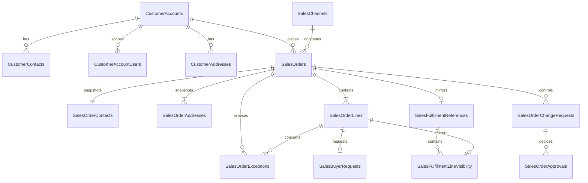

# Sales Database Design

## Status and Authority

This document is the implementation-authoritative relational design for the Sales domain database. Read it with:

- `requirements.md` in this folder for Sales business semantics and state transitions.
- `../../architecture/data-architecture.md` for shared SQL Server, EF Core, identifier, type, and migration conventions.
- `../../architecture/domain-and-application-boundaries.md` for ownership boundaries.

If these sources conflict, resolve the documentation before changing the EF Core model or generating a migration. This design covers Sales-owned durable state and copied integration visibility only. It creates no relationship to another database.

## Database Identity

| Item | Value |
|---|---|
| Runtime database | `sales_db` |
| Owning service | `Acme.Erp.Sales.Api` |
| EF Core context | `SalesDbContext` |
| Connection key | `ConnectionStrings:DomainDatabase` |
| Schema | `dbo` |
| Migration history | `__SalesMigrationsHistory` |

## Relationship Diagram

## Customer and Channel Tables

### `CustomerAccounts`

| Column | SQL type | Null | Rules |
|---|---|---:|---|
| `Id` | `uniqueidentifier` | No | Primary key; generated by Sales |
| `AccountNumber` | `nvarchar(32)` | No | Stable customer-facing code |
| `Name` | `nvarchar(200)` | No | Non-empty |
| `IsActive` | `bit` | No | Default `1` |
| `CreatedAt` | `datetimeoffset(7)` | No | UTC |
| `UpdatedAt` | `datetimeoffset(7)` | No | UTC |
| `RowVersion` | `rowversion` | No | Concurrency token |

Unique constraint: `UQ_CustomerAccounts_AccountNumber` on `AccountNumber`.

### `CustomerContacts`

| Column | SQL type | Null | Rules |
|---|---|---:|---|
| `Id` | `uniqueidentifier` | No | Primary key |
| `CustomerAccountId` | `uniqueidentifier` | No | FK to `CustomerAccounts.Id` |
| `Name` | `nvarchar(200)` | No | Non-empty |
| `Email` | `nvarchar(320)` | No | Format validated by Sales |
| `Phone` | `nvarchar(32)` | Yes | Optional |
| `IsDefault` | `bit` | No | Default `0` |
| `IsActive` | `bit` | No | Default `1` |
| `CreatedAt` | `datetimeoffset(7)` | No | UTC |
| `UpdatedAt` | `datetimeoffset(7)` | No | UTC |
| `RowVersion` | `rowversion` | No | Concurrency token |

Filtered unique index: `UX_CustomerContacts_Default` on `CustomerAccountId` where `IsDefault = 1 AND IsActive = 1`.

### `CustomerAccountUsers`

| Column | SQL type | Null | Rules |
|---|---|---:|---|
| `Id` | `uniqueidentifier` | No | Primary key |
| `CustomerAccountId` | `uniqueidentifier` | No | FK to `CustomerAccounts.Id` |
| `ExternalIdentitySubject` | `nvarchar(200)` | No | Authentik subject; not an identity-database FK |
| `IsActive` | `bit` | No | Default `1` |
| `CreatedAt` | `datetimeoffset(7)` | No | UTC |
| `UpdatedAt` | `datetimeoffset(7)` | No | UTC |
| `RowVersion` | `rowversion` | No | Concurrency token |

Unique constraint: `UQ_CustomerAccountUsers_ExternalIdentitySubject` on `ExternalIdentitySubject` so one authenticated subject maps to one MVP customer account.

### `CustomerAddresses`

| Column | SQL type | Null | Rules |
|---|---|---:|---|
| `Id` | `uniqueidentifier` | No | Primary key |
| `CustomerAccountId` | `uniqueidentifier` | No | FK to `CustomerAccounts.Id` |
| `AddressType` | `nvarchar(16)` | No | `Billing` or `Shipping` |
| `RecipientName` | `nvarchar(200)` | No | Non-empty |
| `Line1` | `nvarchar(200)` | No | Non-empty |
| `Line2` | `nvarchar(200)` | Yes | Optional |
| `City` | `nvarchar(100)` | No | Non-empty |
| `Region` | `nvarchar(100)` | Yes | Optional |
| `PostalCode` | `nvarchar(20)` | No | Non-empty |
| `CountryCode` | `char(2)` | No | ISO 3166-1 alpha-2 |
| `IsDefault` | `bit` | No | Default `0` |
| `IsActive` | `bit` | No | Default `1` |
| `CreatedAt` | `datetimeoffset(7)` | No | UTC |
| `UpdatedAt` | `datetimeoffset(7)` | No | UTC |
| `RowVersion` | `rowversion` | No | Concurrency token |

Check constraint: `CK_CustomerAddresses_AddressType`. Filtered unique index: `UX_CustomerAddresses_DefaultType` on `(CustomerAccountId, AddressType)` where `IsDefault = 1 AND IsActive = 1`.

### `SalesChannels`

| Column | SQL type | Null | Rules |
|---|---|---:|---|
| `Id` | `uniqueidentifier` | No | Primary key; deterministic seed ID |
| `Code` | `nvarchar(32)` | No | `SalesAssistant` or `CustomerOrdering` for MVP |
| `Name` | `nvarchar(100)` | No | Display name |
| `IsActive` | `bit` | No | Default `1` |

Unique constraint: `UQ_SalesChannels_Code`. These two stable channels are migration seed data.

## Sales Order Tables

### `SalesOrders`

| Column | SQL type | Null | Rules |
|---|---|---:|---|
| `Id` | `uniqueidentifier` | No | Primary key |
| `OrderNumber` | `nvarchar(32)` | No | Unique Sales business number |
| `CustomerAccountId` | `uniqueidentifier` | No | FK to `CustomerAccounts.Id` |
| `SalesChannelId` | `uniqueidentifier` | No | FK to `SalesChannels.Id` |
| `Status` | `nvarchar(32)` | No | Sales order status catalog |
| `CreatedBySubject` | `nvarchar(200)` | No | User or service subject |
| `SourceApplication` | `nvarchar(100)` | No | Calling application/service |
| `CreatedAt` | `datetimeoffset(7)` | No | UTC |
| `UpdatedAt` | `datetimeoffset(7)` | No | UTC |
| `SubmittedAt` | `datetimeoffset(7)` | Yes | Set on submission |
| `ConfirmedAt` | `datetimeoffset(7)` | Yes | Set on confirmation |
| `ReleasedAt` | `datetimeoffset(7)` | Yes | Set after Fulfilment acceptance |
| `CompletedAt` | `datetimeoffset(7)` | Yes | Set from Fulfilment update |
| `CancelledAt` | `datetimeoffset(7)` | Yes | Set on cancellation |
| `RowVersion` | `rowversion` | No | Aggregate concurrency token |

Unique constraint: `UQ_SalesOrders_OrderNumber`. Check constraint: `CK_SalesOrders_Status`.

### `SalesOrderContacts`

One immutable order-time contact snapshot per order.

| Column | SQL type | Null | Rules |
|---|---|---:|---|
| `Id` | `uniqueidentifier` | No | Primary key |
| `SalesOrderId` | `uniqueidentifier` | No | FK to `SalesOrders.Id`; unique |
| `SourceCustomerContactId` | `uniqueidentifier` | Yes | Optional local source FK to `CustomerContacts.Id` |
| `Name` | `nvarchar(200)` | No | Snapshot |
| `Email` | `nvarchar(320)` | No | Snapshot |
| `Phone` | `nvarchar(32)` | Yes | Snapshot |

### `SalesOrderAddresses`

| Column | SQL type | Null | Rules |
|---|---|---:|---|
| `Id` | `uniqueidentifier` | No | Primary key |
| `SalesOrderId` | `uniqueidentifier` | No | FK to `SalesOrders.Id` |
| `AddressType` | `nvarchar(16)` | No | `Billing` or `Shipping` |
| `SourceCustomerAddressId` | `uniqueidentifier` | Yes | Optional local source FK to `CustomerAddresses.Id` |
| `RecipientName` | `nvarchar(200)` | No | Snapshot |
| `Line1` | `nvarchar(200)` | No | Snapshot |
| `Line2` | `nvarchar(200)` | Yes | Snapshot |
| `City` | `nvarchar(100)` | No | Snapshot |
| `Region` | `nvarchar(100)` | Yes | Snapshot |
| `PostalCode` | `nvarchar(20)` | No | Snapshot |
| `CountryCode` | `char(2)` | No | Snapshot |

Unique constraint: `UQ_SalesOrderAddresses_OrderType` on `(SalesOrderId, AddressType)`. Check constraint: `CK_SalesOrderAddresses_AddressType`.

### `SalesOrderLines`

| Column | SQL type | Null | Rules |
|---|---|---:|---|
| `Id` | `uniqueidentifier` | No | Primary key |
| `SalesOrderId` | `uniqueidentifier` | No | FK to `SalesOrders.Id` |
| `LineNumber` | `int` | No | Positive; stable within order |
| `ExternalProductId` | `uniqueidentifier` | Yes | Inventory-owned product |
| `ExternalSkuId` | `uniqueidentifier` | Yes | Inventory-owned SKU |
| `ExternalBarcodeId` | `uniqueidentifier` | Yes | Inventory-owned barcode |
| `RequestedItemDescription` | `nvarchar(500)` | Yes | Required for non-stocked request without SKU |
| `Quantity` | `decimal(18,4)` | No | Greater than zero |
| `UnitOfMeasure` | `nvarchar(16)` | No | Inventory-supplied code where applicable |
| `IsStocked` | `bit` | No | Inventory validation result |
| `Status` | `nvarchar(32)` | No | Line status catalog |
| `CreatedAt` | `datetimeoffset(7)` | No | UTC |
| `UpdatedAt` | `datetimeoffset(7)` | No | UTC |
| `RowVersion` | `rowversion` | No | Concurrency token |

Unique constraint: `UQ_SalesOrderLines_OrderLineNumber` on `(SalesOrderId, LineNumber)`. Checks require `Quantity > 0`, a supported status, and either `ExternalSkuId` or a non-empty `RequestedItemDescription`.

## Lifecycle and Control Tables

### `SalesOrderChangeRequests`

| Column | SQL type | Null | Rules |
|---|---|---:|---|
| `Id` | `uniqueidentifier` | No | Primary key |
| `SalesOrderId` | `uniqueidentifier` | No | FK to `SalesOrders.Id` |
| `ChangeType` | `nvarchar(32)` | No | `Amendment`, `Cancellation`, or `Override` |
| `Status` | `nvarchar(24)` | No | `Pending`, `Approved`, `Rejected`, `Applied`, `Cancelled` |
| `RequestedBySubject` | `nvarchar(200)` | No | Used for self-approval rule |
| `Reason` | `nvarchar(1000)` | No | Required business reason |
| `ChangedFieldsJson` | `nvarchar(max)` | Yes | Valid JSON; sanitized field diff |
| `PolicyAmount` | `decimal(19,4)` | Yes | Amount evaluated by policy, when applicable |
| `CurrencyCode` | `char(3)` | Yes | Required with `PolicyAmount` |
| `RequiresApproval` | `bit` | No | Applied policy result |
| `RequestedAt` | `datetimeoffset(7)` | No | UTC |
| `ResolvedAt` | `datetimeoffset(7)` | Yes | UTC |
| `RowVersion` | `rowversion` | No | Concurrency token |

Checks constrain type/status, validate JSON, and require `CurrencyCode` exactly when `PolicyAmount` is populated.

### `SalesOrderApprovals`

| Column | SQL type | Null | Rules |
|---|---|---:|---|
| `Id` | `uniqueidentifier` | No | Primary key; append-only decision attempt |
| `SalesOrderChangeRequestId` | `uniqueidentifier` | No | FK to `SalesOrderChangeRequests.Id` |
| `Decision` | `nvarchar(16)` | No | `Approved`, `Rejected`, or `Denied` |
| `DecidedBySubject` | `nvarchar(200)` | No | Must differ from requester for approval |
| `Reason` | `nvarchar(1000)` | Yes | Required for rejection/denial |
| `DecidedAt` | `datetimeoffset(7)` | No | UTC |

Self-approval is enforced transactionally by Sales and a denied attempt is retained.

### `SalesOrderExceptions`

| Column | SQL type | Null | Rules |
|---|---|---:|---|
| `Id` | `uniqueidentifier` | No | Primary key |
| `SalesOrderId` | `uniqueidentifier` | No | FK to `SalesOrders.Id` |
| `SalesOrderLineId` | `uniqueidentifier` | Yes | Optional FK to `SalesOrderLines.Id` |
| `ExceptionType` | `nvarchar(64)` | No | Availability, buyer request, fulfilment, cancellation, or policy exception |
| `Status` | `nvarchar(16)` | No | `Open`, `Resolved`, `Cancelled` |
| `Summary` | `nvarchar(500)` | No | Operator-safe summary |
| `DetailsJson` | `nvarchar(max)` | Yes | Valid sanitized JSON |
| `OpenedAt` | `datetimeoffset(7)` | No | UTC |
| `ResolvedAt` | `datetimeoffset(7)` | Yes | UTC |
| `RowVersion` | `rowversion` | No | Concurrency token |

## Copied Integration Visibility

### `SalesBuyerRequests`

| Column | SQL type | Null | Rules |
|---|---|---:|---|
| `Id` | `uniqueidentifier` | No | Sales-owned request context PK |
| `SalesOrderLineId` | `uniqueidentifier` | No | FK to `SalesOrderLines.Id`; unique |
| `ExternalPurchasingBuyerRequestId` | `uniqueidentifier` | Yes | Purchasing-owned identity |
| `Status` | `nvarchar(32)` | No | Sales copy of buyer-request state |
| `RequestedDescription` | `nvarchar(500)` | No | Request snapshot |
| `Quantity` | `decimal(18,4)` | No | Greater than zero |
| `Reason` | `nvarchar(1000)` | No | Origination reason |
| `DecisionReason` | `nvarchar(1000)` | Yes | Purchasing response |
| `ExternalPurchaseOrderId` | `uniqueidentifier` | Yes | Optional Purchasing-owned PO |
| `CreatedAt` | `datetimeoffset(7)` | No | UTC |
| `UpdatedAt` | `datetimeoffset(7)` | No | UTC |
| `RowVersion` | `rowversion` | No | Concurrency token |

Filtered unique index on `ExternalPurchasingBuyerRequestId` when non-null.

### `SalesFulfilmentReferences`

| Column | SQL type | Null | Rules |
|---|---|---:|---|
| `Id` | `uniqueidentifier` | No | Primary key |
| `SalesOrderId` | `uniqueidentifier` | No | FK to `SalesOrders.Id`; unique |
| `ExternalFulfilmentTaskId` | `uniqueidentifier` | No | Fulfilment-owned task; unique |
| `FulfilmentStatus` | `nvarchar(32)` | No | Copied status |
| `TrackingReference` | `nvarchar(100)` | Yes | Copied provider reference |
| `ShipmentReference` | `nvarchar(100)` | Yes | Copied shipment reference |
| `ExceptionSummary` | `nvarchar(500)` | Yes | Operator-safe copied exception |
| `UpdatedAt` | `datetimeoffset(7)` | No | UTC business update time |
| `RowVersion` | `rowversion` | No | Concurrency token |

### `SalesFulfilmentLineVisibility`

| Column | SQL type | Null | Rules |
|---|---|---:|---|
| `Id` | `uniqueidentifier` | No | Primary key |
| `SalesFulfilmentReferenceId` | `uniqueidentifier` | No | FK to `SalesFulfilmentReferences.Id` |
| `SalesOrderLineId` | `uniqueidentifier` | No | FK to `SalesOrderLines.Id`; unique |
| `ExternalFulfilmentTaskLineId` | `uniqueidentifier` | Yes | Fulfilment-owned line |
| `FulfilledQuantity` | `decimal(18,4)` | No | Non-negative |
| `BackorderedQuantity` | `decimal(18,4)` | No | Non-negative |
| `Status` | `nvarchar(32)` | No | Copied line status |

## Status Catalogs

| Area | Allowed values |
|---|---|
| Sales order | `Draft`, `Submitted`, `Confirmed`, `PendingInventory`, `PendingBuyerRequest`, `ReleasedToFulfilment`, `PartiallyFulfilled`, `Backordered`, `Completed`, `Cancelled`, `Exception` |
| Sales order line | `Draft`, `Validated`, `PendingInventory`, `PendingBuyerRequest`, `Released`, `PartiallyFulfilled`, `Backordered`, `Completed`, `Cancelled`, `Exception` |
| Buyer request copy | `Accepted`, `LinkedToPurchaseOrder`, `Rejected`, `ReturnedForClarification`, `Closed` |

Check constraints limit persisted values; the transition graph remains the one defined in `requirements.md` and is enforced by Sales before persistence.

## Local Foreign Keys and Delete Behavior

All foreign keys use `ON DELETE NO ACTION`. Required relationships are indexed. Snapshot source links are optional so reference records can be retained or corrected without changing order evidence.

| Dependent | Principal |
|---|---|
| `CustomerContacts`, `CustomerAccountUsers`, `CustomerAddresses`, `SalesOrders` | `CustomerAccounts` |
| `SalesOrders` | `SalesChannels` |
| `SalesOrderContacts`, `SalesOrderAddresses`, `SalesOrderLines`, `SalesOrderChangeRequests`, `SalesOrderExceptions`, `SalesFulfilmentReferences` | `SalesOrders` |
| `SalesOrderContacts` | Optional `CustomerContacts` |
| `SalesOrderAddresses` | Optional `CustomerAddresses` |
| `SalesOrderApprovals` | `SalesOrderChangeRequests` |
| `SalesOrderExceptions`, `SalesBuyerRequests`, `SalesFulfilmentLineVisibility` | `SalesOrderLines` |
| `SalesFulfilmentLineVisibility` | `SalesFulfilmentReferences` |

## Indexes for Required Queries

| Index | Purpose |
|---|---|
| `IX_SalesOrders_Customer_Status_CreatedAt` on `(CustomerAccountId, Status, CreatedAt DESC, Id)` | Customer-scoped order search with stable sorting |
| `IX_SalesOrders_Status_UpdatedAt` on `(Status, UpdatedAt, Id)` | Operational queues and age sorting |
| `IX_SalesOrders_Channel_CreatedAt` on `(SalesChannelId, CreatedAt DESC, Id)` | Channel reporting |
| `IX_SalesOrderLines_ExternalSkuId` on `(ExternalSkuId, SalesOrderId)` | SKU order search |
| `IX_SalesOrderExceptions_Status_Type_OpenedAt` on `(Status, ExceptionType, OpenedAt, Id)` | Exception queue |
| `IX_SalesBuyerRequests_Status_UpdatedAt` on `(Status, UpdatedAt, Id)` | Buyer-request visibility |
| `IX_SalesFulfilmentReferences_Status_UpdatedAt` on `(FulfilmentStatus, UpdatedAt, Id)` | Fulfilment visibility |

## Transactions and Concurrency

- Create an order, its contact/address snapshots, and lines in one transaction.
- Apply every valid status transition with the current `SalesOrders.RowVersion` and update affected line state in one transaction.
- Record a change request and policy result before approval. Apply an approved change only after re-reading the request and order under optimistic concurrency; requester and approver subjects must differ.
- Record a buyer request after Purchasing accepts it and mark Sales released only after Fulfilment accepts the release contract.
- Apply valid Purchasing or Fulfilment business updates and update copied visibility in one transaction.
- Do not hold a database transaction open across an HTTP call.

## External References

| Column family | Owning system | SQL foreign key |
|---|---|---:|
| `ExternalProductId`, `ExternalSkuId`, `ExternalBarcodeId` | Inventory Management | No |
| `ExternalPurchasingBuyerRequestId`, `ExternalPurchaseOrderId` | Purchasing | No |
| `ExternalFulfilmentTaskId`, `ExternalFulfilmentTaskLineId` | Order Fulfilment | No |
| Customer, requester, approver, and creator subject columns | Authentik/platform identity | No |

## Requirement Traceability

| Requirement | Persistence coverage |
|---|---|
| `SAL-DOM-001` | Customer references, channels, order snapshots, and lines are committed atomically |
| `SAL-DOM-002` | Required `SalesChannelId`, seeded `SalesChannels`, and channel indexes preserve origin |
| `SAL-DOM-003` | External Inventory IDs and line stocked state persist accepted validation outcomes |
| `SAL-DOM-004` | Current line and order states record the business result of accepted availability checks |
| `SAL-DOM-005` | `SalesBuyerRequests` owns origination context and copies Purchasing IDs/status without a cross-database FK |
| `SAL-DOM-006` | Checked current status, optimistic concurrency, and transactional transition rules |
| `SAL-DOM-007` | Delivery snapshots and the accepted fulfilment reference persist release evidence |
| `SAL-DOM-008` | Fulfilment header/line visibility and current order status persist accepted fulfilment updates |
| `SAL-DOM-009` | Change requests, approvals, policy snapshots, reasons, self-approval evidence, and optimistic concurrency |
| `SAL-DOM-010` | Purpose-built order, line, exception, buyer-request, and fulfilment indexes |

Business authorization, field-level validation, allowed status transitions, Inventory calls, and response shaping remain API/domain responsibilities. Persistence supplies the durable evidence and constraints they require.

### Business Rule Traceability

| Rule | Persistence or domain disposition |
|---|---|
| `SAL-BR-001` | Required customer/channel FKs, one contact snapshot, billing/shipping uniqueness, and at least one line enforced by aggregate transaction |
| `SAL-BR-002` | `Quantity > 0` check on every order line |
| `SAL-BR-003` | Inventory external IDs and accepted availability results are persisted; active-product decision remains an Inventory call/domain guard |
| `SAL-BR-004` | Inventory owns reservation mutation; Sales records the resulting business state |
| `SAL-BR-005` | Non-stocked line check and unique `SalesBuyerRequests` relationship; release guard remains domain logic |
| `SAL-BR-006` | Required data constraints plus availability, buyer-request, and approval states support the release guard |
| `SAL-BR-007` | Policy amount/currency, approval requirement, requester, and decision evidence; threshold evaluation remains configurable domain logic |
| `SAL-BR-008` | Change request/approval records and order `RowVersion` protect coordinated amendments |
| `SAL-BR-009` | Unique customer subject mapping and indexed `CustomerAccountId`; authorization enforces authenticated scope |

## Seed and Lifecycle Policy

- Seed deterministic `SalesAssistant` and `CustomerOrdering` channel rows.
- Load customer accounts, contacts, users, and addresses through rerunnable Sales-owned environment tooling, not EF model seed data.
- Do not physically delete orders, lines, snapshots, approvals, exceptions, buyer-request context, or fulfilment visibility.

## Excluded Schema

This MVP design intentionally excludes product master tables, inventory balances, Purchasing queue ownership, fulfilment execution, pricing, promotions, tax, payment, invoicing, credit control, returns/RMA, finance postings, guest checkout, multi-tenant partitions, application-service tables, and central audit/compliance tables.

## EF Core and Migration Checklist

- Map every type, maximum length, check constraint, unique/filter index, `rowversion`, and `DeleteBehavior.NoAction` explicitly.
- Keep external IDs as scalar properties with no navigation properties.
- Configure value conversions for statuses to their documented strings, never numeric enum ordinals.
- Configure decision entities as append-only in application behavior; migrations must not replace them with central audit tables without a design change.
- Use `__SalesMigrationsHistory` and inspect every generated migration for cross-database references, cascade deletes, unbounded payload columns, missing checks, or destructive schema changes.
- Add SQL Server integration tests for customer scope, positive quantities, status checks, optimistic concurrency, and migration application.
